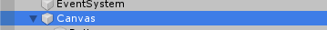
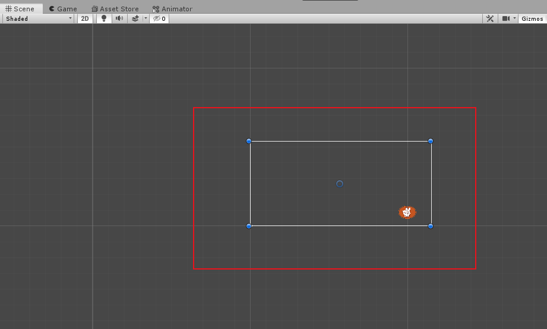
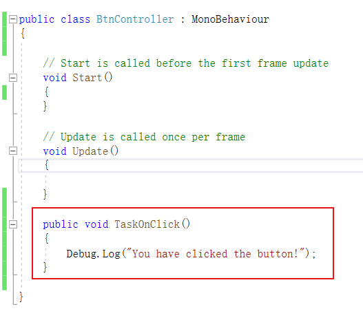
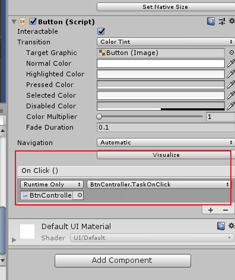
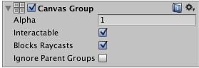

# UI制作

说到UI，我们必须要知道unity里有一种game object叫canvas。

所有的UI部件都是渲染在这个Canvas上的

设定好一个canvas以后，主屏幕就代表中间那个白框，其他部件只有在这个白框中的时候才会渲染出来。所以就可以理解成Canvas是一个特殊的层，用来渲染部件。

**EventSystem：**UI的事件系统，很多新手都会选择遗忘掉这个组件，结果后来做了一个按钮出来不能点击，原因就是这个物体被误删了。当我们在左侧生成一个Canvas 对象的时候，同时这个事件系统对象也会被构建出来。它用来处理一些我们与Canvas交互的事件，比如点击等等。

### 按钮点击事件

按钮被点击的时候可以执行别的object一些函数，比如我们新建一个空gameobject，然后里面写一些函数。

然后把上面脚本绑定给这个game object。最后在button的game object对象的onClick属性里，可以绑定对象的某个函数方法。在那里进行绑定

把gameobject拖进去就好。

## Canvas

Canvas绘制UI有三种模式：

- overlay模式，会直接作为一层渲染在界面最上层。
- Camera模式
- world模式，一般3d游戏用到。

### Rect Transform**

canvas有个组件比较特殊，叫Rect Transform。其实它跟普通的transform差别也不大。

但是也有需要注意的地方

#### CanvasGroup

Canvas Group可以用来控制一组不需要个别控制的UI元素的某些方面，CanvasGroup的属性会影响他所有children的GameObject

简而言之就是一个component，用来控制UI object的某些属性。其中就有：

- Alpha：这个选项很多组件都有，用处也是一样的，在美术中，这个叫做Alpha通道的东东是用来控制透明度的，**他的值从0到1.0是完全透明，1是完全不透明**；
- Interactable确认该组件是否接受输入，当他被设置为false时，交互功能将被禁用；
- Block Raycasts是否让该组件像collider一样接受射线检测？你需要在依赖于Canvas的图形射线检测者上唤醒射线检测方法。这个不会作用于Physics.Raycast;
- Ignore Parent Groups(忽略父级团)是否响应父级group的方法

