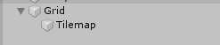
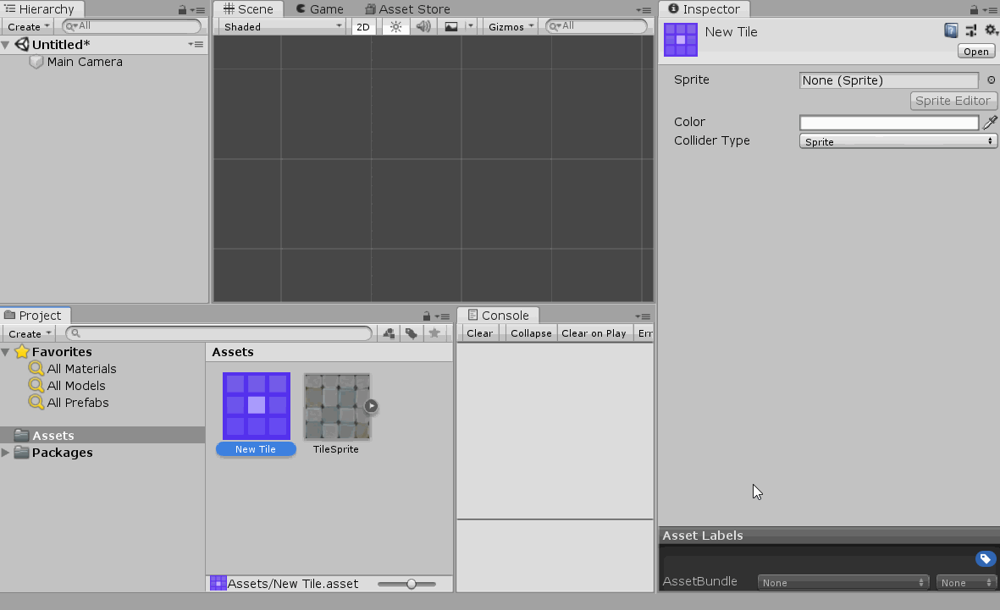
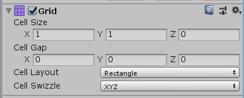
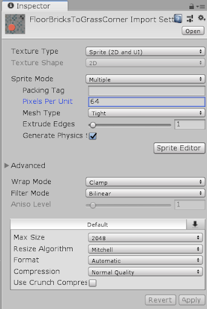
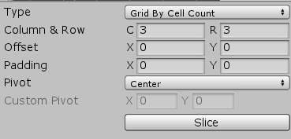
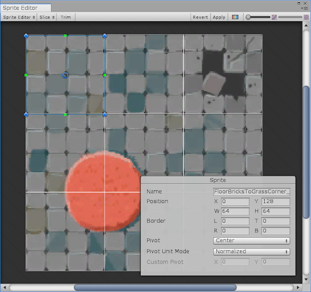

# 地图构建

### TileMap(瓷砖地图)

基础准备里介绍了一下素材图的sprite，那是为了活动的game object而准备的类型。

对于构建地图用的素材，game object要用TileMap。

我们可以在左侧层级窗口右键新建一个TileMap object。

然后事实上点击创建后会产生两个object，一个是Grid，一个是Tilemap

grid可以理解成为构建地图用的网格部件，**而tilemap则由一堆tiles(瓷砖)构成**。

我们可以在project栏下右键，新建一个Tile对象。

新建一个Tile对象以后，其实只是有一个格子，还要导入素材图让它呈现出样子，那就是下面那样的操作。让这个tile绑定一个精灵sprite图

有了Tile，我们才可以去画TileMap。

我们需要打开Tile palette(调色板)面板，在**Window > 2D > Tile palette**

在plaette面板当中，我们可以把tile部件拖进去，相当于有了一个模板。然后我们就可以在scene图中画格子了。

调色板就是一个模板窗口帮助我们更好的在scene中画地图部件。

回到层级侧边栏，我们看看Grid对象。它的属性：

That means each cell is **1 unit in width** and **1 unit in height**.

然后我们可以在Tile素材图里设定它没一个unit可以容纳的像素值，从而可以填充进格子里。

由于我们创造一个地图需要很多不同的瓷砖，所以我们一般导入一个瓷砖集合图来帮助我们更好得到构建地图。

这时我们就可以在素材图里进行瓷砖切分了，

设置素材图属性的时候，我们要把sprite妖精图的mode设置为multiple。说明这张素材精灵图是要拿去复用的。然后我们点击Sprite Editor去切分。选择按gird格子切分，设定好行列

