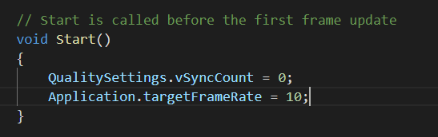

## 基础

首先当然是下载软件，下载Unity Hub然后安装，这个可以在：https://unity3d.com/get-unity/download?_ga=2.252834249.1191511494.1568717087-1863493703.1568717087

然后下载学习教程，这里是根据官方教程，Ruby‘s Adventure来的。

open这个project的时候，会自动导入一堆asset到工程里，不过工程依旧是空白的。

### asset store

打开工程，我们可以去asset store找asset资源。在window>Asset Store目录下。

搜到asset以后下下载import。当然上面这个资源我们已经导入过了，在开启工程的时候。

### scene

在入门基础里我们也有介绍到scene。scene其实就是真实游戏里的场景了，scene里面有很多的game object。

左边的hierarchy目录就列出了这些game object。

在hierarchy目录里我们还能新建scene和保存scene

### game view

scene标签旁边的game view，就展示了游戏效果场景。会display出来给我们进行游戏测试

### Inspector window

给我们展示game object的属性的。展示component

### Sprite（精灵）

Sprite（精灵）是 2D 游戏中最常见的显示图像的方式，在节点上添加 Sprite 组件，就可以在场景中显示项目资源中的图片。

2D模板下，假如我们拖一个图片到project栏里，然后看他的属性，就能看到图片纹理默认被设置成为sprite。游戏需要这种格式的图片来运作。点击project栏里的sprite图播放按钮，会产生一个copy，然后可被拖动到scene当中。

### script

scripts are a specific type of **component**.

接下来这就是跟代码相关的东西了，game object跟很多component相关，而component又是由代码来控制的。

在project目录新建一个script，可以理解为，一个script里的class就是一个component。

start方法会在一帧开始的时候执行。而update则是每一帧都执行。一般一个游戏每秒都会执行30-60帧，每一帧的执行前，这个代码的update方法都会被执行。

脚本文件可以在project目录创建，创建好以后可以拖动脚本文件到inspector到transform和sprite render组件处。which means that the script is attached to your **GameObject**.  

写好脚本并且配置到game object以后，我们就可以按播放键来让物体自动运动了。

### 输入设定

在edit->project settings下我们可以看到设置按钮。那里可以设置对应的按键，比如horizontal就定义了左右键的行为。我们可以用代码获取到这个行为：

由于按键里我们定义了Horizontal，点击左键就会获取到-1，点击右键就会获取到1.

注意，unity会帮助我们光滑按键值，也就是并不是我们按下去就立刻一帧收到1，下一刻变为0，而是会有个过渡的过程，所以打log时我们可以看到很多中间值。

#### 渲染帧值

我们可以在script的start函数里决定，一秒钟渲染多少帧。

我们只需要在start函数里设置好即可：

这就是游戏锁帧，这其实就没意思了，因为我假如配置很好你还给我锁帧，那可不妙。所以为了让不同电脑帧率不一样的情况下，游戏行为保持一致，我们要慎重计算object的行动。**Time.deltaTime**可以获取到该设备上每一帧运作需要的秒数。在10frame per second的情况下，一帧要运作0.1s。