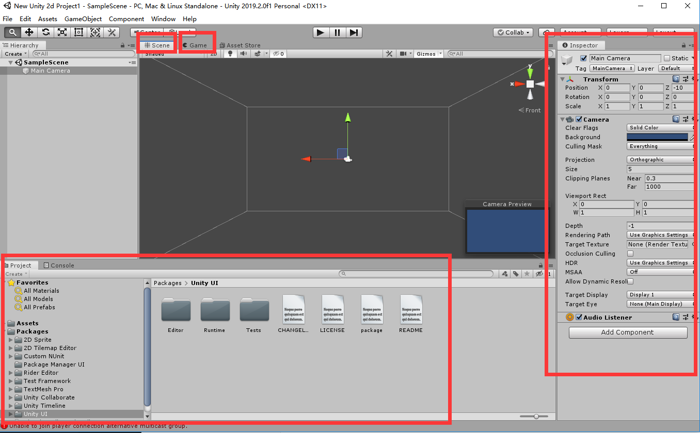
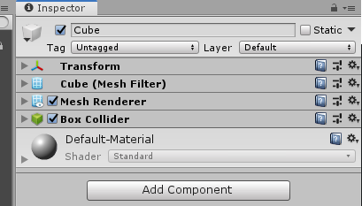
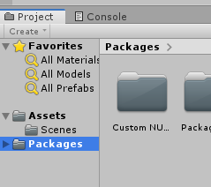

# Unity游戏开发入门基础

游戏开发基本理念：

- 游戏是由一帧一帧控制的，每一帧根据我们写得到程序逻辑控制
- 游戏要素：逻辑+显示 【每一帧都要计算逻辑，然后处理如何显示】

## Unity界面基础

unity软件分成好几个视图，我们new 一个project就能看到

图上就可以看到unity界面分成好几块：

- scene
- game
- project
- inspector

scene其实就是真实游戏里的场景了，里面的每一个物体都是一个**game object**，默认空白scene里有一个game object，那就是摄像机camera。

hierarchy层级目录中就有列出哪些是game object，inspector界面里是它的属性。我们可以直接就在game object菜单栏新建game object。

这里又要注意的是，**一个game object是由一系列component来共同控制的。**在inspector视图里就能看到component，默认新建的game object只有一个component叫transform，这个transform控制了物体的方向，位置等。

新建一个new game object cube，就能看到它有以下component：

#### assets目录

还要注意到左下角的assets目录用来存放游戏的一些资源。

这个目录里的资源可以手动添加进去，这是跟项目文件夹的磁盘相联系的。

#### prfabs

做好的game object我们可以拖到project目录下，行程一个prefabs，简而言之就是模板。我们以后可以复用这个game object

