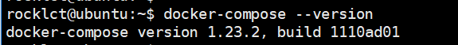
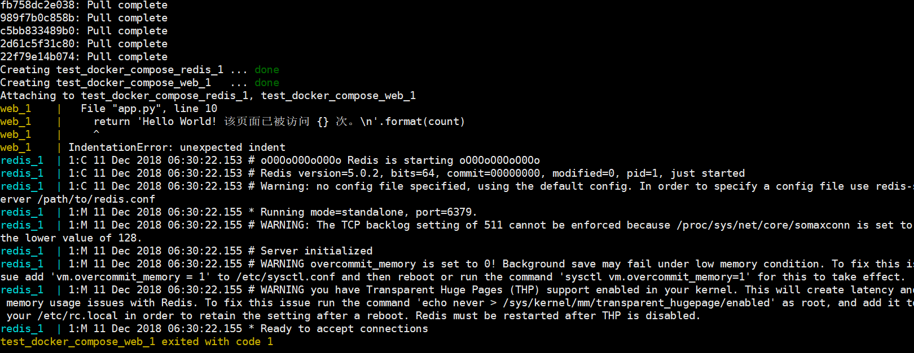

# Compose
Compose 项目是 Docker 官方的开源项目，负责实现对 **本地Docker 容器集群**的快速编排。注意，这里是**本地**

一个使用Docker容器的应用，通常由多个容器组成。使用Docker Compose不再需要使用shell脚本来启动容器。 

Compose 通过一个配置文件来管理多个Docker容器，在配置文件中，所有的容器通过services来定义，然后使用docker-compose脚本来启动，停止和重启应用，和应用中的服务以及所有依赖服务的容器，非常适合组合使用多个容器进行开发的场景。

**zwlj：就是本地用来管理多个docker容器的，注意还要区分另一个开源项目k8s，k8s是多机容器调度管理**

Compose 允许用户通过一个单独的`docker-compose.yml` 模板文件（YAML 格式）来定义一组相关联的应用容器为一个项目（project）。

从上而知Compose中的两个重要概念：

 - 服务 (service)：一个应用的容器，实际上可以包括若干运行相同镜像的容器实例。

 - 项目 (project)：由一组关联的应用容器组成的一个完整业务单元，在 docker-compose.yml 文件中定义。

Compose 的默认管理对象是项目，通过子命令对项目中的一组容器进行便捷地生命周期管理。

**Compose 项目由 Python 编写，实现上调用了 Docker 服务提供的 API 来对容器进行管理。因此，只要所操作的平台支持 Docker API，就可以在其上利用 Compose 来进行编排管理。**

## 安装
Compose 可以通过 Python 的包管理工具 pip 进行安装，也可以直接下载编译好的二进制文件使用，甚至能够直接在 Docker 容器中运行。

前两种方式是传统方式，适合本地环境下安装使用；最后一种方式则不破坏系统环境，更适合云计算场景。

下面给出linux下的安装方法：

安装方法其实是去官网下载二进制包： [下载地址](https://github.com/docker/compose/releases)

官网给出了如下命令：

```
curl -L https://github.com/docker/compose/releases/download/1.23.2/docker-compose-`uname -s`-`uname -m` -o /usr/local/bin/docker-compose
chmod +x /usr/local/bin/docker-compose
```

安装以后可以查看到docker compose的版本



## 配置文件
要玩转docker compose，就是要熟悉他的配置文件的编写。

编写 **docker-compose.yml** 文件，这个是 Compose 使用的主模板文件。一个主模板文件就用来配置出一个项目，一个项目里当然管理着多个容器(对应着的多个dockerfile)。

比如下面的docker-compose.yml：

```
version: "3"

services:
  webapp:
    image: examples/web
    ports:
      - "80:80"
    volumes:
      - "/data"
```

注意每个服务都必须通过 image 指令指定镜像或 build 指令（需要 Dockerfile）等来自动构建生成镜像。如果使用 build 指令，在 Dockerfile 中设置的选项(例如：CMD, EXPOSE, VOLUME, ENV 等) 将会自动被获取，无需在 docker-compose.yml 中再次设置。

#### build
指定 Dockerfile 所在文件夹的路径（可以是绝对路径，或者相对 docker-compose.yml 文件的路径）。 Compose 将会利用它自动构建这个镜像，然后使用这个镜像。

如下指定：

```
version: '3'
services:

  webapp:
    build: ./dir
```

也可以使用 context 指令指定 Dockerfile 所在文件夹的路径。使用 dockerfile 指令指定 Dockerfile 文件名。

```
version: '3'
services:

  webapp:
    build:
      context: ./dir
      dockerfile: Dockerfile-alternate
      args:
        buildno: 1
```

还有许多特殊指令，需要用到的时候可以去查手册。

### 一些重要命令

随便列举一些，有相关用法可以查阅docker的doc。

#### build
构建或重新构建服务。服务一旦构建后，将会带上一个标记名，例如 web_db。可以随时在项目目录下运行 docker-compose build 来重新构建服务。

#### kill
通过发送 SIGKILL 信号来强制停止服务容器。支持通过参数来指定发送的信号，例如

#### run
docker-compose run ubuntu ping docker.com

#### up(重)

构建，（重新）创建，启动，链接一个服务相关的容器。

链接的服务都将会启动，除非他们已经运行。

默认情况， docker-compose up 将会整合所有容器的输出，并且退出时，所有容器将会停止。

如果使用 docker-compose up -d ，将会在后台启动并运行所有的容器。

默认情况，如果该服务的容器已经存在， docker-compose up 将会停止并尝试重新创建他们（保持使用 volumes-from 挂载的卷），以保证 docker-compose.yml 的修改生效。如果你不想容器被停止并重新创建，可以使用 docker-compose up --no-recreate。如果需要的话，这样将会启动已经停止的容器。

### 实际使用

创建新目录，创建app.py:

``` python
from flask import Flask
from redis import Redis

app = Flask(__name__)
redis = Redis(host='redis', port=6379)

@app.route('/')
def hello():
    count = redis.incr('hits')
    return 'Hello World! 该页面已被访问 {} 次。\n'.format(count)

if __name__ == "__main__":
    app.run(host="0.0.0.0", debug=True)
```

然后原地编写dockerfile，

``` docker
FROM python:3.6-alpine
ADD . /code
WORKDIR /code
RUN pip install redis flask
CMD ["python", "app.py"]
```

具体含义可以去看docker笔记，总之就是拉取了官方python镜像，然后创建了一个虚拟的code工作目录，进入工作目录安装依赖后，执行了app。

接下来编写docker compose的模板文件：

```
version: '3'
services:

  web:
    build: .
    ports:
     - "5000:5000"

  redis:
    image: "redis:alpine"
```

编写好文件以后，执行命令

```
docker-compose build
docker-compose up
```




多次访问页面可以看到成功建立


### 参考

[Compose命令说明](http://wiki.jikexueyuan.com/project/docker-technology-and-combat/commands.html)