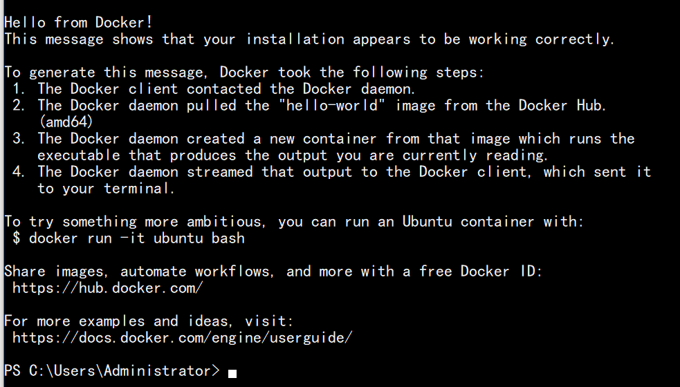

## docker基础
Docker 是一个开源的应用容器引擎，基于 Go 语言 并遵从Apache2.0协议开源。

**Docker 可以让开发者打包他们的应用以及依赖包到一个轻量级、可移植的容器中，然后发布到任何流行的 Linux 机器上，也可以实现虚拟化**。

### Docker核心概念
Docker有三个核心概念，**镜像，容器和仓库**。

#### Docker镜像
镜像就相当于一个模板。比如我们安装虚拟机的时候，镜像就经常指一个操作系统镜像。

镜像是Docker容器的基础，用户可以直接在网上下载别人准备好的应用镜像来直接使用。

#### Docker容器
相当于一个轻量级沙箱，Docker利用容器来运行和隔离应用。容器是从镜像创建的应用运行实例，可以将其启动，开始，停止，删除。

可以把容器看做是一个简易的Linux系统环境和运行在其中的应用程序打包而成的盒子。

#### Docker仓库
集中存放Docker镜像文件的场所。

Docker仓库可以分为公开仓库和私有仓库，目前最大的公开仓库是官方提供的 **Docker Hub**

### Docker安装
Docker是一个开源的商业产品，有社区版CE和企业版EE，一般个人开发用社区版就可以了。

以下以Win10下作为示例来安装Docker CE，参考文档
[Get Docker CE for Windows](https://docs.docker.com/docker-for-windows/install/)和[Docker教程](http://www.runoob.com/docker/docker-tutorial.html)

现在 Docker 有专门的 Win10 专业版系统的安装包，需要开启Hyper-V。


然后去官网下载exe文件

#### 开始hellow world
Win下安装好以后，已经帮我们启动了docker服务，我们接下来可以通过以下命令(powershell下)来看我们本地有的镜像：

```
# 列出本机的所有 image 文件。
$ docker image ls

# 删除 image 文件
$ docker image rm [imageName]
```

#### 有关镜像image
之前我们已经解释了镜像的概念。

一般来说，为了节省时间，我们应该尽量使用别人制作好的 image 文件，而不是自己制作。即使要定制，也应该基于别人的 image 文件进行加工，而不是从零开始制作。

实际开发中，一个 image 文件往往通过继承另一个 image 文件，加上一些个性化设置而生成。举例来说，你可以在 Ubuntu 的 image 基础上，往里面加入 Apache 服务器，形成你的 image。

安装完成后，Docker 会自动启动。通知栏上会出现个小鲸鱼的图标，这表示 Docker 正在运行。

#### 国内镜像加速
根据[Docker 中国官方镜像加速](https://www.docker-cn.com/registry-mirror),我们来加速image的获取

可以直接用类似下面的命令来进行image的拉取,比如我想拉Ubuntu16.04

```
docker pull registry.docker-cn.com/library/ubuntu:16.04
```

当然也可以配置成默认加速，那样可以不用每次都手动添加。比如可以修改文件/etc/docker/daemon.json

```
{
  "registry-mirrors": ["https://registry.docker-cn.com"]
}
```

修改保存后重启 Docker 以使配置生效。

#### 拉取helloworld镜像

```
docker image pull registry.docker-cn.com/library/hello-world
```

然后docker image ls 可以看到image被拉下来了


执行docker run hello-world即可执行



### 参考
[Get Docker CE for Ubuntu](https://docs.docker.com/install/linux/docker-ce/ubuntu/)

[Docker教程](http://www.runoob.com/docker/docker-tutorial.html)

[Docker入门教程--阮一峰](http://www.ruanyifeng.com/blog/2018/02/docker-tutorial.html)

《Docker技术入门与实战》(机械工业出版社)
