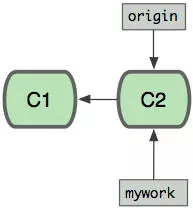
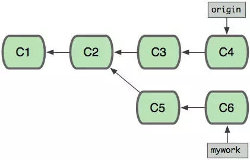
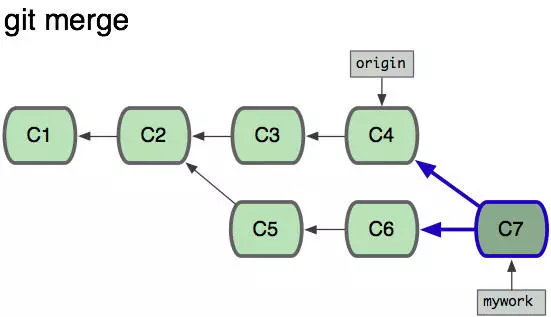
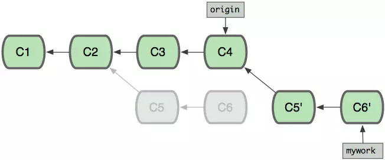

## git基础
记录一些git的实践操作。

### 合并分支(rebase&merge)
其实在git中，合并分支其实有两种形式，一种是merge，一种是rebase。我们先讲讲`git rebase`

git rebase用于把一个分支的修改合并到当前分支。这一点上跟merge就很像。但是本质上还是很大不同的，我们来举个例子，

假如我们一开始有个分支，在C1节点状态，然后做了一些变动到C2,此时checkout出一个分支work，如下图：



然后我们同时，在origin分支和work分支上做修改，这样两条开发分支就会并行：



这时如果想要合并分支(mywork想吸收origin的修改)，git merge的做法，就是向前伸展，找到一个新的前进点，居于C6之后，然后把C4 C6都指向它



如上图，很直观的合并关系。相当于先pull了C4的内容，然后冲突修改，再提交到本地分支。

但是git rebase就有所不同，

```
rebase:
$ git checkout mywork
$ git rebase origin
```

git rebase命令会把你的"mywork"分支里的每个提交(commit)取消掉，并且把它们**临时保存为补丁**(patch)(这些补丁放到".git/rebase"目录中),然后把"mywork"分支更新 为最新的"origin"分支，最后把保存的这些补丁应用到"mywork"分支上。

这就是一种跳跃式前进，找到两个分支的公共父节点，然后以另外一条分支的终点作为起点(rebase)，再来做出变动。



如上图，就是相当于把mywork的修改都当做补丁，打回到新的origin上。当'mywork'分支更新之后，它会指向这些新创建的提交(commit),而那些老的提交会被丢弃。 如果运行垃圾收集命令(pruning garbage collection), 这些被丢弃的提交就会删除

#### 总结
git rebase 和 git merge 作用基本是相同的，二者的一个重要的区别是：历史提交本版的区别。git rebase可以使得你的分支看起来像是没有经历过合并一样。

### 不同项目配置不同username
有时候不同的项目需要使用不同的身份提交，因此需要到项目的`.git`文件夹里去改配置。


在这里添加name和email选项即可了。这样提交的时候用户就不同了。
