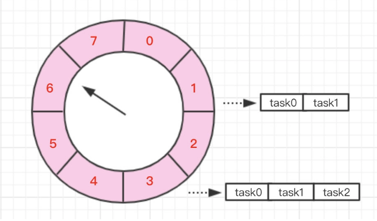
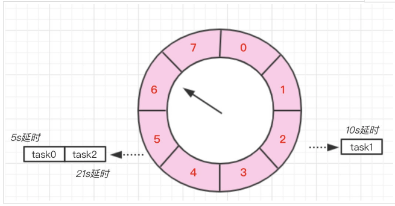
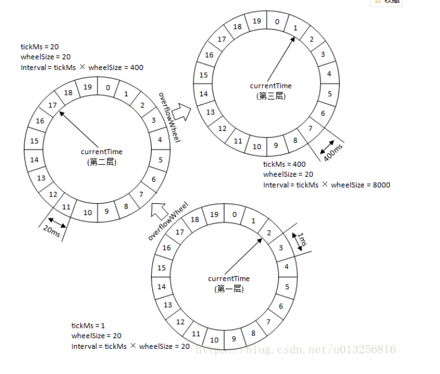
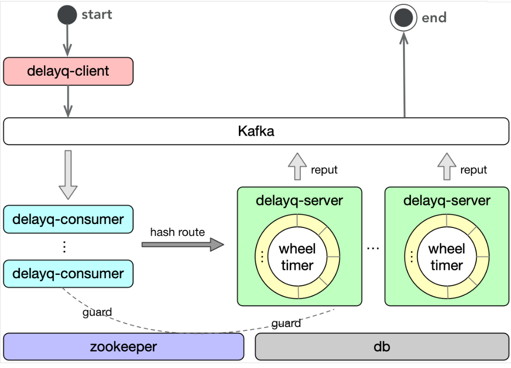
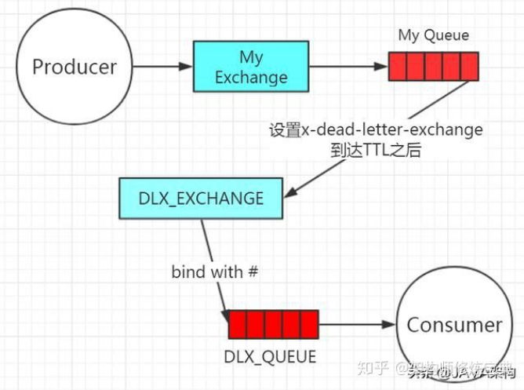
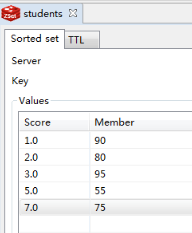

## 延迟队列实现

延时任务，顾名思义，就是延迟一段时间后才执行的任务。举个例子，假设我们有个发布资讯的功能，运营需要在每天早上7点准时发布资讯，但是早上7点大家都还没上班，这个时候就可以使用延时任务来实现资讯的延时发布了。又或者下订单之后20分钟之后发消息。


延迟队列的主要特性是进入队列的消息会被推迟到指定的时间才出队被消费。而对于Kafka队列，消息入队后会排在队尾等待被消费，并不能指定出队时间。因此，延迟队列中的一条消息，除了消息本身外，还需要附加一个“何时出队”的信息。


既然Kafka不支持延迟队列，我们有什么选择呢？


- Java Collections Framework中包含的[DelayQueue](https://docs.oracle.com/javase/9/docs/api/java/util/concurrent/DelayQueue.html)便是延迟队列的实现。然而这毕竟只是一个数据结构，基于它建设一个队列服务的工作量不少。

- RabbitMQ通过[RabbitMQ Delayed Message Plugin](https://github.com/rabbitmq/rabbitmq-delayed-message-exchange)可支持延迟队列。可惜我司的基础设施中没有RabbitMQ。

- Redis的[Sorted Set](https://redis.io/topics/data-types#sorted-sets)可被用于实现简单的延迟队列。利用Redis的Lua支持我们也可以将基建设成一个功能全面的延迟队列服务。

先不着急谈方案，这里再记录一下延时消息实现的一些原理与知识。

### 时间轮

要实现延时消息就不得不提到一种数据结构【`时间轮`】，时间轮听这名字可以很直观的抽象出它的数据结构。




其实本质上它就是一个环形的数组，如图所示，假设我们创建了一个长度为 8 的时间轮

当我们需要新建一个 5s 延时消息，则只需要将它放到下标为 5 的那个槽中。而如果是一个 10s 的延时消息，则需要将它放到下标为 2 (10%8=2)的槽中，**但同时需要记录它所对应的圈数**，不然就和 2 秒的延时消息重复了。当创建一个 21s 的延时消息时，它所在的位置就和5s的消息相同了，都在下标为 5 的槽中，所以为了区别需要为他加上圈数为 2。



当我们需要取出延时消息时，只需要每秒往下移动这个指针，然后取出该位置的所有任务即可。当然取出任务之前还得判断圈数是否为 0 ，不为 0 时说明该任务还得再轮几圈，同时需要将圈数 -1 。这样就可避免轮询所有的任务，不过如果时间轮的槽比较少，导致某一个槽上的任务非常多那效率也比较低，这就和 `HashMap` 的 `hash` 冲突是一样的。

#### 时间轮升降级

如果时间跨度比较大，那该如何处理呢？总不可能把时间轮的slot无限扩充吧，这时就得使用多级时间轮来实现。



第一层的时间轮tickMs=1ms, wheelSize=20, interval=20ms。第二层的时间轮的tickMs为第一层时间轮的interval，即为20ms。每一层时间轮的wheelSize是固定的，都是20，那么第二层的时间轮的总体时间跨度interval为400ms。以此类推，这个400ms也是第三层的tickMs的大小，第三层的时间轮的总体时间跨度为8000ms。

**也就是这三个时间轮可以实现8000ms的操作**

好比说，350ms的定时任务，显然第一层时间轮不能满足条件，所以就升级到第二层时间轮中，最终被插入到第二层时间轮中时间格17所对应的TimerTaskList中。如果此时又有一个定时为450ms的任务，那么显然第二层时间轮也无法满足条件，所以又升级到第三层时间轮中，最终被插入到第三层时间轮中时间格1的TimerTaskList中。注意到在到期时间在[400ms,800ms)区间的多个任务（比如446ms、455ms以及473ms的定时任务）都会被放入到第三层时间轮的时间格1中，时间格1对应的TimerTaskList的超时时间为400ms。

随着时间的流逝，当次TimerTaskList到期之时，原本定时为450ms的任务还剩下50ms的时间，还不能执行这个任务的到期操作。这里就有一个时间轮降级的操作，会将这个剩余时间为50ms的定时任务重新提交到层级时间轮中，此时第一层时间轮的总体时间跨度不够，而第二层足够，所以该任务被放到第二层时间轮到期时间为[40ms,60ms)的时间格中。再经历了40ms之后，此时这个任务又被“察觉”到，不过还剩余10ms，还是不能立即执行到期操作。所以还要再有一次时间轮的降级，此任务被添加到第一层时间轮到期时间为[10ms,11ms)的时间格中，之后再经历10ms后，此任务真正到期，最终执行相应的到期操作。


### Kafka强行实现思路

可不可以用kafka强行实现呢，其实也是可以的。



消息推到kafka之后，服务通过时间轮操作，过期之后重新推到kafka

### RabbitMQ实现延时队列

RabbitMQ，大致可以通过两种方式实现这个需求。用到的就是RabbitMQ的死信队列DLX

当一个消息在一个队列中变成死信之后，它能被重新自动推送到另一个交换机——死信交换机，我们声明一个死信队列，和死信交换机进行绑定之后，死信就会被路由到死信队列。需要注意，**死信交换机和死信交换机都是基于其用途来描述的**，它们实际上也是普通的交换机和普通的队列。如果队列没有指定DLX或者无法被路由到一个DLQ，则队列中过期的消息会被直接丢弃。

**消息的流转流程**

生产者——原交换机——原队列——（超过TTL之后）——死信交换机——死信队列——最终消费者



可知就是消息过时之后，被推到了另外一个队列来处理。

#### rabbitmq-delayed-message-exchange插件

在RabbitMQ 3.5.7及以后的版本提供了一个插件（rabbitmq-delayed-message-exchange）来实现延时队列功能。同时插件依赖Erlang/OPT 18.0及以上。

这种插件的原理方式大致和上面相同。

### Redis实现延时队列

那么这里就介绍使用redis的sorted set来实现延迟队列


zset是set的一个升级版本，他在set的基础上增加了一个顺序属性，这一属性在添加修改元素的时候可以指定，每次指定后，zset会自动重新按新的值调整顺序。 可以对指定键的值进行排序权重的设定，它应用排名模块比较多。

比如一个存储全班同学成绩的 Sorted Sets，其集合 value 可以是同学的学号，而 score 就可以是其考试得分，这样在数据插入集合的时候，就已经进行了天然的排序。另外还可以用 Sorted Sets 来做带权重的队列，比如普通消息的 score 为1，重要消息的 score 为2，然后工作线程可以选择按 score 的倒序来获取工作任务，让重要的任务优先执行。


```java
public function testRedis()
    {//zset 添加元素
        app()->redis->zadd('students', '1', '90');
        app()->redis->zadd('students', '2', '80');
        app()->redis->zadd('students', '3', '95');
        app()->redis->zadd('students', '7', '75');
        app()->redis->zadd('students', '5', '55');
        //取出 zset
        $zset = app()->redis->zrange('students', 0, -1);
        print_r($zset);
        echo "\n";
    }
```


上面是zset的实例代码，实际上存储的结构就是




### 时间戳实现延迟


我们要在redis上实现超时操作，只需要在redis中插入消息的时候插入分数。比如zadd key timestap value


注意这个timestap为，现在的timestap+delay。那就是zadd key delay_timestamp value

因此我们在淘汰数据的时候，使用线程去轮询。每次都用现在的时间做range去查询

```
ZRANGEBYSCORE key 0 now_time
```

处理完就把这个消息处理掉