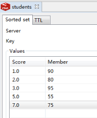

## 延迟队列实现

延时任务，顾名思义，就是延迟一段时间后才执行的任务。举个例子，假设我们有个发布资讯的功能，运营需要在每天早上7点准时发布资讯，但是早上7点大家都还没上班，这个时候就可以使用延时任务来实现资讯的延时发布了。又或者下订单之后20分钟之后发消息。


延迟队列的主要特性是进入队列的消息会被推迟到指定的时间才出队被消费。而对于Kafka队列，消息入队后会排在队尾等待被消费，并不能指定出队时间。因此，延迟队列中的一条消息，除了消息本身外，还需要附加一个“何时出队”的信息。


既然Kafka不支持延迟队列，我们有什么选择呢？


- Java Collections Framework中包含的[DelayQueue](https://docs.oracle.com/javase/9/docs/api/java/util/concurrent/DelayQueue.html)便是延迟队列的实现。然而这毕竟只是一个数据结构，基于它建设一个队列服务的工作量不少。

- RabbitMQ通过[RabbitMQ Delayed Message Plugin](https://github.com/rabbitmq/rabbitmq-delayed-message-exchange)可支持延迟队列。可惜我司的基础设施中没有RabbitMQ。

- Redis的[Sorted Set](https://redis.io/topics/data-types#sorted-sets)可被用于实现简单的延迟队列。利用Redis的Lua支持我们也可以将基建设成一个功能全面的延迟队列服务。


那么这里就介绍使用redis的sorted set来实现延迟队列


zset是set的一个升级版本，他在set的基础上增加了一个顺序属性，这一属性在添加修改元素的时候可以指定，每次指定后，zset会自动重新按新的值调整顺序。 可以对指定键的值进行排序权重的设定，它应用排名模块比较多。

比如一个存储全班同学成绩的 Sorted Sets，其集合 value 可以是同学的学号，而 score 就可以是其考试得分，这样在数据插入集合的时候，就已经进行了天然的排序。另外还可以用 Sorted Sets 来做带权重的队列，比如普通消息的 score 为1，重要消息的 score 为2，然后工作线程可以选择按 score 的倒序来获取工作任务，让重要的任务优先执行。


```java
public function testRedis()
    {//zset 添加元素
        app()->redis->zadd('students', '1', '90');
        app()->redis->zadd('students', '2', '80');
        app()->redis->zadd('students', '3', '95');
        app()->redis->zadd('students', '7', '75');
        app()->redis->zadd('students', '5', '55');
        //取出 zset
        $zset = app()->redis->zrange('students', 0, -1);
        print_r($zset);
        echo "\n";
    }
```


上面是zset的实例代码，实际上存储的结构就是




### 时间戳实现延迟


我们要在redis上实现超时操作，只需要在redis中插入消息的时候插入分数。比如zadd key timestap value


注意这个timestap为，现在的timestap+delay。那就是zadd key delay_timestamp value

因此我们在淘汰数据的时候，使用线程去轮询。每次都用现在的时间做range去查询

```
ZRANGEBYSCORE key 0 now_time
```

处理完就把这个消息处理掉