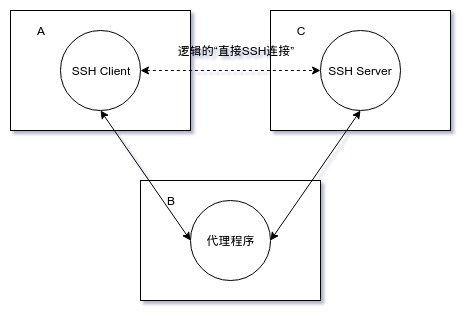

## ssh

### ssh代理
当有一台机器A，欲与机器C建立SSH连接，但由于隔离限制（比如“存在防火墙”）该SSH连接不能直接建立。
ssh命令的“ProxyCommand”选项被设计用来解决以上问题。

通过“ProxyCommand”选项，机器A能够**灵活使用任意代理机制与机器C上的SSH Server端口建立连接**，接着机器A上的SSH Client再与该连接进行数据交互，从而机器A上的SSH Client与机器C上的SSH Server之间建立了与一般“直接SSH连接”不太一样的“间接SSH连接”。不过由于“间接SSH连接”的透明性，**逻辑上可认为机器A上的SSH Client与机器C上的SSH Server建立了“直接SSH连接”**。



#### 代理机制1
“ProxyCommand”选项值形式为“ssh -W C:CPort -l USER -i PRIVATE_KEY -p BPort B”

原理：ssh命令自提供的代理机制，在机器A上另外单独建立与B的SSH连接，该SSH连接的B端侧与机器C上的SSH Server端口（即“C:CPort”）建立连接，该SSH连接的A端侧与机器A上的SSH Client（即“最终欲建立‘间接SSH连接’在机器A上的SSH Client”）建立连接。

```
Host C
    HostName %h
    User dsl 
    Port 1046
    IdentityFile ~/.ssh/id_rsa
    ProxyCommand ssh -W %h:%p B
```

**zwlj：这里便是用ssh(A->B)接ssh(B->C)来实现通道打通**


#### 代理机制2
“ProxyCommand”选项值形式为“nc -X 5 -x B:BPort C CPort”

原理：利用“nc”命令，在机器A上使用“nc”命令与代理服务器（即“-x B:BPort”，通过“-X 5”参数来指定与代理服务器的通信协议为“SOCKS4/SOCKS5/HTTPS”）建立代理连接。该代理连接的B端侧与机器C上的SSH Server端口（即“C CPort”）建立连接，该代理连接的A端侧与机器A上的SSH Client（即“最终欲建立‘间接SSH连接’在机器A上的SSH Client”）建立连接。

```
Host C
    HostName %h
    User dsl 
    Port 1046
    IdentityFile ~/.ssh/id_rsa
    ProxyCommand nc -X 5 -x B:8989 %h %p

```

**zwlj：这里便是用代理协议(A->B http/https/socks5)接ssh(B->C)来实现通道打通**

根据以上所述，此时在A上应该有一个NC进程和一个SSH进程，前者对应于“A与B的代理连接”，后者对应于“A与C的SSH连接”