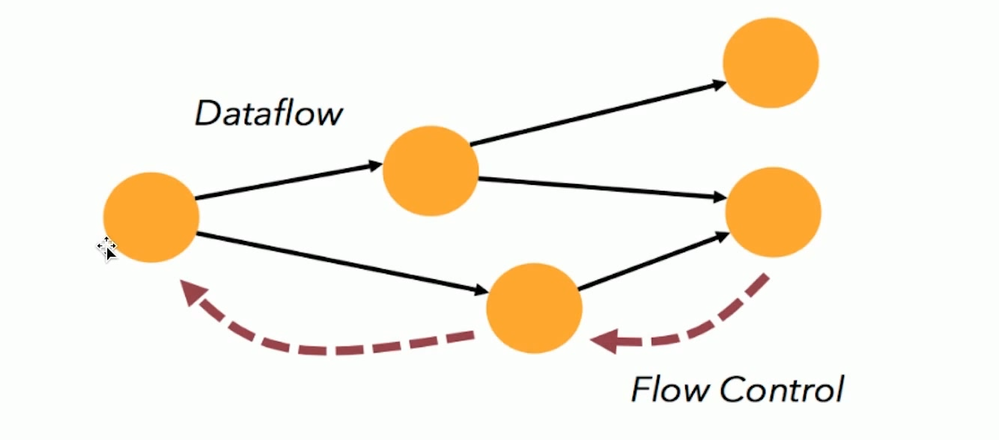

## Flink基础概念

Flink 是一个流处理框架，支持流处理和批处理，特点是流处理有限，可容错，可扩展，高吞吐，低延迟。

流处理是处理一条，立马下一个节点会从缓存中取出，在下一个节点进行计算

批处理是只有处理一批完成后，才会经过网络传输到下一个节点

流处理的优点是低延迟 批处理的优点是高吞吐

ps: 之前的流处理方案，一个是storm，延时可以达到很低但是吞吐量不是很高。Spark Streaming是对spark的扩展，把数据切成一段段批处理，吞吐量很高，但是延时去到秒级。因此Flink应运而生

### 应用场景

- 实时监控(用户行为，风控规则预警)
- 实时报表 (双11直播大屏 精细化运营)
- 流数据分析(智能推送，内容投放，个性化推荐)
- 实时数据仓库

### 核心特性1 时间机制

见flink时间窗口笔记

### 核心特性2 分布式快照容错

Flink 容错机制的关键部分是为分布式数据系统建立一致性快照和操作状态。这些快照充当一致性检查点，在出现失败时，就可以回滚。

Flink分布式快照中的一个关键元素是流栅栏（stream barriers）。这个栅栏被注入到数据流中，这些记录流作为数据流的一部分。Barriers 绝不超车其他的记录，会严格的保证顺序。Barrier将记录分割成记录集，并流入不同的快照中。每一个barrier都为快照携带一个ID。Barries不会打断数据流的流动，因此非常的轻量。不同快照的多个barrier可以在一个流中同时出现，这就意味着不同的快照会同时发生。

更多详见相关笔记

### 核心特性3 状态计算支持

支持有状态的计算框架

以访问日志统计量的例子进行说明，比如当前拿到一个 Nginx 访问日志，一条日志表示一个请求，记录该请求从哪里来，访问的哪个地址，需要实时统计每个地址总共被访问了多少次，也即每个 API 被调用了多少次。可以看到下面简化的输入和输出，输入第一条是在某个时间点请求 GET 了 /api/a；第二条日志记录了某个时间点 Post  /api/b ;第三条是在某个时间点 GET 了一个 /api/a，总共有 3 个 Nginx 日志。从这 3 条 Nginx 日志可以看出，第一条进来输出 /api/a 被访问了一次，第二条进来输出 /api/b 被访问了一次，紧接着又进来一条访问 api/a，所以 api/a 被访问了 2 次。不同的是，两条 /api/a 的 Nginx 日志进来的数据是一样的，但输出的时候结果可能不同，第一次输出 count=1 ，第二次输出 count=2，说明相同输入可能得到不同输出。输出的结果取决于当前请求的 API 地址之前累计被访问过多少次。第一条过来累计是 0 次，count = 1，第二条过来 API 的访问已经有一次了，所以 /api/a 访问累计次数 count=2。单条数据其实仅包含当前这次访问的信息，而不包含所有的信息。要得到这个结果，还需要依赖 API 累计访问的量，即状态

### 核心特性4 反压连续流模型

下游节点处理不过来的时候会通过流控的方式通知上游节点，一层层通知到源节点去控制一个消费的速度。