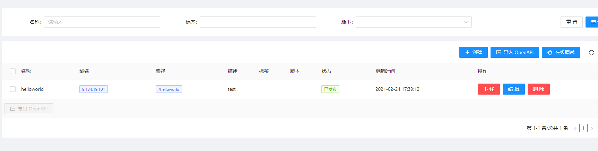

# apisix基本概念

### Route
Route 字面意思就是路由，通过定义一些规则来匹配客户端的请求，然后根据匹配结果加载并执行相应的 插件，并把请求转发给到指定 Upstream。


Route 中主要包含三部分内容：匹配规则(比如 uri、host、remote_addr 等)，插件配置(限流限速等)和上游信息。 请看下图示例，是一些 Route 规则的实例，当某些属性值相同时，图中用相同颜色标识。


**ps：apisix中的upstream指的其实是我们一般意义说的下游服务**


一个route其实就是对应着一些路由规则

在dashboard里，可以配置相应的upstream以及插件




### Upstream

我们所说的下游服务，既是upstream，在apisix里反而叫上游服务

Upstream 是虚拟主机抽象，对给定的多个服务节点按照配置规则进行负载均衡。Upstream 的地址信息可以直接配置到 `Route`（或 `Service`) 上，当 Upstream 有重复时，就需要用“引用”方式避免重复了。


### Service

`Service` 是某类 API 的抽象（也可以理解为一组 Route 的抽象）。它通常与上游服务抽象是一一对应的，`Route` 与 `Service` 之间，通常是 N:1 的关系，参看下图。


**ps：简而言之，service其实就是upstream + plugin**

### Plugin

`Plugin` 表示将在 `HTTP` 请求/响应生命周期期间执行的插件配置。

`Plugin` 配置可直接绑定在 `Route` 上，也可以被绑定在 `Service` 或 `Consumer`上。而对于同一 个插件的配置，只能有一份是有效的，配置选择优先级总是 `Consumer` > `Route` > `Service`。

在 `conf/config.yaml` 中，可以声明本地 APISIX 节点都支持哪些插件。这是个白名单机制，不在该 白名单的插件配置，都将会被自动忽略。这个特性可用于临时关闭或打开特定插件，应对突发情况非常有效。 如果你想在现有插件的基础上新增插件，注意需要拷贝 `conf/config-default.yaml` 的插件节点内容到 `conf/config.yaml` 的插件节点中。

插件的配置可以被直接绑定在指定 Route 中，也可以被绑定在 Service 中，不过 Route 中的插件配置 优先级更高。

一个插件在一次请求中只会执行一次，即使被同时绑定到多个不同对象中（比如 Route 或 Service）。 插件运行先后顺序是根据插件自身的优先级来决定的，例如：

```
local _M = {
    version = 0.1,
    priority = 0, -- 这个插件的优先级为 0
    name = plugin_name,
    schema = schema,
    metadata_schema = metadata_schema,
}
```

插件配置作为 Route 或 Service 的一部分提交的，放到 `plugins` 下。它内部是使用插件 名字作为哈希的 key 来保存不同插件的配置项。

```
{
    ...
    "plugins": {
        "limit-count": {
            "count": 2,
            "time_window": 60,
            "rejected_code": 503,
            "key": "remote_addr"
        },
        "prometheus": {}
    }
}
```

并不是所有插件都有具体配置项，比如 `prometheus` 下是没有任何具体配置项，这时候用一个空的对象 标识即可。

如果一个请求因为某个插件而被拒绝，会有类似这样的 warn 日志：`ip-restriction exits with http status code 403`。

### Script

`Script` 表示将在 `HTTP` 请求/响应生命周期期间执行的脚本。

`Script` 配置可直接绑定在 `Route` 上。

`Script` 与 `Plugin` 互斥，且优先执行 `Script` ，这意味着配置 `Script` 后，`Route` 上配置的 `Plugin` 将不被执行。

理论上，在 `Script` 中可以写任意 lua 代码，也可以直接调用已有插件以重用已有的代码。

`Script` 也有执行阶段概念，支持 `access`、`header_filter`、`body_filter` 和 `log` 阶段。系统会在相应阶段中自动执行 `Script` 脚本中对应阶段的代码。

### 

