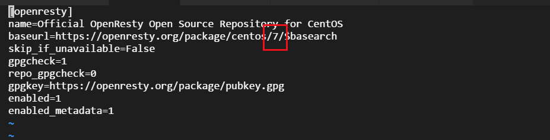
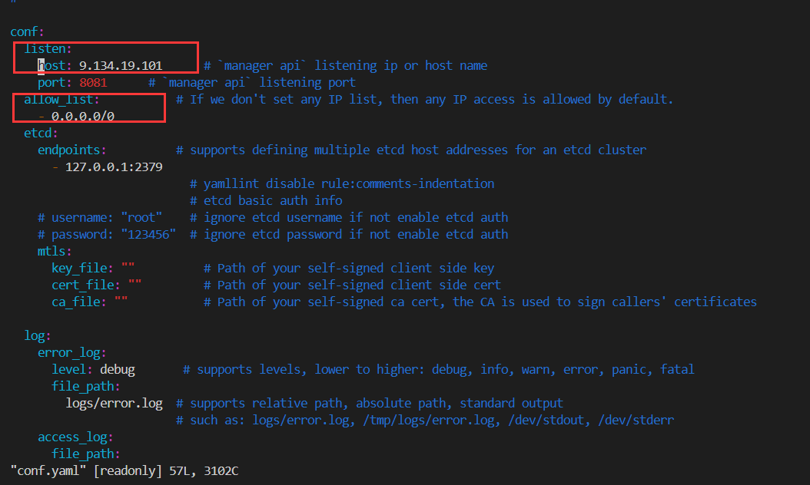

# apisix部署

### rpm包安装

```
sudo yum install -y https://github.com/apache/apisix/releases/download/2.3/apisix-2.3-0.x86_64.rpm
```
查看版本和打开网关

```
apisix version

apisix start
```
### 编译安装
尝试在tlinux下安装依赖，有依赖之后打开etcd

```
# 安装 epel, `luarocks` 需要它
wget http://dl.fedoraproject.org/pub/epel/epel-release-latest-7.noarch.rpm
sudo rpm -ivh epel-release-latest-7.noarch.rpm

# 安装 etcd
wget https://github.com/etcd-io/etcd/releases/download/v3.4.13/etcd-v3.4.13-linux-amd64.tar.gz
tar -xvf etcd-v3.4.13-linux-amd64.tar.gz && \
    cd etcd-v3.4.13-linux-amd64 && \
    sudo cp -a etcd etcdctl /usr/bin/

# 开启 etcd server
nohup etcd &
```

依赖还没装完，最重要的就是安装openresty

```
# add the yum repo:
wget https://openresty.org/package/centos/openresty.repo
sudo mv openresty.repo /etc/yum.repos.d/
```

上面两个操作是为了添加yum源到配置文件里，但是tlinux有个很恶心的地方，它默认的版本是错的
这会导致访问外网的yum源软件失败，找不到地址。
我们已知tlinux是基于centos7定制的，所以把对应url的版本改了

我们cd 进 /etc/yum.repos.d/
然后vi openresty.repo 



红框圈中的地方改成7

然后就开始正式安装openresty了
```
yum install -y openresty curl git gcc openresty-openssl111-devel openresty-openssl-devel unzip
yum install openresty-openssl-devel
```

接下来开始安装本体(用编译的方式)

```
mkdir apisix-2.3
wget https://downloads.apache.org/apisix/2.3/apache-apisix-2.3-src.tgz
tar zxvf apache-apisix-2.3-src.tgz -C apisix-2.3
```

进入到apisix的目录
```
make deps
```

编译好后就可以查看版本和打开网关

```
./bin/apisix version

./bin/apisix start
```

### dashboard

dashboard现在和apisix项目分离部署

yum可以直接安装

```
sudo yum install -y https://github.com/apache/apisix-dashboard/releases/download/v2.4/apisix-dashboard-2.4-0.x86_64.rpm
sudo nohup manager-api -p /usr/local/apisix/dashboard/ &
```

若要使得非本机访问，则监听的ip，以及权限列表都要做改动
在 /usr/local/apisix/dashboard/conf中




### apisix配置

默认配置都是在 /usr/local/apisix/conf 里，
里面要配置一下etcd
通过修改本地 conf/config.yaml 文件，或者在启动 APISIX 时使用 -c 或 --config 添加文件路径参数 apisix start -c <path string>，完成对 APISIX 服务本身的基本配置。

比如指定 APISIX 默认监听端口为 8000，并且设置 etcd 地址为 http://foo:2379， 其他配置保持默认。在 config.yaml 中只需这样配置：

```
apisix:
  node_listen: 8000             # APISIX listening port

etcd:
  host: "http://foo:2379"       # etcd address
```

具体在config-default.yaml可以看到全局模板

注意 不要手工修改 APISIX 自身的 conf/nginx.conf 文件，当服务每次启动时，apisix 会根据 config.yaml 配置自动生成新的 conf/nginx.conf 并自动启动服务。


### 热加载插件

只需要通过 admin API 发送一个 HTTP 请求即可：

```
curl http://127.0.0.1:9080/apisix/admin/plugins/reload -H 'X-API-KEY: edd1c9f034335f136f87ad84b625c8f1' -X PUT
```

