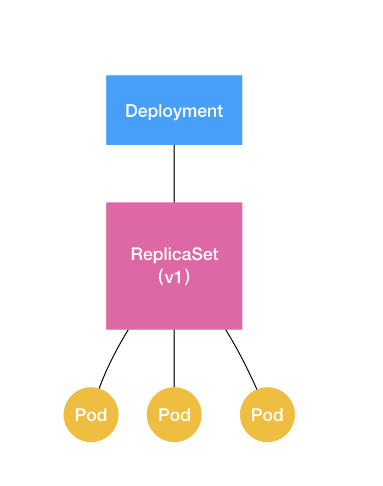
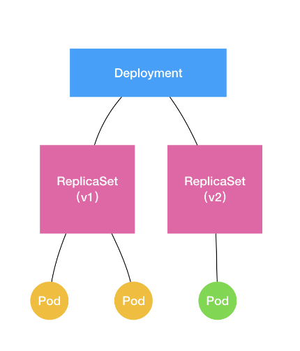

## Deployment控制器

在说deployment之前，先说一下ReplicaSet对象。我们知道k8s都是通过声明式api，也就是api对象来对一些容器进行控制的。

而存在一种对象 ReplicaSet

### ReplicaSet

ReplicaSet 的结构非常简单，我们可以通过这个 YAML 文件查看一下

```yaml
apiVersion: apps/v1
kind: ReplicaSet
metadata:
  name: nginx-set
  labels:
    app: nginx
spec:
  replicas: 3
  selector:
    matchLabels:
      app: nginx
  template:
    metadata:
      labels:
        app: nginx
    spec:
      containers:
      - name: nginx
        image: nginx:1.7.9
```

从这个 YAML 文件中，我们可以看到，**一个 ReplicaSet 对象，其实就是由副本数目的定义和一个 Pod 模板组成的**。不难发现，它的定义其实是 Deployment 的一个子集。

**更重要的是，Deployment 控制器实际操纵的，正是这样的 ReplicaSet 对象，而不是 Pod 对象。**



如上图，deployment对象通过控制replicaset来控制pod

```
apiVersion: apps/v1
kind: Deployment
metadata:
  name: nginx-deployment
  labels:
    app: nginx
spec:
  replicas: 3
  selector:
    matchLabels:
      app: nginx
  template:
    metadata:
      labels:
        app: nginx
    spec:
      containers:
      - name: nginx
        image: nginx:1.7.9
        ports:
        - containerPort: 80

```

ReplicaSet 负责通过“控制器模式”，保证系统中 Pod 的个数永远等于指定的个数（比如，3 个）。这也正是 Deployment 只允许容器的 restartPolicy=Always 的主要原因：只有在容器能保证自己始终是 Running 状态的前提下，ReplicaSet 调整 Pod 的个数才有意义。

而在此基础上，Deployment 同样通过“控制器模式”，来操作 ReplicaSet 的个数和属性

### 滚动更新

接下来说说滚动更新，什么是滚动更新呢？**将一个集群中正在运行的多个 Pod 版本，交替地逐一升级的过程，就是“滚动更新”。**

也就是pod内容的版本升级

修改 Deployment 有很多方法。比如，我可以直接使用 kubectl edit 指令编辑 Etcd 里的 API 对象。

```
$ kubectl edit deployment/nginx-deployment
... 
    spec:
      containers:
      - name: nginx
        image: nginx:1.9.1 # 1.7.9 -> 1.9.1
        ports:
        - containerPort: 80
...
deployment.extensions/nginx-deployment edited

```

这个 kubectl edit 指令，会帮你直接打开 nginx-deployment 的 API 对象。然后，你就可以修改这里的 Pod 模板部分了。比如，在这里，我将 nginx 镜像的版本升级到了 1.9.1。

保存退出，Kubernetes 就会立刻触发“滚动更新”的过程。

还可以通过 kubectl rollout status 指令查看 nginx-deployment 的状态变化：

可以通过查看 Deployment 的 Events，看到这个“滚动更新”的流程：

```
$ kubectl describe deployment nginx-deployment
...
Events:
  Type    Reason             Age   From                   Message
  ----    ------             ----  ----                   -------
...
  Normal  ScalingReplicaSet  24s   deployment-controller  Scaled up replica set nginx-deployment-1764197365 to 1
  Normal  ScalingReplicaSet  22s   deployment-controller  Scaled down replica set nginx-deployment-3167673210 to 2
  Normal  ScalingReplicaSet  22s   deployment-controller  Scaled up replica set nginx-deployment-1764197365 to 2
  Normal  ScalingReplicaSet  19s   deployment-controller  Scaled down replica set nginx-deployment-3167673210 to 1
  Normal  ScalingReplicaSet  19s   deployment-controller  Scaled up replica set nginx-deployment-1764197365 to 3
  Normal  ScalingReplicaSet  14s   deployment-controller  Scaled down replica set nginx-deployment-3167673210 to 0
```

修改了 Deployment 里的 Pod 定义之后，Deployment Controller 会使用这个修改后的 Pod 模板，创建一个新的 ReplicaSet（hash=1764197365），这个新的 ReplicaSet 的初始 Pod 副本数是：0。

然后，在 Age=24 s 的位置，Deployment Controller 开始将这个新的 ReplicaSet 所控制的 Pod 副本数从 0 个变成 1 个，即：“水平扩展”出一个副本。

紧接着，在 Age=22 s 的位置，Deployment Controller 又将旧的 ReplicaSet（hash=3167673210）所控制的旧 Pod 副本数减少一个，即：“水平收缩”成两个副本。

如此交替进行，新 ReplicaSet 管理的 Pod 副本数，从 0 个变成 1 个，再变成 2 个，最后变成 3 个。而旧的 ReplicaSet 管理的 Pod 副本数则从 3 个变成 2 个，再变成 1 个，最后变成 0 个。这样，就完成了这一组 Pod 的版本升级过程。

结合以上讲述，现在我们可以扩展一下 Deployment、ReplicaSet 和 Pod 的关系图了。



如上所示，Deployment 的控制器，实际上控制的是 ReplicaSet 的数目，以及每个 ReplicaSet 的属性。

而一个应用的版本，对应的正是一个 ReplicaSet；这个版本应用的 Pod 数量，则由 ReplicaSet 通过它自己的控制器（ReplicaSet Controller）来保证。