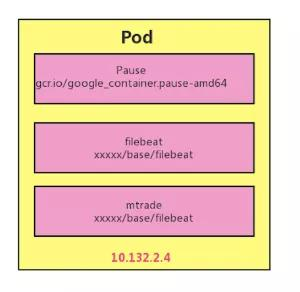
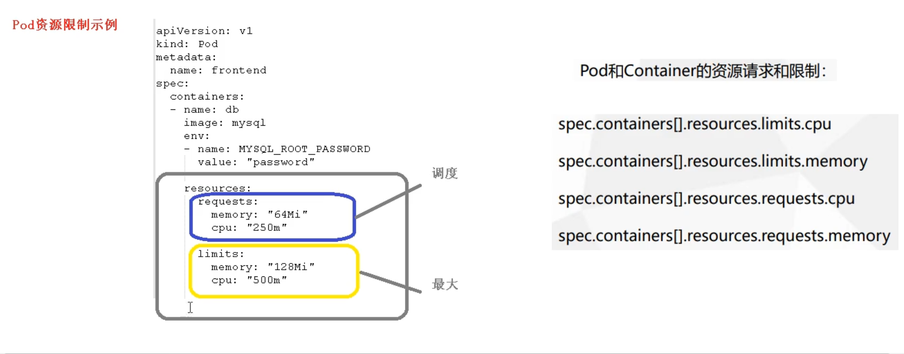
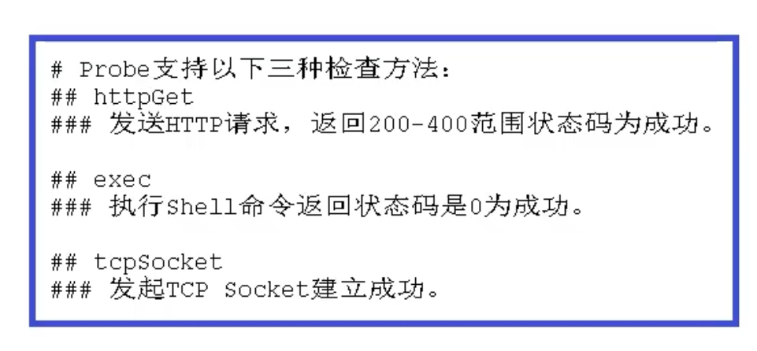

## Pod使用

### 根容器

每个 Pod 中的容器由一个特殊的 **Pause 容器**，及一个或多个紧密相关的业务容器组成。Pause 容器是 Pod 的根容器，对应的镜像属于 Kubernetes 平台的一部分，以它的状态代表整个容器组的状态。同一个 Pod 里的容器之间仅需通过 localhost 就能互相通信。

每个 Pod 会被 Kubernetes 网络组件分配一个唯一的(在集群内的 IP 地址，称为 Pod IP，这样就允许不同 Pod 中的服务可以使用同一端口




ps：pasue进程创建以后，业务进程会加入到pasue进程当中。怎么理解加入两个字呢，其实就是可以了解为业务进程作为了pasue进程的子进程。pasue进程创建了一个namesapce，pid为1。 业务进程也加入了这个namespace，并且加入到了pasuse子进程树的树形结构当中。这么做，僵尸进程就能很好被管理。

### 一些yaml字段解释

介绍 Pod  yaml中几个重要字段的含义和用法。下面先介绍的几个字段，都是pod级别的字段

**NodeSelector：是一个供用户将 Pod 与 Node 进行绑定的字段**，用法如下所示：

```yaml
apiVersion: v1
kind: Pod
...
spec:
 nodeSelector:
   disktype: ssd
```

这样的一个配置，意味着这个 Pod 永远只能运行在携带了“disktype: ssd”标签（Label）的节点(机器)上；否则，它将调度失败。

**NodeName**：一旦 Pod 的这个字段被赋值，Kubernetes 项目就会被认为这个 Pod 已经经过了调度，调度的结果就是赋值的节点名字。所以，这个字段一般由调度器负责设置，但用户也可以设置它来“骗过”调度器，当然这个做法一般是在测试或者调试的时候才会用到。

**HostAliases：定义了 Pod 的 hosts 文件（比如 /etc/hosts）里的内容**，用法如下：

```
apiVersion: v1
kind: Pod
...
spec:
  hostAliases:
  - ip: "10.1.2.3"
    hostnames:
    - "foo.remote"
    - "bar.remote"
...
```

在这个 Pod 的 YAML 文件中，我设置了一组 IP 和 hostname 的数据。这样，这个 Pod 启动后，/etc/hosts 文件的内容将如下所示：

```
cat /etc/hosts
# Kubernetes-managed hosts file.
127.0.0.1 localhost
...
10.244.135.10 hostaliases-pod
10.1.2.3 foo.remote
10.1.2.3 bar.remote
```

其中，最下面两行记录，就是我通过 HostAliases 字段为 Pod 设置的。需要指出的是，在 Kubernetes 项目中，如果要设置 hosts 文件里的内容，一定要通过这种方法。否则，如果直接修改了 hosts 文件的话，在 Pod 被删除重建之后，kubelet 会自动覆盖掉被修改的内容。

除了上述跟“机器”相关的配置外，你可能也会发现，**凡是跟容器的 Linux Namespace 相关的属性，也一定是 Pod 级别的**。这个原因也很容易理解：Pod 的设计，就是要让它里面的容器尽可能多地共享 Linux Namespace，仅保留必要的隔离和限制能力。这样，Pod 模拟出的效果，就跟虚拟机里程序间的关系非常类似了。


举个例子，在下面这个 Pod 的 YAML 文件中，我定义了 shareProcessNamespace=true：

```yaml
apiVersion: v1
kind: Pod
metadata:
  name: nginx
spec:
  shareProcessNamespace: true
  containers:
  - name: nginx
    image: nginx
  - name: shell
    image: busybox
    stdin: true
    tty: true
```

而在这个 YAML 文件中，我还定义了两个容器：一个是 nginx 容器，一个是开启了 tty 和 stdin 的 shell 容器。

我在前面介绍容器基础时，曾经讲解过什么是 tty 和 stdin。而在 Pod 的 YAML 文件里声明开启它们俩，其实等同于设置了 docker run 里的 -it（-i 即 stdin，-t 即 tty）参数。

于是，这个 Pod 被创建后，你就可以使用 shell 容器的 tty 跟这个容器进行交互了：

```
kubectl create -f nginx.yaml
kubectl attach -it nginx -c shell
```

这样，我们就可以在 shell 容器里执行 ps 指令，查看所有正在运行的进程：

```
$ kubectl attach -it nginx -c shell
/ # ps ax
PID   USER     TIME  COMMAND
    1 root      0:00 /pause
    8 root      0:00 nginx: master process nginx -g daemon off;
   14 101       0:00 nginx: worker process
   15 root      0:00 sh
   21 root      0:00 ps ax
```

可以看到，在这个容器里，我们不仅可以看到它本身的 ps ax 指令，还可以看到 nginx 容器的进程，以及 Infra 容器的 /pause 进程。这就意味着，整个 Pod 里的每个容器的进程，对于所有容器来说都是可见的：它们共享了同一个 PID Namespace。

类似地，**凡是 Pod 中的容器要共享宿主机的 Namespace，也一定是 Pod 级别的定义**，比如：

```yaml
apiVersion: v1
kind: Pod
metadata:
  name: nginx
spec:
  hostNetwork: true
  hostIPC: true
  hostPID: true
  containers:
  - name: nginx
    image: nginx
  - name: shell
    image: busybox
    stdin: true
    tty: true
```

在这个 Pod 中，我定义了共享宿主机的 Network、IPC 和 PID Namespace。这就意味着，这个 Pod 里的所有容器，会直接使用宿主机的网络、直接与宿主机进行 IPC 通信、看到宿主机里正在运行的所有进程。

当然，除了这些属性，Pod 里最重要的字段当属“Containers”了。

#### container级别配置字段

**首先，是 ImagePullPolicy 字段**。它定义了镜像拉取的策略。而它之所以是一个 Container 级别的属性，是因为容器镜像本来就是 Container 定义中的一部分。ImagePullPolicy 的值默认是 Always，即每次创建 Pod 都重新拉取一次镜像。另外，当容器的镜像是类似于 nginx 或者 nginx:latest 这样的名字时，ImagePullPolicy 也会被认为 Always。

而如果它的值被定义为 Never 或者 IfNotPresent，则意味着 Pod 永远不会主动拉取这个镜像，或者只在宿主机上不存在这个镜像时才拉取。

**其次，是 Lifecycle 字段**。它定义的是 Container Lifecycle Hooks。顾名思义，Container Lifecycle Hooks 的作用，是在容器状态发生变化时触发一系列“钩子”。我们来看这样一个例子：

```yaml
apiVersion: v1
kind: Pod
metadata:
  name: lifecycle-demo
spec:
  containers:
  - name: lifecycle-demo-container
    image: nginx
    lifecycle:
      postStart:
        exec:
          command: ["/bin/sh", "-c", "echo Hello from the postStart handler > /usr/share/message"]
      preStop:
        exec:
          command: ["/usr/sbin/nginx","-s","quit"]
```

这是一个来自 Kubernetes 官方文档的 Pod 的 YAML 文件。它其实非常简单，只是定义了一个 nginx 镜像的容器。不过，在这个 YAML 文件的容器（Containers）部分，你会看到这个容器分别设置了一个 postStart 和 preStop 参数。这是什么意思呢？

先说 postStart 吧。它指的是，在容器启动后，立刻执行一个指定的操作。需要明确的是，postStart 定义的操作，虽然是在 Docker 容器 ENTRYPOINT 执行之后，但它并不严格保证顺序。也就是说，在 postStart 启动时，ENTRYPOINT 有可能还没有结束。

当然，如果 postStart 执行超时或者错误，Kubernetes 会在该 Pod 的 Events 中报出该容器启动失败的错误信息，导致 Pod 也处于失败的状态。

而类似地，preStop 发生的时机，则是容器被杀死之前（比如，收到了 SIGKILL 信号）。而需要明确的是，preStop 操作的执行，是同步的。所以，它会阻塞当前的容器杀死流程，直到这个 Hook 定义操作完成之后，才允许容器被杀死，这跟 postStart 不一样。

所以，在这个例子中，我们在容器成功启动之后，在 /usr/share/message 里写入了一句“欢迎信息”（即 postStart 定义的操作）。而在这个容器被删除之前，我们则先调用了 nginx 的退出指令（即 preStop 定义的操作），从而实现了容器的“优雅退出”。

### 资源限制

pod一个很重要的作用就是做资源限制，yaml文件里可以对pod做配置



如上图，yaml文件里，resources字段指示了pod中的某个容器需要占用的资源。request是指，去调度分配到node的时候，不能小于这个值。比如上图，node机器的内存必须大于64M才能被调度。而最大则是限制了这个docker容器最多只能使用128M的内存和0.5core的cpu资源。

### 生命周期

Pod 生命周期的变化，主要体现在 Pod API 对象的**Status 部分**，这是它除了 Metadata 和 Spec 之外的第三个重要字段。

其中，pod.status.phase，就是 Pod 的当前状态，它有如下几种可能的情况：

1. Pending。这个状态意味着，Pod 的 YAML 文件已经提交给了 Kubernetes，API 对象已经被创建并保存在 Etcd 当中。但是，这个 Pod 里有些容器因为某种原因而不能被顺利创建。比如，调度不成功。
2. Running。这个状态下，Pod 已经调度成功，跟一个具体的节点绑定。它包含的容器都已经创建成功，并且至少有一个正在运行中。
3. Succeeded。这个状态意味着，Pod 里的所有容器都正常运行完毕，并且已经退出了。这种情况在运行一次性任务时最为常见。
4. Failed。这个状态下，Pod 里至少有一个容器以不正常的状态（非 0 的返回码）退出。这个状态的出现，意味着你得想办法 Debug 这个容器的应用，比如查看 Pod 的 Events 和日志。
5. Unknown。这是一个异常状态，意味着 Pod 的状态不能持续地被 kubelet 汇报给 kube-apiserver，这很有可能是主从节点（Master 和 Kubelet）间的通信出现了问题。


### 数据卷

在 Kubernetes 中，有几种特殊的 Volume，它们存在的意义不是为了存放容器里的数据，也不是用来进行容器和宿主机之间的数据交换。这些特殊 Volume 的作用，是为容器**提供预先定义好的数据**。所以，从容器的角度来看，这些 Volume 里的信息就是仿佛是**被 Kubernetes“投射”（Project）进入容器当中的**。这正是 Projected Volume 的含义。

到目前为止，Kubernetes 支持的 Projected Volume 一共有四种：

1. Secret；
2. ConfigMap；
3. Downward API；
4. ServiceAccountToken。


#### Secret

它的作用，是帮你把 Pod 想要访问的加密数据，存放到 Etcd 中。然后，你就可以通过在 Pod 的容器里挂载 Volume 的方式，访问到这些 Secret 里保存的信息了。

Secret 最典型的使用场景，莫过于存放数据库的 Credential 信息，比如下面这个例子：


```
apiVersion: v1
kind: Pod
metadata:
  name: test-projected-volume 
spec:
  containers:
  - name: test-secret-volume
    image: busybox
    args:
    - sleep
    - "86400"
    volumeMounts:
    - name: mysql-cred
      mountPath: "/projected-volume"
      readOnly: true
  volumes:
  - name: mysql-cred
    projected:
      sources:
      - secret:
          name: user
      - secret:
          name: pass
```

在这个 Pod 中，定义了一个简单的容器。它声明挂载的 Volume，并不是常见的 emptyDir 或者 hostPath 类型，而是 projected 类型。而这个 Volume 的数据来源（sources），则是名为 user 和 pass 的 Secret 对象，分别对应的是数据库的用户名和密码。

这里用到的数据库的用户名、密码，正是以 Secret 对象的方式交给 Kubernetes 保存的。完成这个操作的指令，如下所示：

```
$ cat ./username.txt
admin
$ cat ./password.txt
c1oudc0w!
 
$ kubectl create secret generic user --from-file=./username.txt
$ kubectl create secret generic pass --from-file=./password.txt
```

其中，username.txt 和 password.txt 文件里，存放的就是用户名和密码；而 user 和 pass，则是我为 Secret 对象指定的名字。而我想要查看这些 Secret 对象的话，只要执行一条 kubectl get 命令就可以了：

```
$ kubectl get secrets
NAME           TYPE                                DATA      AGE
user          Opaque                                1         51s
pass          Opaque                                1         51s
```

当然，除了使用 kubectl create secret 指令外，我也可以直接通过编写 YAML 文件的方式来创建这个 Secret 对象，比如：

```
apiVersion: v1
kind: Secret
metadata:
  name: mysecret
type: Opaque
data:
  user: YWRtaW4=
  pass: MWYyZDFlMmU2N2Rm

```

当 Pod 变成 Running 状态之后，我们再验证一下这些 Secret 对象是不是已经在容器里了：

```
$ kubectl exec -it test-projected-volume -- /bin/sh
$ ls /projected-volume/
user
pass
$ cat /projected-volume/user
root
$ cat /projected-volume/pass
1f2d1e2e67df
```

从返回结果中，我们可以看到，保存在 Etcd 里的用户名和密码信息，已经以文件的形式出现在了容器的 Volume 目录里。而这个文件的名字，就是 kubectl create secret 指定的 Key，或者说是 Secret 对象的 data 字段指定的 Key。

更重要的是，像这样通过挂载方式进入到容器里的 Secret，一旦其对应的 Etcd 里的数据被更新，这些 Volume 里的文件内容，同样也会被更新。其实，**这是 kubelet 组件在定时维护这些 Volume。**

需要注意的是，这个更新可能会有一定的延时。所以**在编写应用程序时，在发起数据库连接的代码处写好重试和超时的逻辑，绝对是个好习惯。**

#### ConfigMap

**与 Secret 类似的是 ConfigMap**，它与 Secret 的区别在于，ConfigMap 保存的是不需要加密的、应用所需的配置信息。而 ConfigMap 的用法几乎与 Secret 完全相同：你可以使用 kubectl create configmap 从文件或者目录创建 ConfigMap，也可以直接编写 ConfigMap 对象的 YAML 文件。

比如，一个 Java 应用所需的配置文件（.properties 文件），就可以通过下面这样的方式保存在 ConfigMap 里：

```
# .properties 文件的内容
$ cat example/ui.properties
color.good=purple
color.bad=yellow
allow.textmode=true
how.nice.to.look=fairlyNice
 
# 从.properties 文件创建 ConfigMap
$ kubectl create configmap ui-config --from-file=example/ui.properties
 
# 查看这个 ConfigMap 里保存的信息 (data)
$ kubectl get configmaps ui-config -o yaml
apiVersion: v1
data:
  ui.properties: |
    color.good=purple
    color.bad=yellow
    allow.textmode=true
    how.nice.to.look=fairlyNice
kind: ConfigMap
metadata:
  name: ui-config
```


#### Downward API

它的作用是：让 Pod 里的容器能够直接获取到这个 Pod API 对象本身的信息。

```
apiVersion: v1
kind: Pod
metadata:
  name: test-downwardapi-volume
  labels:
    zone: us-est-coast
    cluster: test-cluster1
    rack: rack-22
spec:
  containers:
    - name: client-container
      image: k8s.gcr.io/busybox
      command: ["sh", "-c"]
      args:
      - while true; do
          if [[ -e /etc/podinfo/labels ]]; then
            echo -en '\n\n'; cat /etc/podinfo/labels; fi;
          sleep 5;
        done;
      volumeMounts:
        - name: podinfo
          mountPath: /etc/podinfo
          readOnly: false
  volumes:
    - name: podinfo
      projected:
        sources:
        - downwardAPI:
            items:
              - path: "labels"
                fieldRef:
                  fieldPath: metadata.labels
```

在这个 Pod 的 YAML 文件中，我定义了一个简单的容器，声明了一个 projected 类型的 Volume。只不过这次 Volume 的数据来源，变成了 Downward API。而这个 Downward API Volume，则声明了要暴露 Pod 的 metadata.labels 信息给容器。

通过这样的声明方式，当前 Pod 的 Labels 字段的值，就会被 Kubernetes 自动挂载成为容器里的 /etc/podinfo/labels 文件。

而这个容器的启动命令，则是不断打印出 /etc/podinfo/labels 里的内容。所以，当我创建了这个 Pod 之后，就可以通过 kubectl logs 指令，查看到这些 Labels 字段被打印出来，如下所示：

```
$ kubectl create -f dapi-volume.yaml
$ kubectl logs test-downwardapi-volume
cluster="test-cluster1"
rack="rack-22"
zone="us-est-coast"
```

目前，Downward API 支持的字段已经非常丰富了，比如：

```
1. 使用 fieldRef 可以声明使用:
spec.nodeName - 宿主机名字
status.hostIP - 宿主机 IP
metadata.name - Pod 的名字
metadata.namespace - Pod 的 Namespace
status.podIP - Pod 的 IP
spec.serviceAccountName - Pod 的 Service Account 的名字
metadata.uid - Pod 的 UID
metadata.labels['<KEY>'] - 指定 <KEY> 的 Label 值
metadata.annotations['<KEY>'] - 指定 <KEY> 的 Annotation 值
metadata.labels - Pod 的所有 Label
metadata.annotations - Pod 的所有 Annotation
 
2. 使用 resourceFieldRef 可以声明使用:
容器的 CPU limit
容器的 CPU request
容器的 memory limit
容器的 memory request
```

上面这个列表的内容，随着 Kubernetes 项目的发展肯定还会不断增加。所以这里列出来的信息仅供参考，你在使用 Downward API 时，还是要记得去查阅一下官方文档。

不过，需要注意的是，Downward API 能够获取到的信息，**一定是 Pod 里的容器进程启动之前就能够确定下来的信息**。而如果你想要获取 Pod 容器运行后才会出现的信息，比如，容器进程的 PID，那就肯定不能使用 Downward API 了，而应该考虑在 Pod 里定义一个 sidecar 容器。

其实，Secret、ConfigMap，以及 Downward API 这三种 Projected Volume 定义的信息，大多还可以通过环境变量的方式出现在容器里。但是，通过环境变量获取这些信息的方式，不具备自动更新的能力。所以，一般情况下，我都建议你使用 Volume 文件的方式获取这些信息。


### 健康检查与恢复

在 Kubernetes 中，你可以为 Pod 里的容器定义一个健康检查“探针”（Probe）。这样，kubelet 就会根据这个 Probe 的返回值决定这个容器的状态，而不是直接以容器进行是否运行（来自 Docker 返回的信息）作为依据。这种机制，是生产环境中保证应用健康存活的重要手段。

```yaml
apiVersion: v1
kind: Pod
metadata:
  labels:
    test: liveness
  name: test-liveness-exec
spec:
  containers:
  - name: liveness
    image: busybox
    args:
    - /bin/sh
    - -c
    - touch /tmp/healthy; sleep 30; rm -rf /tmp/healthy; sleep 600
    livenessProbe:
      exec:
        command:
        - cat
        - /tmp/healthy
      initialDelaySeconds: 5
      periodSeconds: 5
```

在这个 Pod 中，我们定义了一个有趣的容器。它在启动之后做的第一件事，就是在 /tmp 目录下创建了一个 healthy 文件，以此作为自己已经正常运行的标志。而 30 s 过后，它会把这个文件删除掉。

与此同时，我们定义了一个这样的 livenessProbe（健康检查）。它的类型是 exec，这意味着，它会在容器启动后，在容器里面执行一句我们指定的命令，比如：“cat /tmp/healthy”。这时，如果这个文件存在，这条命令的返回值就是 0，Pod 就会认为这个容器不仅已经启动，而且是健康的。这个健康检查，在容器启动 5 s 后开始执行（initialDelaySeconds: 5），每 5 s 执行一次（periodSeconds: 5）。

K8S会自动帮助我们检查健康状态，如果有异常事件那就会重启。

这个功能就是 Kubernetes 里的**Pod 恢复机制**，也叫 restartPolicy。它是 Pod 的 Spec 部分的一个标准字段（pod.spec.restartPolicy），默认值是 Always，即：任何时候这个容器发生了异常，它一定会被重新创建。

<<<<<<< HEAD
但一定要强调的是，Pod 的恢复过程，永远都是发生在当前节点上，而不会跑到别的节点上去。事实上，一旦一个 Pod 与一个节点（Node）绑定，除非这个绑定发生了变化（pod.spec.node 字段被修改），否则它永远都不会离开这个节点。这也就意味着，如果这个宿主机宕机了，这个 Pod 也不会主动迁移到其他节点上去。

### 污点容忍

Pod的api对象里有两个属性 **nodeSelector和nodeAffinity**，代表节点选择和节点亲和性。用来指示pod更加容易被调度到哪些Node机器上。

而Node上，同时也有属性**Taint**，也就是污点属性，说明节点不适合做普通分配调度。

被打上Taint属性的节点将不会被调度到

但是pod也可以添加属性**tolerations**代表污点容忍，说明可以容忍一定的污点，被调度到有污点的机器上。
=======
但一定要强调的是，**Pod 的恢复过程，永远都是发生在当前节点上**，而不会跑到别的节点上去。事实上，一旦一个 Pod 与一个节点（Node）绑定，除非这个绑定发生了变化（pod.spec.node 字段被修改），否则它永远都不会离开这个节点。这也就意味着，如果这个宿主机宕机了，这个 Pod 也不会主动迁移到其他节点上去。

#### 健康检查的几个方式

除了上面示例的exec，其实还有几个方式可以对pod进行健康感知：


>>>>>>> c6fd542c745b1ffc1778248affa660e67c79d3d6
