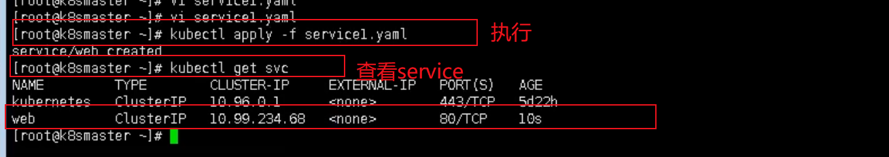

## Service

K8S里存在Service这个概念，用于pod之间的**负载均衡和服务发现**。

Kubernetes中一个应用服务会有一个或多个实例（Pod）,每个实例（Pod）的IP地址由网络插件动态随机分配（Pod重启后IP地址会改变）。为屏蔽这些后端实例的动态变化和对多实例的负载均衡，引入了Service这个资源对象

service同样通过label和selector来和对应的pod建立关联

Service主要有三个类型：

- ClusterIP
- NodePort
- LoadBalancer

api对象如下图所示：

```yaml
apiVersion: v1
kind: Service
metadata:
  name: nginx-svc
  labels:
    app: nginx
spec:
  type: ClusterIP
  ports:
    - port: 80
       targetPort: 80
  selector:
    app: nginx
```

根据创建Service的`type`类型不同，可分成4种模式：

-  `ClusterIP`
 默认方式。根据是否生成ClusterIP又可分为普通Service和Headless Service两类：
- `普通Service`：通过为Kubernetes的Service分配一个集群内部可访问的固定虚拟IP（Cluster IP），实现集群内的访问。为最常见的方式。
  - `Headless Service`：该服务不会分配Cluster IP，也不通过kube-proxy做反向代理和负载均衡。而是通过DNS提供稳定的网络ID来访问，DNS会将headless service的后端直接解析为podIP列表。主要供StatefulSet使用。
  
- `NodePort`：除了使用Cluster IP之外，还通过将service的port映射到集群内每个节点的相同一个端口，实现通过nodeIP:nodePort从集群外访问服务。

- `LoadBalancer`：和nodePort类似，不过除了使用一个Cluster IP和nodePort之外，还会向所使用的公有云申请一个负载均衡器(负载均衡器后端映射到各节点的nodePort)，实现从集群外通过LB访问服务。

- `ExternalName`：是 Service 的特例。此模式主要面向运行在集群外部的服务，通过它可以将外部服务映射进k8s集群，且具备k8s内服务的一些特征（如具备namespace等属性），来为集群内部提供服务。此模式要求kube-dns的版本为1.7或以上。这种模式和前三种模式（除headless service）最大的不同是重定向依赖的是dns层次，而不是通过kube-proxy。

ps: 总而言之就是，ClusterIP是给集群内部使用的，NodePort是对外暴露使用的(对外访问应用)。LoadBalancer也是对外访问应用暴露使用，但是用于公有云(可连接公有云的负载均衡控制器)

#### 创建使用

创建一个service之后一般都会得到一个ip，这个ip用于对外。

好比上面那个ClusterIP yaml对象文件被执行后，就会出现一个对应的Service对象



可以看到产生了一个service，并提供了一个ip对集群内使用