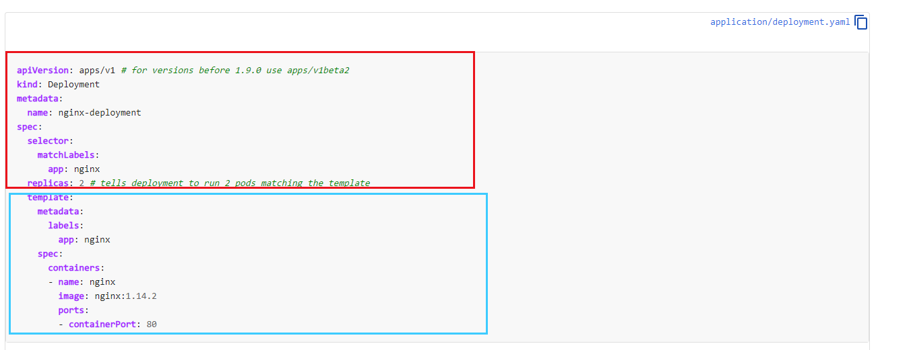

## yaml文件浅析

我们知道，kubectl命令行工具，可以直接通过yaml配置文件来控制资源的创建，这些资源其实也被称为k8s对象。

其实yaml文件主要分为两部分



上面那一个部分属于控制器对象，下面那一个部分属于被控制对象。

我们来具体看看yaml文件模板：

```
apiVersion: apps/v1 # for versions before 1.9.0 use apps/v1beta2
kind: Deployment
metadata:
  name: nginx-deployment
spec:
  selector:
    matchLabels:
      app: nginx
  replicas: 2 # tells deployment to run 2 pods matching the template
  template:
    metadata:
      labels:
        app: nginx
    spec:
      containers:
      - name: nginx
        image: nginx:1.14.2
        ports:
        - containerPort: 80
```

- apiversion，就是这个api对象的版本，k8s有对api进行一个版本控制
- kind，资源类型，比如是deployment还是StatefulSet

- metadata 资源元数据
- spec，资源规格