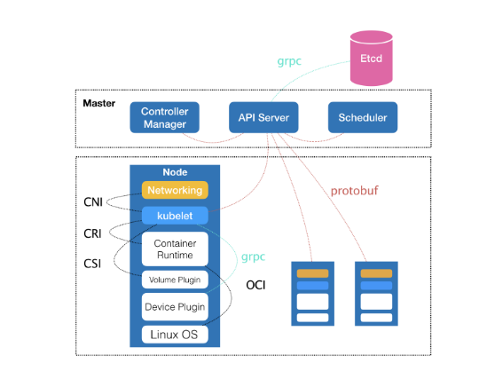
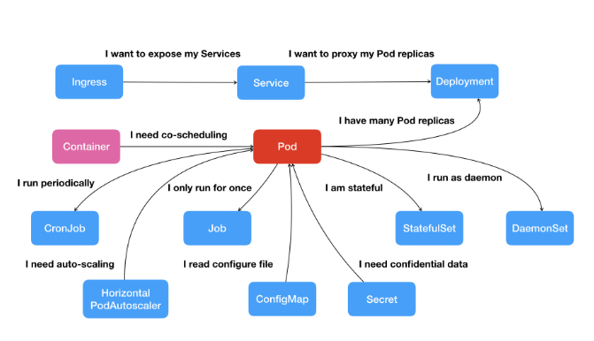
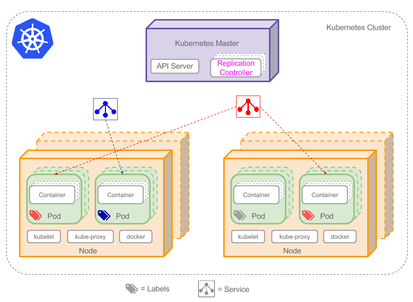
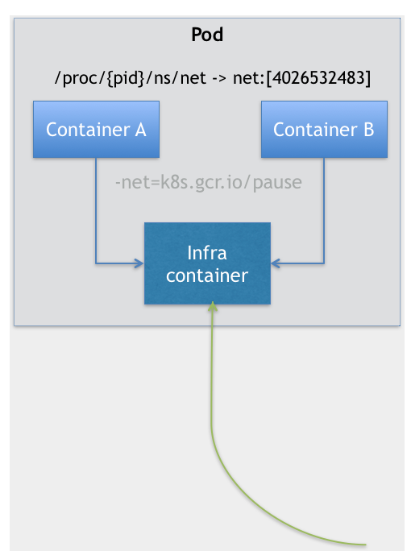

## k8s概念基础

根据容器相关基础概念笔记，我们知道：

一个正在运行的 Linux 容器，其实可以被“一分为二”地看待：

1. 一组联合挂载在 /var/lib/docker/aufs/mnt 上的 rootfs，这一部分我们称为“容器镜像”（Container Image），是容器的静态视图；
2. 一个由 Namespace+Cgroups 构成的隔离环境，这一部分我们称为“容器运行时”（Container Runtime），是容器的动态视图。

更进一步地说，作为一名开发者，并不关心容器运行时的差异。因为，在整个“开发 - 测试 - 发布”的流程中，真正承载着容器信息进行传递的，是容器镜像，而不是容器运行时。

这个重要假设，正是容器技术圈在 Docker 项目成功后不久，就迅速走向了“容器编排”这个“上层建筑”的主要原因：作为一家云服务商或者基础设施提供商，我只要能够将用户提交的 Docker 镜像以容器的方式运行起来，就能成为这个非常热闹的容器生态图上的一个承载点，从而将整个容器技术栈上的价值，沉淀在我的这个节点上。

### k8s要解决的问题

对于大多数用户来说，他们希望 Kubernetes 项目带来的体验是确定的：现在我有了应用的容器镜像，请帮我在一个给定的集群上把这个应用运行起来。

更进一步地说，我还希望 Kubernetes 能给我提供路由网关、水平扩展、监控、备份、灾难恢复等一系列运维能力。

等一下，这些功能听起来好像有些耳熟？这不就是经典 PaaS（比如，Cloud Foundry）项目的能力吗？

Kubernetes 项目的架构，跟它的原型项目 Borg 非常类似，都由 Master 和 Node 两种节点组成，而这两种角色分别对应着控制节点和计算节点。

其中，控制节点，即 Master 节点，由三个紧密协作的独立组件组合而成，它们分别是负责 API 服务的 kube-apiserver、负责调度的 kube-scheduler，以及负责容器编排的 kube-controller-manager。整个集群的持久化数据，则由 kube-apiserver 处理后保存在 Etcd 中。

而计算节点上最核心的部分，则是一个叫作 kubelet 的组件。

**在 Kubernetes 项目中，kubelet 主要负责同容器运行时（比如 Docker 项目）打交道**。而这个交互所依赖的，是一个称作 CRI（Container Runtime Interface）的远程调用接口，这个接口定义了容器运行时的各项核心操作，比如：启动一个容器需要的所有参数。

**此外，kubelet 还通过 gRPC 协议同一个叫作 Device Plugin 的插件进行交互**。这个插件，是 Kubernetes 项目用来管理 GPU 等宿主机物理设备的主要组件，也是基于 Kubernetes 项目进行机器学习训练、高性能作业支持等工作必须关注的功能。

而**kubelet 的另一个重要功能，则是调用网络插件和存储插件为容器配置网络和持久化存储**。这两个插件与 kubelet 进行交互的接口，分别是 CNI（Container Networking Interface）和 CSI（Container Storage Interface）。

### Pod

Kubernetes 项目对容器间的“访问”进行了分类，首先总结出了一类非常常见的“紧密交互”的关系，即：这些应用之间需要非常频繁的交互和访问；又或者，它们会直接通过本地文件进行信息交换。

在常规环境下，这些应用往往会被直接部署在同一台机器上，通过 Localhost 通信，通过本地磁盘目录交换文件。而在 Kubernetes 项目中，这些容器则会被划分为一个“Pod”，Pod 里的容器共享同一个 Network Namespace、同一组数据卷，从而达到高效率交换信息的目的。

Kubernetes 项目的做法是给 Pod 绑定一个 Service 服务，而 Service 服务声明的 IP 地址等信息是“终生不变”的。这个**Service 服务的主要作用，就是作为 Pod 的代理入口（Portal），从而代替 Pod 对外暴露一个固定的网络地址**。

这样，对于 Web 应用的 Pod 来说，它需要关心的就是数据库 Pod 的 Service 信息。不难想象，Service 后端真正代理的 Pod 的 IP 地址、端口等信息的自动更新、维护，则是 Kubernetes 项目的职责。

像这样，围绕着容器和 Pod 不断向真实的技术场景扩展，我们就能够摸索出一幅如下所示的 Kubernetes 项目核心功能的“全景图”。

[Pod](http://kubernetes.io/v1.1/docs/user-guide/pods.html)（上图绿色方框）安排在节点上，包含一组容器和卷。同一个Pod里的容器共享同一个网络命名空间，可以使用localhost互相通信。Pod是短暂的，不是持续性实体。你可能会有这些问题：

- 如果Pod是短暂的，那么我怎么才能持久化容器数据使其能够跨重启而存在呢？ 是的，Kubernetes支持[卷](http://kubernetes.io/v1.1/docs/user-guide/volumes.html)的概念，因此可以使用持久化的卷类型。
- 是否手动创建Pod，如果想要创建同一个容器的多份拷贝，需要一个个分别创建出来么？可以手动创建单个Pod，但是也可以使用Replication Controller使用Pod模板创建出多份拷贝，下文会详细介绍。
- 如果Pod是短暂的，那么重启时IP地址可能会改变，那么怎么才能从前端容器正确可靠地指向后台容器呢？这时可以使用Service，下文会详细介绍。

#### 实现

在 Kubernetes 项目里，Pod 的实现需要使用一个中间容器，这个容器叫作 Infra 容器。在这个 Pod 中，Infra 容器永远都是第一个被创建的容器，而其他用户定义的容器，则通过 Join Network Namespace 的方式，与 Infra 容器关联在一起。这样的组织关系，可以用下面这样一个示意图来表达：

Infra 容器一定要占用极少的资源，所以它使用的是一个非常特殊的镜像，叫作：`k8s.gcr.io/pause`。这个镜像是一个用汇编语言编写的、永远处于“暂停”状态的容器，解压后的大小也只有 100~200 KB 左右。

这也就意味着，对于 Pod 里的容器 A 和容器 B 来说：

- 它们可以直接使用 localhost 进行通信；
- 它们看到的网络设备跟 Infra 容器看到的完全一样；
- 一个 Pod 只有一个 IP 地址，也就是这个 Pod 的 Network Namespace 对应的 IP 地址；
- 当然，其他的所有网络资源，都是一个 Pod 一份，并且被该 Pod 中的所有容器共享；
- Pod 的生命周期只跟 Infra 容器一致，而与容器 A 和 B 无关。

### Label

一些Pod有Label。一个Label是attach到Pod的一对键/值对，用来传递用户定义的属性。比如，你可能创建了一个"tier"和“app”标签，通过Label（**tier=frontend, app=myapp**）来标记前端Pod容器，使用Label（**tier=backend, app=myapp**）标记后台Pod。然后可以使用[Selectors](http://kubernetes.io/v1.1/docs/user-guide/labels.html#label-selectors)选择带有特定Label的Pod，并且将Service或者Replication Controller应用到上面。

### Replication Controller

Replication Controller确保任意时间都有指定数量的Pod“副本”在运行。如果为某个Pod创建了Replication Controller并且指定3个副本，它会创建3个Pod，并且持续监控它们。如果某个Pod不响应，那么Replication Controller会替换它，保持总数为3.如下面的动画所示

如果之前不响应的Pod恢复了，现在就有4个Pod了，那么Replication Controller会将其中一个终止保持总数为3。如果在运行中将副本总数改为5，Replication Controller会立刻启动2个新Pod，保证总数为5。还可以按照这样的方式缩小Pod，这个特性在执行滚动[升级](https://cloud.google.com/container-engine/docs/replicationcontrollers/#rolling_updates)时很有用。

当创建Replication Controller时，需要指定两个东西：

- Pod模板：用来创建Pod副本的模板Label

- Replication Controller需要监控的Pod的标签。

### Service

*如果Pods是短暂的，那么重启时IP地址可能会改变，怎么才能从前端容器正确可靠地指向后台容器呢？*

[Service](http://kubernetes.io/v1.1/docs/user-guide/services.html)是定义一系列Pod以及访问这些Pod的**策略的一层抽象**。Service通过Label找到Pod组。因为Service是抽象的，所以在图表里通常看不到它们的存在，这也就让这一概念更难以理解。

现在，假定有2个后台Pod，并且定义后台Service的名称为‘backend-service’，lable选择器为（**tier=backend, app=myapp**）【ps，这个service只包含了两个后台pod】。*backend-service* 的Service会完成如下两件重要的事情：

Service会完成如下两件重要的事情：会为Service创建一个本地集群的DNS入口，因此前端Pod只需要DNS查找主机名为 ‘backend-service’，就能够解析出前端应用程序可用的IP地址。现在前端已经得到了后台服务的IP地址，但是它应该访问2个后台Pod的哪一个呢？Service在这2个后台Pod之间提供透明的负载均衡，会将请求分发给其中的任意一个（如下面的动画所示）。通过每个Node上运行的代理（kube-proxy）完成。这里有更多技术细节。

### Node

节点（上图橘色方框）是物理或者虚拟机器，作为Kubernetes worker，通常称为Minion。每个节点都运行如下Kubernetes关键组件：

- Kubelet：是主节点代理。
- Kube-proxy：Service使用其将链接路由到Pod
- Docker或Rocket