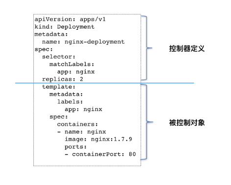

## 容器编排

我们曾经使用过 Deployment 这个最基本的控制器对象。 回顾一下这个名叫 nginx-deployment 的例子：

```yaml
apiVersion: apps/v1
kind: Deployment
metadata:
  name: nginx-deployment
spec:
  selector:
    matchLabels:
      app: nginx
  replicas: 2
  template:
    metadata:
      labels:
        app: nginx
    spec:
      containers:
      - name: nginx
        image: nginx:1.7.9
        ports:
        - containerPort: 80

```

这个 Deployment 定义的编排动作非常简单，即：确保携带了 app=nginx 标签的 Pod 的个数，永远等于 spec.replicas 指定的个数，即 2 个。

这就意味着，如果在这个集群中，携带 app=nginx 标签的 Pod 的个数大于 2 的时候，就会有旧的 Pod 被删除；反之，就会有新的 Pod 被创建。

这时，你也许就会好奇：究竟是 Kubernetes 项目中的哪个组件，在执行这些操作呢？

我在前面介绍 Kubernetes 架构的时候，曾经提到过一个叫作 kube-controller-manager 的组件。

实际上，这个组件，就是一系列控制器的集合。我们可以查看一下 Kubernetes 项目的 pkg/controller 目录：

```
$ cd kubernetes/pkg/controller/
$ ls -d */              
deployment/             job/                    podautoscaler/          
cloud/                  disruption/             namespace/              
replicaset/             serviceaccount/         volume/
cronjob/                garbagecollector/       nodelifecycle/          replication/            statefulset/            daemon/
...
```

这个目录下面的每一个控制器，都以独有的方式负责某种编排功能。而我们的 Deployment，正是这些控制器中的一种。

实际上，这些控制器之所以被统一放在 pkg/controller 目录下，就是因为它们都遵循 Kubernetes 项目中的一个通用编排模式，即：控制循环（control loop）。

比如，现在有一种待编排的对象 X，它有一个对应的控制器。那么，我就可以用一段 Go 语言风格的伪代码，为你描述这个**控制循环**：


```
for {
  实际状态 := 获取集群中对象 X 的实际状态（Actual State）
  期望状态 := 获取集群中对象 X 的期望状态（Desired State）
  if 实际状态 == 期望状态{
    什么都不做
  } else {
    执行编排动作，将实际状态调整为期望状态
  }
}
```

**在具体实现中，实际状态往往来自于 Kubernetes 集群本身**。

比如，kubelet 通过心跳汇报的容器状态和节点状态，或者监控系统中保存的应用监控数据，或者控制器主动收集的它自己感兴趣的信息，这些都是常见的实际状态的来源。

**而期望状态，一般来自于用户提交的 YAML 文件**。

比如，Deployment 对象中 Replicas 字段的值。很明显，这些信息往往都保存在 Etcd 中。

接下来，以 Deployment 为例，我和你简单描述一下它对控制器模型的实现：

1. Deployment 控制器从 Etcd 中获取到所有携带了“app: nginx”标签的 Pod，然后统计它们的数量，这就是实际状态；
2. Deployment 对象的 Replicas 字段的值就是期望状态；
3. Deployment 控制器将两个状态做比较，然后根据比较结果，确定是创建 Pod，还是删除已有的 Pod（具体如何操作 Pod 对象，我会在下一篇文章详细介绍）。

可以看到，一个 Kubernetes 对象的主要编排逻辑，实际上是在第三步的“对比”阶段完成的。

这个操作，通常被叫作调谐（Reconcile）。这个调谐的过程，则被称作“Reconcile Loop”（调谐循环）或者“Sync Loop”（同步循环）。

而调谐的最终结果，往往都是对被控制对象的某种写操作。

比如，增加 Pod，删除已有的 Pod，或者更新 Pod 的某个字段。**这也是 Kubernetes 项目“面向 API 对象编程”的一个直观体现。**

像 Deployment 定义的 template 字段，在 Kubernetes 项目中有一个专有的名字，叫作 PodTemplate（Pod 模板）。

这个概念非常重要，因为后面我要讲解到的大多数控制器，都会使用 PodTemplate 来统一定义它所要管理的 Pod。更有意思的是，我们还会看到其他类型的对象模板，比如 Volume 的模板。

至此，我们就可以对 Deployment 以及其他类似的控制器，做一个简单总结了：



如上图所示，**类似 Deployment 这样的一个控制器，实际上都是由上半部分的控制器定义（包括期望状态），加上下半部分的被控制对象的模板组成的。**

这就是为什么，在所有 API 对象的 Metadata 里，都有一个字段叫作 ownerReference，用于保存当前这个 API 对象的拥有者（Owner）的信息。