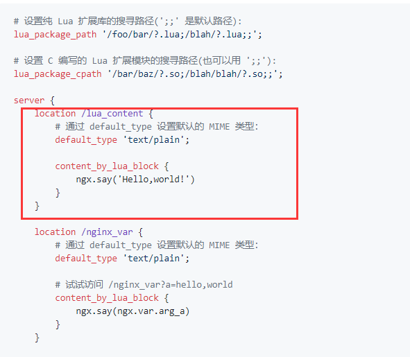

## OpenResty基础

OpenResty是一个基于 Nginx 与 Lua 的高性能 Web 平台。

**ps: 简而言之，就是在nginx里嵌入一个Luajit虚拟机，然后当请求来的时候，让nginx的worker去执行lua脚本**

### 开发

直接在nginx里配置就可以用到openresty里的功能。

这里略去安装openresty的步骤

上图是nginx配置的一部分，可以看到location里，写了一个content_by_lua_block,然后这里就调用了openresty模块输出了一个helloworld。访问nginx本地lua_content的时候就能看到。

这么做的一个重大意义就是，我们甚至可以再nginx配置文件里面嵌入lua脚本了。当然我们也可以指定地址来访问lua脚本

### Openresty文档

我们切记，在开发过程中一定要用ngx lua的文档。

如果我们调用的是lua的api，那很可能会阻塞掉。但是ngx lua是非阻塞的

所以切记，一定要使用ngx lua api

https://www.nginx.com/resources/wiki/modules/lua/