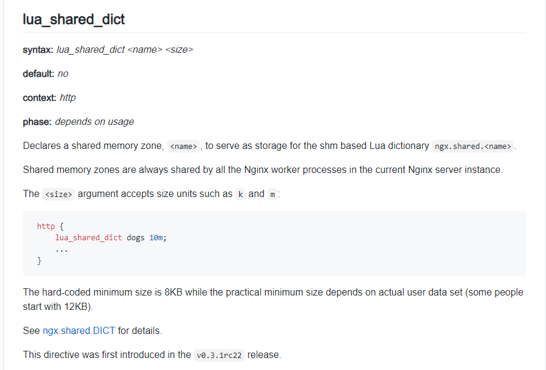
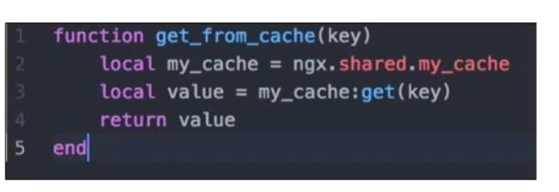

## openresty缓存

缓存在服务端很重要，openresty怎么做缓存的呢

### lua_shared_dict指令

openresty里有一个lua_shared_dict指令，这个指令是要写在nginx.conf文件当中的

用这个指令可以预先分配一段buffer，这样在lua脚本里就能调用

看文档可以看到，写在nginx.conf http这个配置项里面,起了个名字叫dog

在lua脚本里我们就能直接调用了，比如我们用指令定义了一块共享内存叫my_cache

就能如上调用

**shared_dict是全nginx worker共享的，但是同时，也会带来一些锁的操作**

### lru_cache

resty实现的lru cache

https://github.com/openresty/lua-resty-lrucache

### lua-resty-lock

为了优雅解决缓存失效风暴而实现的锁机制

用到时可以深入了解

