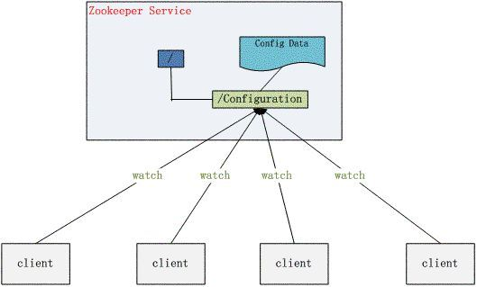
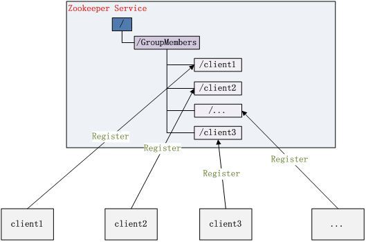
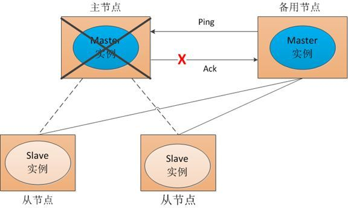
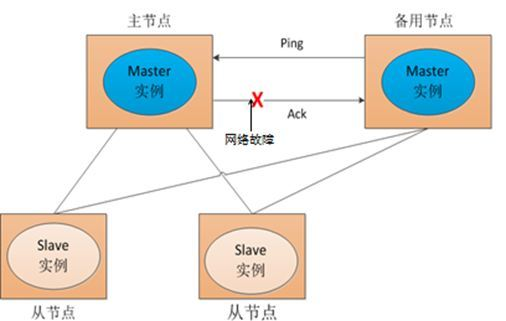
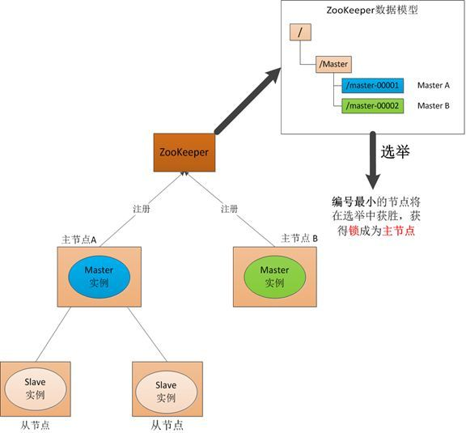
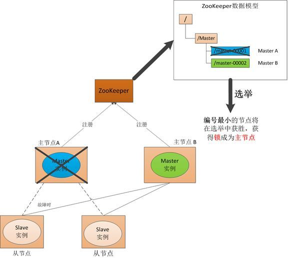
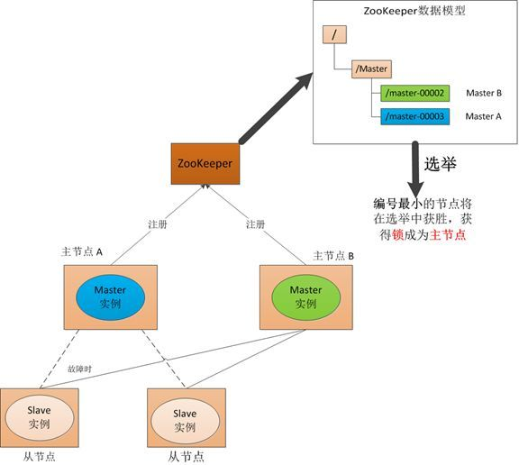
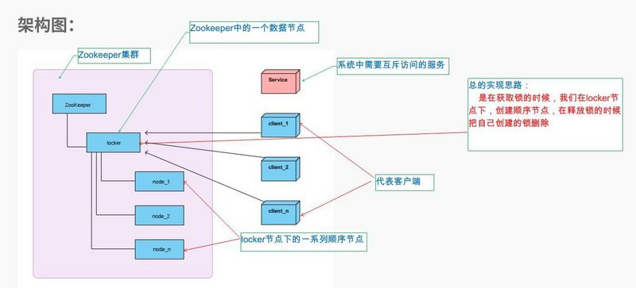
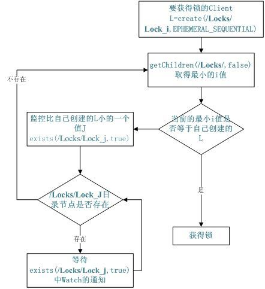
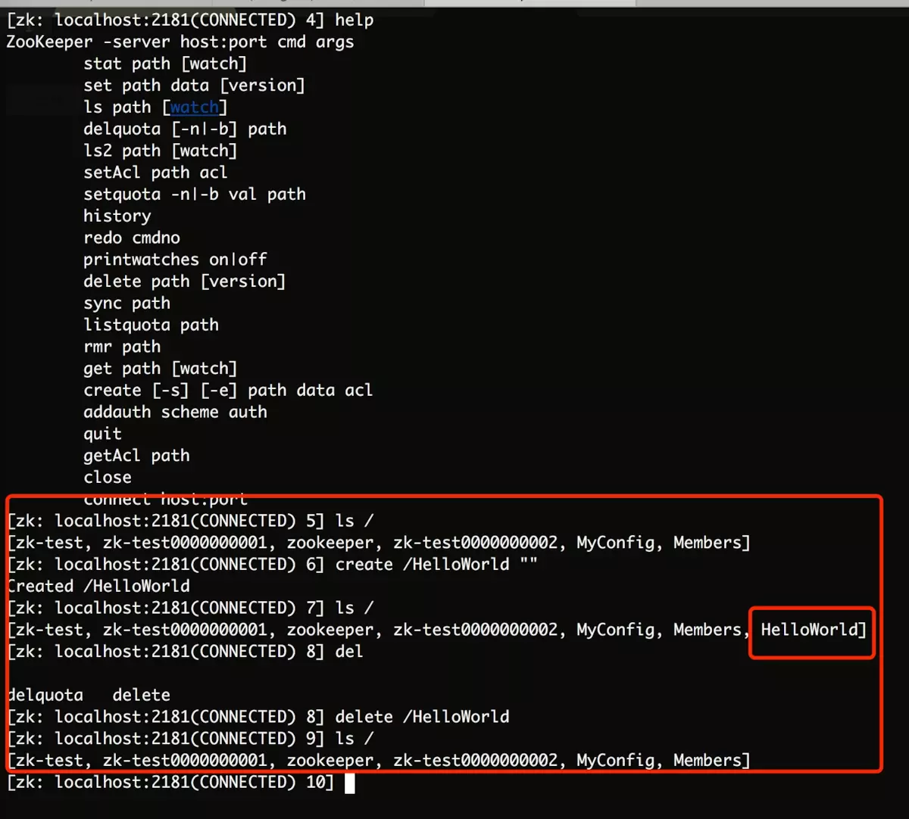

## Zookeeper基础

在 2006 年，Google 发表了一篇名为 [The Chubby lock service for loosely-coupled distributed systems](https://static.googleusercontent.com/media/research.google.com/en//archive/chubby-osdi06.pdf) 的论文，其中描述了一个分布式锁服务 Chubby 的设计理念和实现原理；作为 Google 内部的一个基础服务，虽然 Chubby 与 GFS、Bigtable 和 MapReduce 相比并没有那么大的名气，不过它在 Google 内部也是非常重要的基础设施。

相比于名不见经传的 Chubby，作者相信 Zookeeper 更被广大开发者所熟知，作为非常出名的分布式协调服务，Zookeeper 有非常多的应用，包括发布订阅、命名服务、分布式协调和分布式锁

**ZooKeeper 是一个典型的分布式数据一致性解决方案，分布式应用程序可以基于 ZooKeeper 实现诸如数据发布/订阅、负载均衡、命名服务、分布式协调/通知、集群管理、Master 选举、分布式锁和分布式队列等功能。**

**zwlj：zk就是一个服务帮你解决诸多分布式的常见协调问题**


**Zookeeper 一个最常用的使用场景就是用于担任服务生产者和服务消费者的注册中心(服务发现)。** 服务生产者将自己提供的服务注册到Zookeeper中心，服务的消费者在进行服务调用的时候先到Zookeeper中查找服务，获取到服务生产者的详细信息之后，再去调用服务生产者的内容与数据。如下图所示，在 Dubbo架构中 Zookeeper 就担任了注册中心这一角色。


### Zookeeper的一些特性&概念

- **ZooKeeper 本身就是一个分布式程序（只要半数以上节点存活，ZooKeeper 就能正常服务）。**
- 为了保证高可用，最好是以集群形态来部署 ZooKeeper，这样只要集群中大部分机器是可用的（能够容忍一定的机器故障），那么 ZooKeeper 本身仍然是可用的。
- **ZooKeeper 将数据保存在内存中，这也就保证了 高吞吐量和低延迟**（但是内存限制了能够存储的容量不太大，此限制也是保持znode中存储的数据量较小的进一步原因）。
- ZooKeeper 是高性能的。 在“读”多于“写”的应用程序中尤其地高性能，因为“写”会导致所有的服务器间同步状态。（“读”多于“写”是协调服务的典型场景。）
- ZooKeeper有临时节点的概念。 当创建临时节点的客户端会话一直保持活动，瞬时节点就一直存在。而当会话终结时，瞬时节点被删除。持久节点是指一旦这个ZNode被创建了，除非主动进行ZNode的移除操作，否则这个ZNode将一直保存在Zookeeper上。
- **ZooKeeper 底层其实只提供了两个功能：①管理（存储、读取）用户程序提交的数据；②为用户程序提交数据节点监听服务。(zwlj:其实这一点才是至关重要的，其实zk也是个存储服务，但是用途是协调，这得跟redis等区分开来)**

#### 数据模型

zk的数据模型是以znode的形式存储和组织。与标准文件系统类似，是一个树形结构，根节点是’/’。


如上图所示，ZooKeeper数据模型的结构与Unix文件系统很类似，整体上可以看作是一棵树，每个节点称做一个ZNode。每个ZNode都可以通过其路径唯一标识，比如上图中第三层的第一个ZNode, 它的路径是/app1/c1。在每个ZNode上可存储少量数据(默认是1M, 可以通过配置修改, 通常不建议在ZNode上存储大量的数据)，这个特性非常有用


#### 会话Session

Session 指的是 ZooKeeper 服务器与客户端会话。**在 ZooKeeper 中，一个客户端连接是指客户端和服务器之间的一个 TCP 长连接**。客户端启动的时候，首先会与服务器建立一个 TCP 连接，从第一次连接建立开始，客户端会话的生命周期也开始了。**通过这个连接，客户端能够通过心跳检测与服务器保持有效的会话，也能够向Zookeeper服务器发送请求并接受响应，同时还能够通过该连接接收来自服务器的Watch事件通知。** Session的`sessionTimeout`值用来设置一个客户端会话的超时时间。当由于服务器压力太大、网络故障或是客户端主动断开连接等各种原因导致客户端连接断开时，**只要在sessionTimeout规定的时间内能够重新连接上集群中任意一台服务器，那么之前创建的会话仍然有效。**

**在为客户端创建会话之前，服务端首先会为每个客户端都分配一个sessionID。由于 sessionID 是 Zookeeper 会话的一个重要标识，许多与会话相关的运行机制都是基于这个 sessionID 的，因此，无论是哪台服务器为客户端分配的 sessionID，都务必保证全局唯一。**

#### Znode

**在谈到分布式的时候，我们通常说的“节点"是指组成集群的每一台机器。然而，在Zookeeper中，“节点"分为两类，第一类同样是指构成集群的机器，我们称之为机器节点；第二类则是指数据模型中的数据单元，我们称之为数据节点一一ZNode(就是上图那个树形结构的节点)。**

Zookeeper将所有数据存储在内存中，数据模型是一棵树（Znode Tree)，由斜杠（/）的进行分割的路径，就是一个Znode，例如/foo/path1。每个上都会保存自己的数据内容，同时还会保存一系列属性信息。

**在Zookeeper中，node可以分为持久节点和临时节点两类。所谓持久节点是指一旦这个ZNode被创建了，除非主动进行ZNode的移除操作，否则这个ZNode将一直保存在Zookeeper上。而临时节点就不一样了，它的生命周期和客户端会话绑定，一旦客户端会话失效，那么这个客户端创建的所有临时节点都会被移除。**另外，ZooKeeper还允许用户为每个节点添加一个特殊的属性：**SEQUENTIAL**.一旦节点被标记上这个属性，那么在这个节点被创建的时候，Zookeeper会自动在其节点名后面追加上一个整型数字，这个整型数字是一个由父节点维护的自增数字。

#### Watcher

ZooKeeper支持一种Watch操作，Client可以在某个ZNode上设置一个Watcher，来Watch该ZNode上的变化。如果该ZNode上有相应的变化，就会触发这个Watcher，把相应的事件通知给设置Watcher的Client。需要注意的是，ZooKeeper中的Watcher是一次性的，即触发一次就会被取消，如果想继续Watch的话，需要客户端重新设置Watcher。这个跟epoll里的oneshot模式有点类似。


#### 读写更新

在ZooKeeper集群中，读可以从任意一个ZooKeeper Server读，这一点是保证ZooKeeper比较好的读性能的关键；写的请求会先Forwarder到Leader，然后由Leader来通过ZooKeeper中的原子广播协议，将请求广播给所有的Follower，Leader收到一半以上的写成功的Ack后，就认为该写成功了，就会将该写进行持久化，并告诉客户端写成功了。


### Zookeeper用途

上面已经说了zk的主要数据模型，特性。可知其主要就是提供了数据存取的功能，以及数据变更监听。且zk支持集群部署。那么提供这样功能的zk主要是想解决什么问题呢？


#### 配置管理

配置的管理在分布式应用环境中很常见，例如同一个应用系统需要多台Server 运行，但该应用系统的某些配置项是相同的，如果要修改这些相同的配置项，那么就必须同时修改每台运行该系统的Server上的配置，这样非常麻烦而且容易出错。

像这样的配置信息完全可以交给 Zookeeper 来管理，将配置信息保存在 Zookeeper 的某个节点中，然后将所有需要修改的应用机器监控配置信息的状态，一旦配置信息发生变化，每台应用机器就会收到 Zookeeper 的通知，然后从 Zookeeper 获取新的配置信息应用到系统中。



#### 集群管理

ZooKeeper的集群管理主要在两点：**监控集群是否有机器退出和加入、选举master**。

对于第一点，过去的做法通常是：

监控系统通过某种手段（比如ping）定时检测每个机器，或者每个机器自己定时向监控系统汇报“我还活着”。 

这种做法可行，但是存在两个比较明显的问题：

1. 集群中机器有变动的时候，牵连修改的东西比较多。

2. 有一定的延时。

利用ZooKeeper有两个特性,就可以实时另一种集群机器存活性监控系统：所有机器约定在父目录（比如`/GroupMembers`）下创建临时目录节点，然后监听父目录节点的子节点变化消息。**一旦有机器挂掉，该机器与 zookeeper的连接断开，其所创建的临时目录节点被删除，所有其他机器都收到通知：某个目录被删除，即有一台机器挂掉了**。新机器加入也是类似。




对于第二点(**选举master**)，在分布式环境中，相同的业务应用分布在不同的机器上，有些业务逻辑（例如一些耗时的计算，网络I/O处理），往往只需要让整个集群中的某一台机器进行执行， 其余机器可以共享这个结果，这样可以大大减少重复劳动，提高性能，于是这个master选举便是这种场景下的碰到的主要问题。利用ZooKeeper的强一致性，能够保证在分布式高并发情况下节点创建的全局唯一性，即：同时有多个客户端请求创建 ·`/currentMaster `节点，最终一定只有一个客户端请求能够创建成功。利用这个特性，就能很轻易的在分布式环境中进行集群选取了。

另外，这种场景演化一下，就是动态master选举。这就要用到`EPHEMERAL_SEQUENTIAL`类型节点的特性了。
动态master选举可以用来解决分布式系统中的单点故障。什么是分布式系统中的单点故障：通常分布式系统采用主从模式，就是一个主控机连接多个处理节点。主节点负责分发任务，从节点负责处理任务，当我们的主节点发生故障时，那么整个系统就都瘫痪了，那么我们把这种故障叫作<font color=#D2691E>单点故障</font>。

传统的解决方案是采用一个备用节点，这个备用节点定期给当前主节点发送ping包，主节点收到ping包以后向备用节点发送回复Ack，当备用节点收到回复的时候就会认为当前主节点还活着，让它继续提供服务。


当主节点挂了，这时候备用节点收不到回复了，然后他就认为主节点挂了接替他成为主节点：



但是这种方式就是有一个隐患，就是网络问题，来看一网络问题会造成什么后果



也就是说我们的主节点的并没有挂，只是在回复的时候网络发生故障，这样我们的备用节点同样收不到回复，就会认为主节点挂了，然后备用节点将他的Master实例启动起来，这样我们的分布式系统当中就有了两个主节点也就是---双Master， 出现双Master以后从节点就会将它所做的事一部分汇报给了主节点，一部分汇报给了备用节点，这样服务就全乱了。为了防止出现这种情况，我们引入了 ZooKeeper，它虽然不能避免网络故障，但它能够保证每时每刻只有一个Master（**解决脑裂的问题**）。


具体方案是：

在引入了Zookeeper以后我们启动了两个主节点，"主节点-A"和"主节点-B"他们启动以后，都向ZooKeeper去注册一个节点（EPHEMERAL_SEQUENTIAL类型节点）。我们假设"主节点-A"注册的节点是"master-00001"，"主节点-B"注册的节点是"master-00002"，注册完以后进行选举，规定选举序号最小的节点作为为主节点，也就是我们的"主节点-A"将会成为主节点，然后"主节点-B"将成为一个备用节点。通过这种方式就完成了对两个Master进程的调度。



假如master故障了：

如果"主节点-A"挂了，这时候他所注册的节点将被自动删除，ZooKeeper会自动感知节点的变化，然后再次发出选举，这时候"主节点-B"将在选举中获胜，替代"主节点-A"成为主节点。



如果主节点恢复了，他会再次向ZooKeeper注册一个节点，这时候他注册的节点将会是"master-00003"，ZooKeeper会感知节点的变化再次发动选举，这时候"主节点-B"在选举中会再次获胜继续担任"主节点"，"主节点-A"会担任备用节点。




#### 分布式锁

分布式锁主要得益于**ZooKeeper为我们保证了数据的一致性**，即用户只要完全相信每时每刻，zk集群中任意节点（一台zk server）上的相同Znode的数据是一定都是相同的。



**分布式锁的总体思路**
需要获得锁的 client 创建一个 EPHEMERAL_SEQUENTIAL 目录节点，然后调用 getChildren方法获取当前的目录节点列表中最小的目录节点是不是就是自己创建的目录节点，如果正是自己创建的，那么它就获得了这个锁，如果不是那么它就调用 exists(String path, boolean watch) 方法并监控 Zookeeper 上目录节点列表的变化，一直到自己创建的节点是列表中最小编号的目录节点，从而获得锁，释放锁很简单，只要删除前面它自己所创建的目录节点就行了。



#### 分布式队列

这种场景其实偏少。

Zookeeper 可以处理两种类型的队列：Zookeeper 可以处理两种类型的队列：

1. 队列按照 FIFO 方式进行入队和出队操作，例如实现生产者和消费者模型。
2. 当一个队列的成员都聚齐时，这个队列才可用，否则一直等待所有成员到达，这种是**同步队列**。

第一类，和分布式锁服务中的控制时序场景基本原理一致，入列有编号，出列按编号。实现起来也非常简单，就是在特定的目录下创建 SEQUENTIAL 类型的子目录`/queue_i`，这样就能保证所有成员加入队列时都是有编号的，出队列时通过`getChildren( )`方法可以返回当前所有的队列中的元素，然后消费其中最小的一个，这样就能保证 FIFO。

第二类，通常可以在`/queue`这个Znode下预先建立一个`/queue/num`节点，并且赋值为n（或者直接给/queue赋值为n），表示队列大小，之后每次有队列成员加入后，就判断下是否已经到达队列大小，决定是否可以开始执行 了。这种用法的典型场景是，分布式环境中，一个大任务Task A，需要在很多子任务完成（或条件就绪）情况下才能进行。这个时候，凡是其中一个子任务完成（就绪），那么就去 `/taskList`下建立自己的临时时序节点（CreateMode.EPHEMERAL_SEQUENTIAL），当`/taskList`发现自己下面的子节点满足指定个数，就可以进行下一步处理了（比如创建一个`/task/start`节点）。

### ZK命令行使用


使用zookeeper

```shell
# 这里命令写的长是为了便于知道ZooKeeper是如何使用配置文件的。
/usr/local/zookeeper/bin/zkServer.sh start /usr/local/zookeeper/conf/zoo.cfg  

# 查看ZooKeeper是否运行
ps –ef | grep zookeeper 
# 也可以使用jps ，可以看到java进程中有QuorumPeerMain列出来。

# 查看ZooKeeper的状态
zkServer.sh status

# 常用的ZooKeeper用法，这个属于Linux基础的部分，就不过多说明了
./zkServer.sh {start|start-foreground|stop|restart|status|upgrade|print-cmd}
```

使用zkCli连接ZooKeeper

```
/usr/local/zookeeper/bin/zkCli.sh -server localhost:2181
```



可以看到zk里是根据目录树来管理数据的。