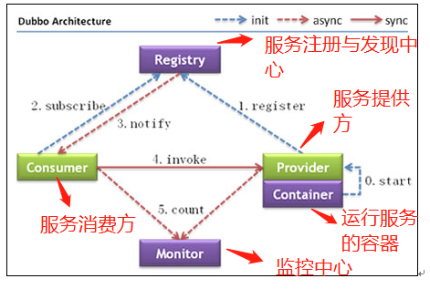
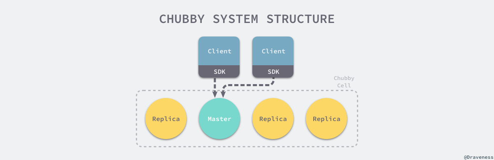
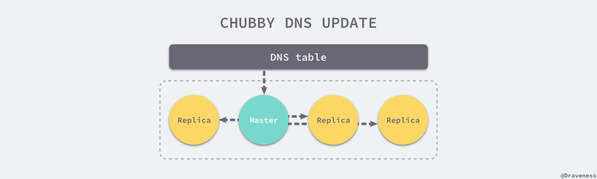
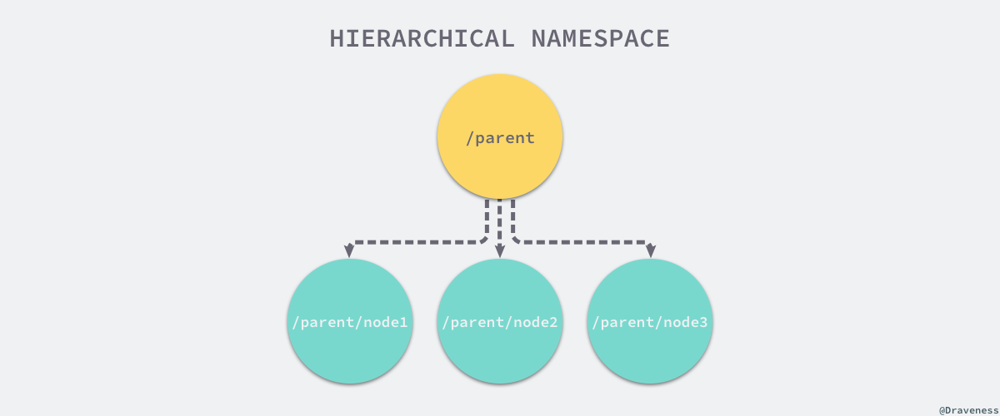

## Zookeeper基础

在 2006 年，Google 发表了一篇名为 [The Chubby lock service for loosely-coupled distributed systems](https://static.googleusercontent.com/media/research.google.com/en//archive/chubby-osdi06.pdf) 的论文，其中描述了一个分布式锁服务 Chubby 的设计理念和实现原理；作为 Google 内部的一个基础服务，虽然 Chubby 与 GFS、Bigtable 和 MapReduce 相比并没有那么大的名气，不过它在 Google 内部也是非常重要的基础设施。

相比于名不见经传的 Chubby，作者相信 Zookeeper 更被广大开发者所熟知，作为非常出名的分布式协调服务，Zookeeper 有非常多的应用，包括发布订阅、命名服务、分布式协调和分布式锁

**ZooKeeper 是一个典型的分布式数据一致性解决方案，分布式应用程序可以基于 ZooKeeper 实现诸如数据发布/订阅、负载均衡、命名服务、分布式协调/通知、集群管理、Master 选举、分布式锁和分布式队列等功能。**

**Zookeeper 一个最常用的使用场景就是用于担任服务生产者和服务消费者的注册中心。** 服务生产者将自己提供的服务注册到Zookeeper中心，服务的消费者在进行服务调用的时候先到Zookeeper中查找服务，获取到服务生产者的详细信息之后，再去调用服务生产者的内容与数据。如下图所示，在 Dubbo架构中 Zookeeper 就担任了注册中心这一角色。

### Zookeeper的一些特性&概念

- **ZooKeeper 本身就是一个分布式程序（只要半数以上节点存活，ZooKeeper 就能正常服务）。**
- **为了保证高可用，最好是以集群形态来部署 ZooKeeper，这样只要集群中大部分机器是可用的（能够容忍一定的机器故障），那么 ZooKeeper 本身仍然是可用的。**
- **ZooKeeper 将数据保存在内存中，这也就保证了 高吞吐量和低延迟**（但是内存限制了能够存储的容量不太大，此限制也是保持znode中存储的数据量较小的进一步原因）。
- **ZooKeeper 是高性能的。 在“读”多于“写”的应用程序中尤其地高性能，因为“写”会导致所有的服务器间同步状态。**（“读”多于“写”是协调服务的典型场景。）
- **ZooKeeper有临时节点的概念。 当创建临时节点的客户端会话一直保持活动，瞬时节点就一直存在。而当会话终结时，瞬时节点被删除。持久节点是指一旦这个ZNode被创建了，除非主动进行ZNode的移除操作，否则这个ZNode将一直保存在Zookeeper上。**
- ZooKeeper 底层其实只提供了两个功能：①管理（存储、读取）用户程序提交的数据；②为用户程序提交数据节点监听服务。

#### 会话Session

Session 指的是 ZooKeeper 服务器与客户端会话。**在 ZooKeeper 中，一个客户端连接是指客户端和服务器之间的一个 TCP 长连接**。客户端启动的时候，首先会与服务器建立一个 TCP 连接，从第一次连接建立开始，客户端会话的生命周期也开始了。**通过这个连接，客户端能够通过心跳检测与服务器保持有效的会话，也能够向Zookeeper服务器发送请求并接受响应，同时还能够通过该连接接收来自服务器的Watch事件通知。** Session的`sessionTimeout`值用来设置一个客户端会话的超时时间。当由于服务器压力太大、网络故障或是客户端主动断开连接等各种原因导致客户端连接断开时，**只要在sessionTimeout规定的时间内能够重新连接上集群中任意一台服务器，那么之前创建的会话仍然有效。**

**在为客户端创建会话之前，服务端首先会为每个客户端都分配一个sessionID。由于 sessionID 是 Zookeeper 会话的一个重要标识，许多与会话相关的运行机制都是基于这个 sessionID 的，因此，无论是哪台服务器为客户端分配的 sessionID，都务必保证全局唯一。**

#### Znode

**在谈到分布式的时候，我们通常说的“节点"是指组成集群的每一台机器。然而，在Zookeeper中，“节点"分为两类，第一类同样是指构成集群的机器，我们称之为机器节点；第二类则是指数据模型中的数据单元，我们称之为数据节点一一ZNode。**

Zookeeper将所有数据存储在内存中，数据模型是一棵树（Znode Tree)，由斜杠（/）的进行分割的路径，就是一个Znode，例如/foo/path1。每个上都会保存自己的数据内容，同时还会保存一系列属性信息。

**在Zookeeper中，node可以分为持久节点和临时节点两类。所谓持久节点是指一旦这个ZNode被创建了，除非主动进行ZNode的移除操作，否则这个ZNode将一直保存在Zookeeper上。而临时节点就不一样了，它的生命周期和客户端会话绑定，一旦客户端会话失效，那么这个客户端创建的所有临时节点都会被移除。**另外，ZooKeeper还允许用户为每个节点添加一个特殊的属性：**SEQUENTIAL**.一旦节点被标记上这个属性，那么在这个节点被创建的时候，Zookeeper会自动在其节点名后面追加上一个整型数字，这个整型数字是一个由父节点维护的自增数字。

### Chubby

作为分布式锁服务，Chubby 的目的就是允许多个客户端对它们的行为进行同步

GFS 和 Bigtable 都使用了 Chubby 以解决主节点的选举等问题。在网络上你很难找到关于 Chubby 的相关资料，我们只能从 [The Chubby lock service for loosely-coupled distributed systems](https://ai.google/research/pubs/pub27897) 一文中窥见它的一些设计思路、技术架构等信息。

从论文的摘要中我们可以看出 Chubby 首先被定义成一个**分布式的锁服务**，它能够为分布式系统提供**松耦合、粗粒度**的分布式锁功能，然而我们并不能依赖于它来做一些重量的数据存储。

#### 系统架构

为了提高系统的稳定性，每一个 Chubby 单元都由一组服务器组成，它会使用 [共识算法](https://draveness.me/consensus) 从集群中选举出主节点。

在一个 Chubby Cell 中，**只有**主节点会对外提供读写服务，其他的节点其实都是当前节点的副本（Replica），它们只是维护一个数据的拷贝并会在主节点更新时对它们持有的数据库进行更新；客户端通过向副本发送请求获取主节点的位置，一旦它获取到了主节点的位置，就会向所有的读写请求发送给主节点，直到其不再响应为止。写请求都会通过一致性协议传播到所有的副本中，当集群中的多数节点都同步了请求时就会认为当前的写入已经被确认。

当主节点宕机时，副本会在其租约到期时重新进行选举，副本节点如果在宕机几小时还没有回复，那么系统就会从资源池中选择一个新的节点并在该节点上启动 Chubby 服务并更新 DNS 表。

主节点会不停地轮询 DNS 表获取集群中最新的配置，每次 DNS 表更新时，主节点都会将新的配置下发给 Chubby 集群中其他的副本节点。

### ZK的具体实现

说了这么多，终于到了ZK相关了。

Chubby 和 Zookeeper 从最根本的设计理念上就有着非常明显的不同，在上文中我们已经提到了 Chubby 被设计成一个分布式的锁服务，它能够为分布式系统提供松耦合、粗粒度的分布式锁功能，然而我们并不能依赖于它来做一些重量的数据存储，而 Zookeeper 的论文在摘要中介绍到，它是一个能够为分布式系统提供**协调**功能的服务：