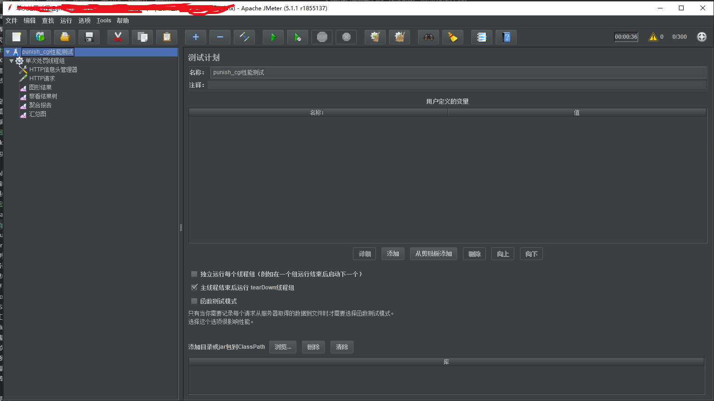
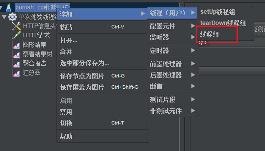
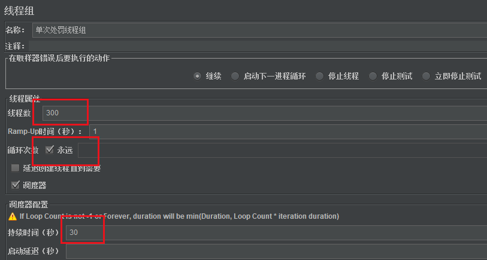
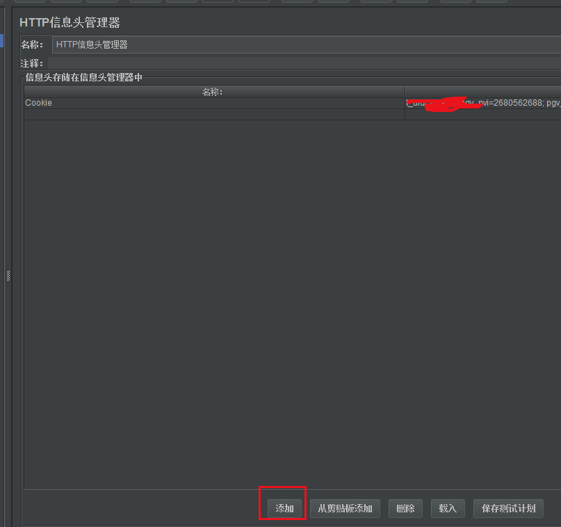
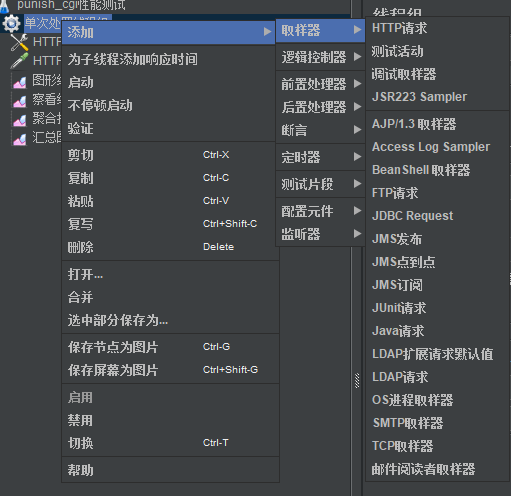
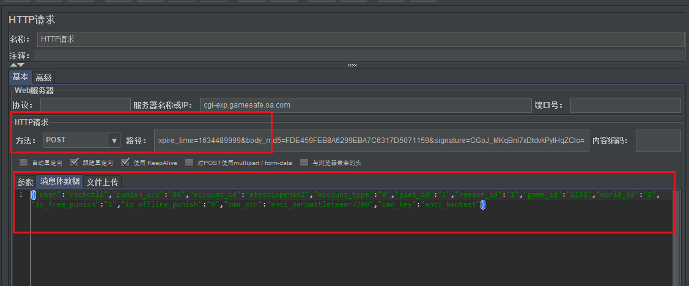
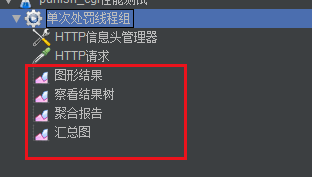
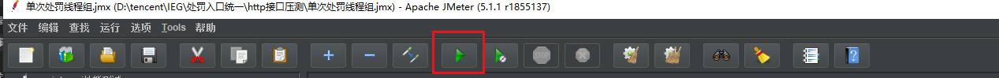
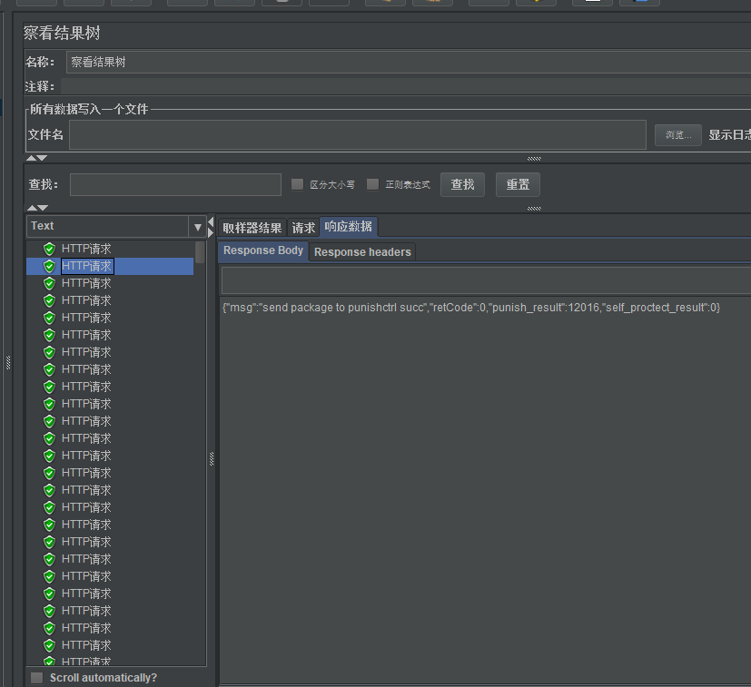

## http接口压力测试
测试http接口的性能，我们可以有很多种工具去测。
其中比较出名的工具就有jmeter。

### Jmeter使用
Jmeter的使用并不算复杂，只需要去官网下载压缩包。

win系统下的话，去到bin里打开ApacheJmeter.jar文件，需要提前安装java

打开之后界面如下：



名称那里输入名字建立一个测试计划，这个测试计划最好需要把它保存成本地文件的形式。

#### 1.建立线程组
我们需要一个线程组来帮助我们进行压测，



对测试计划右键，添加一个线程组。然后我们可以配置线程组的一些信息。



配置时注意填写信息，线程数代表开启线程的数量，循环次数代表是否循环，持续时间代表执行多长时间。

如上图配置的含义就是，开启300个线程，持续压测30秒。

#### 2. 建立http信息头
要发送http包，当然需要我们设置发送的header，我们就可以再这个地方设置。

同理，我们**右键添加->配置原件->HTTP信息头管理器**



这里可以添加Cookie信息，我们点击下面按钮添加键值对即可。

#### 3.建立http请求



右键添加，取样器，添加Http请求。



这里就可以配置一些http请求的内容了，方法选post的话，服务器名称处写域名，路径处写path，下面的消息体数据还能指定body传递什么内容过去。

#### 4. 建立结果展示集
http配置完以后，我们还需要添加一些图形组件来帮助我们观测这个结果。



右键添加，监听器里我们可以添加图形结果，查看结果树，聚合报告，汇总图等等一些组件。

然后我们就可以执行run来看看组件的展示了，点击启动按钮：



察看结果树这个组件下我们可以看到http执行的结果。



聚合报告组件则能看到我们本次压测执行的结果信息。


### ab 工具

ab 测试工具是 Apache 提供的一款测试工具，具有简单易上手的特点，在测试 Web 服务时非常实用。

ab 可以在 Windows 系统中使用，也可以在 Linux 系统中使用。这里我说下在 Linux 系统中的安装方法，非常简单，只需要在 Linux 系统中输入 yum-y install httpd-tools 命令，就可以了。

ab 工具用来测试 post get 接口请求非常便捷，可以通过参数指定请求数、并发数、请求参数等。

例如，一个测试并发用户数为 10、请求数量为 100 的的 post 请求输入如下：

```
ab -n 100  -c 10 -p 'post.txt' -T 'application/x-www-form-urlencoded' 'http://test.api.com/test/register'
```


### wrk

wrk is a modern HTTP benchmarking tool capable of generating significant load when run on a single multi-core CPU. It combines a multithreaded design with scalable event notification systems such as epoll and kqueue.


安装wrk

```
sudo yum groupinstall 'Development Tools'
sudo yum install -y openssl-devel git 
git clone https://github.com/wg/wrk.git wrk
cd wrk
make
# 将可执行文件移动到 /usr/local/bin 位置
sudo cp wrk /usr/local/bin
```

