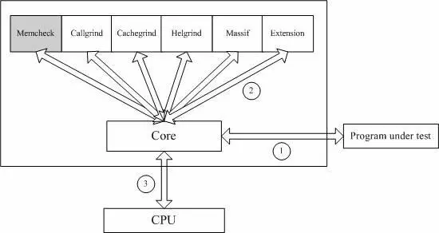
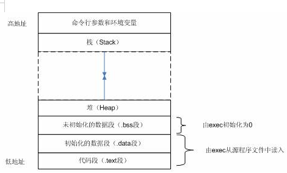

## valgrind基础

Valgrind是一套Linux下，开放源代码（GPL
V2）的**仿真调试工具的集合**。Valgrind由内核（core）以及基于内核的其他调试工具组成。

内核类似于一个框架（framework），它模拟了一个CPU环境，并提供服务给其他工具；而其他工具则类似于插件 (plug-in)，利用内核提供的服务完成各种特定的内存调试任务。

Valgrind包括如下一些工具：

- Memcheck：这是valgrind应用最广泛的工具，一个重量级的内存检查器，能够发现开发中绝大多数内存错误使用情况，比如：使用未初始化的内存，使用已经释放了的内存，内存访问越界等。
- Callgrind：它主要用来检查程序中函数调用过程中出现的问题。
- Cachegrind：它主要用来检查程序中缓存使用出现的问题。
- Helgrind：它主要用来检查多线程程序中出现的竞争问题。
- Massif：它主要用来检查程序中堆栈使用中出现的问题。
- Extension：可以利用core提供的功能，自己编写特定的内存调试工具。

下图展示了一个典型的Linux C程序内存空间布局：

- **代码段（.text）。**这里存放的是CPU要执行的指令。代码段是可共享的，相同的代码在内存中只会有一个拷贝，同时这个段是只读的，防止程序由于错误而修改自身的指令。
- **初始化数据段（.data）。**这里存放的是程序中需要明确赋初始值的变量，例如位于所有函数之外的全局变量：int val=100。需要强调的是，以上两段都是位于程序的可执行文件中，内核在调用exec函数启动该程序时从源程序文件中读入。
- **未初始化数据段（.bss）**。位于这一段中的数据，内核在执行该程序前，将其初始化为0或者null。例如出现在任何函数之外的全局变量：int sum;
- **堆（Heap）。**这个段用于在程序中进行动态内存申请，例如经常用到的malloc，new系列函数就是从这个段中申请内存。
- **栈（Stack）。**函数中的局部变量以及在函数调用过程中产生的临时变量都保存在此段中。

### 检测原理

**Memcheck**检测内存问题的原理如下图所示：

Memcheck 能够检测出内存问题，关键在于其建立了两个全局表。

**Valid-Value 表：**

对于进程的整个地址空间中的每一个字节(byte)，都有与之对应的 8 个 bits；对于 CPU 的每个寄存器，也有一个与之对应的 bit 向量。这些 bits 负责记录该字节或者寄存器值是否具有有效的、已初始化的值。

**Valid-Address 表**

对于进程整个地址空间中的每一个字节(byte)，还有与之对应的 1 个 bit，负责记录该地址是否能够被读写。

**检测原理：**

- 当要读写内存中某个字节时，首先检查这个字节对应的 A bit。如果该A bit显示该位置是无效位置，memcheck 则报告读写错误。
- 内核（core）类似于一个虚拟的 CPU 环境，这样当内存中的某个字节被加载到真实的 CPU 中时，该字节对应的 V bit 也被加载到虚拟的 CPU 环境中。一旦寄存器中的值，被用来产生内存地址，或者该值能够影响程序输出，则 memcheck 会检查对应的V bits，如果该值尚未初始化，则会报告使用未初始化内存错误。

### 执行

**在valgrind下，运行可执行程序。**

利用valgrind调试内存问题，不需要重新编译源程序，它的输入就是二进制的可执行程序。调用Valgrind的通用格式是：**valgrind [valgrind-options] your-prog [your-prog-options]**

Valgrind 的参数分为两类，一类是 core 的参数，它对所有的工具都适用；另外一类就是具体某个工具如 memcheck 的参数。Valgrind 默认的工具就是 memcheck，也可以通过“--tool=*tool name*”指定其他的工具。Valgrind 提供了大量的参数满足你特定的调试需求，具体可参考其用户手册。

这个例子将使用 memcheck，于是可以输入命令入下：**valgrind <Path>/sample.**

然后可以分析valgrind的输出信息：

- 左边显示类似行号的数字（32372）表示的是 Process ID。
- 最上面的红色方框表示的是 valgrind 的版本信息。
- 中间的红色方框表示 valgrind 通过运行被测试程序，发现的内存问题。通过阅读这些信息，可以发现：
  1. 这是一个对内存的非法写操作，非法写操作的内存是4 bytes。
  2. 发生错误时的函数堆栈，以及具体的源代码行号。
  3. 非法写操作的具体地址空间。
- 最下面的红色方框是对发现的内存问题和内存泄露问题的总结。内存泄露的大小（40 bytes）也能够被检测出来。