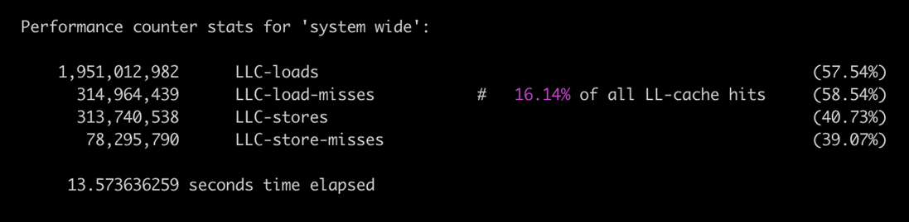
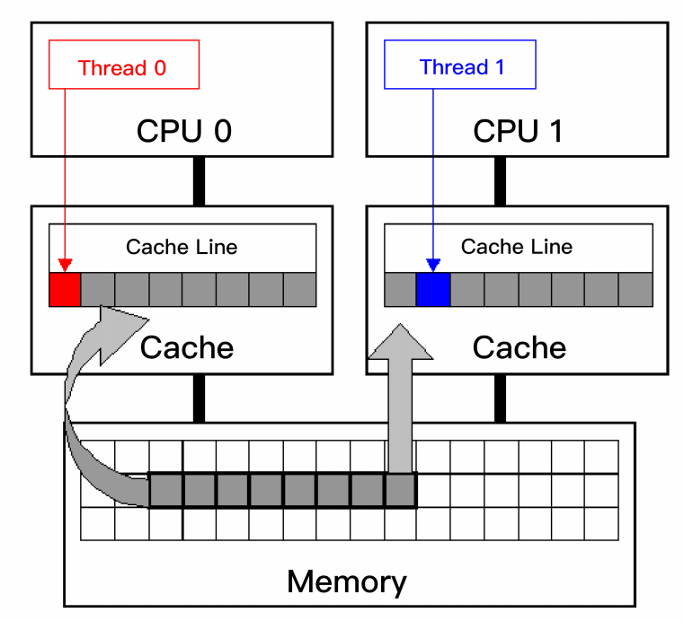

## CPU LLC优化

这个性能案例，是关于CPU 的最后一级缓存的。你应该知道，最后一级缓存（一般也就是L3），如果命中率不高的话，对系统性能会有极坏的影响。

建议采取三种性能优化策略，来提高最后一级缓存的命中率。分别是：**紧凑化数据结构**、**软件预取数据**和**去除伪共享缓存**。

最后一级缓存叫 **LLC（Last Level Cache）**；LLC 的后面就是内存。 缓存不命中的比例对 CPU 的性能影响很大，尤其是最后一级缓存的不命中时，对性能的损害尤其严重。这个损害主要有两方面的性能影响：

- 第一个方面的影响很直白，就是 **CPU 的速度**受影响。我们前面讲过，内存的访问延迟，是LLC 的延迟的很多倍（比如五倍）；所以 LLC 不命中对计算速度的影响可想而知。
- 第二个方面的影响就没有那么直白了，这方面是关于**内存带宽**。我们知道，如果 LLC 没有命中，那么就只能从内存里面去取了。LLC 不命中的计数，其实就是对内存访问的计数，因为 CPU 对内存的访问总是要经过 LLC，不会跳过 LLC 的。所以每一次 LLC 不命中，就会导致一次内存访问；反之也是成立的：每一次内存访问都是因为 LLC 没有命中。

### 问题测量

针对 LLC 不命中率高的问题，我们需要衡量一下问题的严重程度。在 Linux 系统里，可以用 Perf 这个工具来测量 LLC 的不命中率。PMU 尤其可以监测 **LLC 相关的指标数据**，比如 **LLC 读写计数、LLC 不命中计数、LLC 预先提取计数等指标**。

具体用 Perf 来测量 LLC 各种计数的命令格式是：

`perf stat -e LLC-loads,LLC-load-misses,LLC-stores,LLC-store-misses`

比如下面perf的执行结果：

我们可以看到，在这段取样时间内，有 1951M（19.51 亿）次 LLC 的读取，大约 16% 是不命中。有 313M（3.13 亿）次 LLC 的写入(store)，差不多 24% (7000W+的store miss)是不命中。 

#### 降低LLC不命中率

第一个方案，也是最直白的方案，就是**缩小数据结构**，让数据变得紧凑。

开源的 C++ Folly 库里面有很多类，比如 F14ValueMap，就比一般的标准库实现小很多，从而占用比较少的内存；采用它的话，自然缓存的命中率就比较高。

第二个方案，是**用软件方式来预取数据**。

这个方案也就是通过合理预测，把以后可能要读取的数据提前取出，放到缓存里面，这样就可以减少缓存不命中率。“用软件方式来预取数据”理论上也算是一种“**用空间来换时间**”的策略

第三个方案，是具体为了解决一种特殊问题：就是伪共享缓存。这个方案也算是一种“**空间换时间**”的策略，是通过让每个数据结构变大，牺牲一点存储空间，来解决伪共享缓存的问题。 

#### 软件提前预取指令

先展开讨论一下第二种方案，也就是用软件提前预取指令。现代 CPU 其实一般都有**硬件指令**和**数据预取**功能，也就是根据程序的运行状态进行预测。并提前把指令和数据预取到缓存中。这种硬件预测针对连续性的内存访问特别有效。

但是在相当多的情况下，程序对内存的访问模式是随机、不规则的，也就是不连续的。硬件预取器对于这种随机的访问模式，根本无法做出正确的预测，这就需要使用**软件预取**。

软件预取就是这样一种预取到缓存中的技术，以便及时提供给 CPU，减少 CPU 停顿，从而降低缓存的不命中率，也就提高了 CPU 的使用效率。现代 CPU 都提供相应的预取指令，具体来讲，Windows 下可以使用 VC++ 提供的 `_mm_prefetch` 函数，Linux 下可以使用 GCC 提供的 `__builtin_prefetch` 函数。GCC 提供了这样的接口，允许开发人员向编译器提供提示，从而帮助 GCC 为底层的编译处理器产生预取指令。这种策略在硬件预取不能正确、及时地预取数据时，极为有用。 

但是软件预取也是有代价的。

一是预取的操作本身也是一种 CPU 指令，执行它就会占用 CPU 的周期。更重要的是，预取的内存数据总是会占用缓存空间。因为缓存空间很有限，这样可能会踢出其他的缓存的内容，从而造成被踢出内容的缓存不命中。如果预取的数据没有及时被用到，或者带来的好处不大，甚至小于带来的踢出其他缓存相对应的代价，那么软件预取就不会提升性能。

软件预期有以下几个实践经验：

- 软件预取最好只针对绝对必要的情况，就是对会实际严重导致 CPU 停顿的数据进行预取。 
- 对于很长的循环（就是循环次数比较多），尽量提前预取后面的两到三个循环所需要的数据。 
- 而对于短些的循环（循环次数比较少），可以试试在进入循环之前，就把数据提前预取到。 

#### 取出伪共享缓存

我们接着来讨论第三个方案：去除伪共享缓存。

一般是以缓存行（Cache Line）为单位存储的。最常见的缓存行大小是 64 个字节。现代 CPU 为了保证缓存相对于内存的一致性，必须实时监测每个核对缓存相对应的内存位置的修改。如果不同核所对应的缓存，其实是对应内存的同一个位置，那么对于这些缓存位置的修改，就必须轮流有序地执行，以保证内存一致性。 

但是，这将导致核与核之间产生竞争关系，因为一个核对内存的修改，将导致另外的核在该处内存上的缓存失效。在多线程的场景下就会导致这样的问题。当多线程修改看似互相独立的变量时，如果这些变量共享同一个缓存行，就会在无意中影响彼此的性能，这就是**伪共享**。 

可以参考下面这张 Intel 公司提供的图，两个线程运行在不同的核上，每个核都有自己单独的缓存，并且两个线程访问同一个缓存行。 

如果线程 0 修改了缓存行的一部分，比如一个字节，那么为了保证缓存一致性，这个核上的整个缓存行的 64 字节，都必须写回到内存；这就导致其他核的对应缓存行失效。其他核的缓存就必须从内存读取最新的缓存行数据。这就造成了其他线程（比如线程 1）相对较大 的停顿。 

这个问题就是**伪共享缓存**。之所以称为“伪共享”，是因为，单单从程序代码上看，好像线程间没有冲突，可以完美共享内存，所以看不出什么问题。由于这种冲突性共享导致的问题不是程序本意，而是由于底层缓存按块存取和缓存一致性的机制导致的，所以才称为“伪共享”。

这个问题的解决方案，是**让每个元素单独占用一个缓存行**，比如 64 字节，也就是按缓存行的大小来对齐（Cache Line Alignment）。具体方法怎么实现呢？其实就是插入一些无用的字节（Padding）。这样的好处，是多个线程可以修改各自的元素和对应的缓存行，不会存在缓存行竞争，也就避免了“伪共享”问题。 