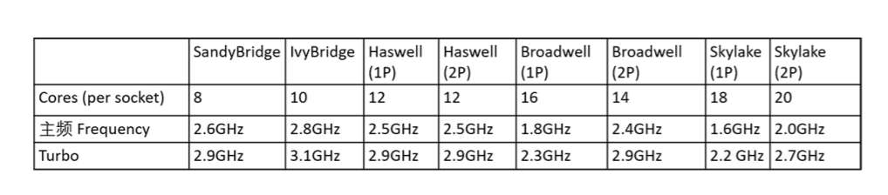
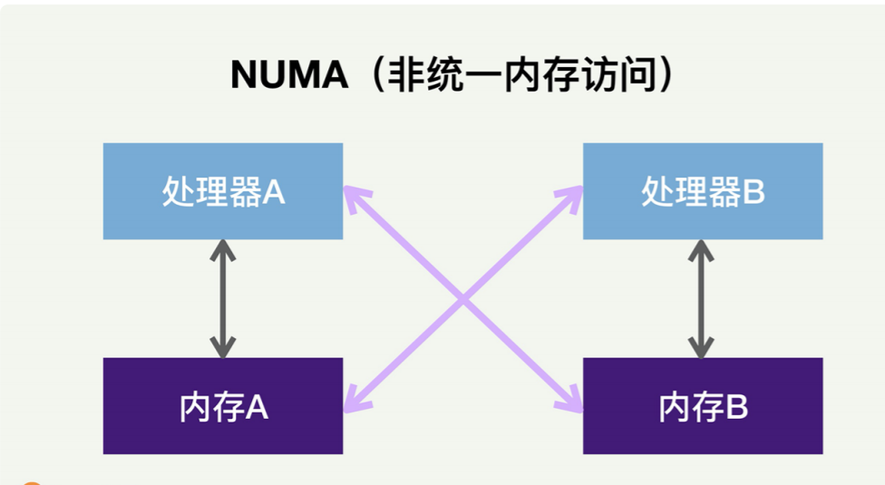
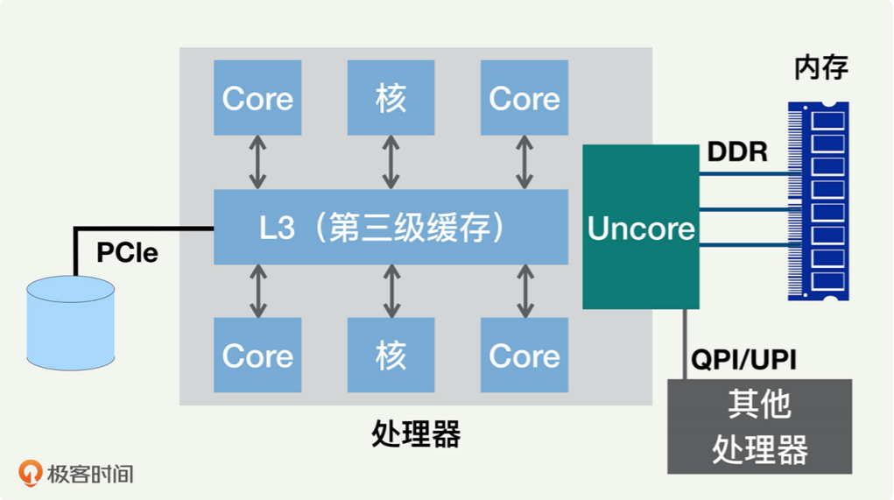

## CPU性能基础

宏观来讲，一台服务器里面的 CPU 性能取决于好几个因素，包括有多少处理器、多少个 核、时钟主频是多少、有没有 Turbo 模式、处理器内部的运算架构以及和 CPU 紧密交互 的其他部件的性能。

CPU 的更新换代很频繁，基本上每两年就会更新一代。比如 Intel 的 CPU，最近 10 年已 经经历了 5 代左右。每一代都有主频的变化，而且有好几个变种。

下面的表格描述了从十年前（也就是 2009 年）的 SandyBridge，到后来的 IvyBridge、 Haswell、Broadwell，直到 Skylake。ps：单处理器（1P）和双处理器（2P）。

大体上我们可以看出，虽然 CPU 更新换代，但是处理器的时钟主频基本不再提高，甚至变 得更低了。这样的目的是降低 CPU 的功耗。比如 SandyBridge 的时钟频率是 2.6GHz，但 是到了 Skylake，反而降低到了 2GHz。

为了提升单个处理器的性能，每个处理器里面的核数却越来越多，这样就可以尽量的提升并 行处理能力。比如 SandyBridge 的每个处理器只有 8 个核，而 Skylake 则多达 20 个核。

而且我们也看到，每一代 CPU 都允许**Turbo 模式**，就是让 CPU 的主频提高。目的是可以 让处理器在特殊情况下，用提高功耗的代价来增加主频，从而获得更高性能。

### 多处理器和NUMA

现在的 CPU 普遍采用多处理器（Socket）来提高 CPU 性能，**每个处理器都有自己可以直 接访问的本地内存（Local Memory）**。一般来讲，这里面每个处理器的性能和内存大小都 是一样的。每个处理器也都可以访问其他处理器的内存，这些内存就相当于是外地 / 远程 内存（Remote Memory）。

当 CPU 处理器访问本地内存时，会有较短的响应时间（称为本地访问 Local Access）。而 如果需要访问外地 / 远程内存时候，就需要通过**互联通道访问**，响应时间就相比本地内存 变慢了（称为远端访问 Remote Access）。所以 NUMA（Non-Uniform Memory Access）就此得名。

**zwlj：由上图就可以得知，cpu是分控几个内存区域的**

**采用多处理器和 NUMA 架构的主要原因，是提高整个 CPU 的并行处理性能**。每一台服务 器可以同时运行很多程序和进程。对每一个进程和线程而言，当它运行在某一个处理器上 时，它所对应的内存使用默认的分配方案是——优先尝试在请求线程当前所处的处理器的 本地内存上分配。**如果本地内存不足，才会分配到外地 / 远程内存上去。**

### 多核结构和多级缓存

我们再看看每个处理器内部的结构。我们刚刚讲到的处理器，内部一般都是多核（Core） 架构。随着多核处理器的发展，CPU 的缓存通常分成了三个级别：L1、L2 和 L3。

级别越小就越接近 CPU，速度更快，同时容量也越小。L1 和 L2 一般在核的内部，我们下 一讲还会详细讲。L3 缓存是三级缓存中最大的一级，同时也是最慢的一级；在同一个处理 器内部的核会共享同一个 L3 缓存。

除了多个核以及 L3 缓存外，处理器上一般还有非核心处理器（Uncore），里面含有和指 令运行不直接相关的组件，包括 QPI 控制器和存储器一致性监测组件，如下图所示。

### 超线程（Hyperthreading，HT）

一个核还可以进一步分成几个逻辑核，来执行多个控制流程，这样可以进一步提高并行程 度，这一技术就叫超线程，有时叫做 simultaneous multi-threading（SMT）。

超线程技术主要的出发点是，当处理器在运行一个线程，执行指令代码时，很多时候处理器 并不会使用到全部的计算能力，部分计算能力就会处于空闲状态。而超线程技术就是通过多 线程来进一步“压榨”处理器。

举个例子，如果一个线程运行过程中，必须要等到一些数据加载到缓存中以后才能继续执 行，此时 CPU 就可以切换到另一个线程，去执行其他指令，而不用去处于空闲状态，等待 当前线程的数据加载完毕。

通常，一个传统的处理器在线程之间切换，可能需要几万个时钟周期。而一个具有 HT 超线 程技术的处理器只需要 1 个时钟周期。因此就大大减小了线程之间切换的成本，从而最大 限度地让处理器满负荷运转。

一个核分成几个超线程呢？ 这个数字会根据 CPU 架构有所变化；Intel 一般是把一个核分成 2 个。

接下来就是我们说的CPU计算：

**比如，如果一台计算机有两个处理器，每个处理器有 12 个核，而且采用了 HT 超线程，那 么总的 CPU 数目就是 48，就是 2×12×2。这个数字 48，就是我们平时用监控软件和命令 看到的 CPU 的数量。比如，Linux 的 top 或者 vmstat 命令，显示的 CPU 个数就是这样 算出来的。**

### CPU的性能

如果 10% 的 CPU 使用率可以每秒处理 1 千个请求，那么 80% 的 CPU 使用率 能够处理多少请求呢？不太可能处理每秒 8 千个请求，往往会远远小于这个数字。

衡量一个应用程序对 CPU 使用效率时，往往会考察 CPI（Cycles Per Instruction，每指令 的周期数）和 IPC（Instructions Per Cycle，每周期的指令数）。这两个指标有助于识别 运行效率高或低的应用程序。而一台计算机的 CPU 性能一般用 MIPS（Millions of Instructions Per Second）来衡量，表示每秒能运行多少个百万指令，MIPS 越高，性能 越高。MIPS 的计算很简单，就是时钟频率×IPC。

继续往深处分析，CPU 常见的各种中断包括软中断和硬中断。除此之外，还有一种特殊的 中断：上下文切换。这些指标需要和每个核挂钩，理想情况下是各个核上的中断能够均衡。 如果数量不均衡，往往会造成严重的性能问题——有的核会超载而导致系统响应缓慢，但 是其他的核反而空闲。

和 CPU 相关的性能问题，基本上就是表现为 CPU 超载或者空闲。

**如果是 CPU 超载，那么就要分析为什么超载。多数情况下都不一定是合理的超载，比如说 多核之间的负载没有平衡好，或者 CPU 干了很多没用的活，或者应用程序本身的设计需要 优化等等。反之，如果是 CPU 空闲，那就需要了解为什么空闲，或许是指令里面太多内存数据操作，从而造成 CPU 停顿，也或许是太多的分支预测错误等，这就需要具体分析和对 症下药的优化**。

CPU 对多线程的执行顺序是谁定的呢？

是由内核的进程调度来决定的。内核进程调度负责管理和分配 CPU 资源，合理决定哪个进 程该使用 CPU，哪个进程该等待。进程调度给不同的线程和任务分配了不同的优先级，优 先级最高的是硬件中断，其次是内核（系统）进程，最后是用户进程。每个逻辑 CPU 都维 护着一个可运行队列，用来存放可运行的线程来调度。