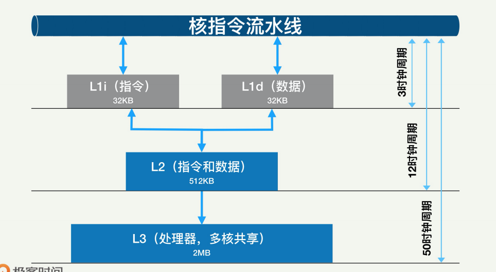
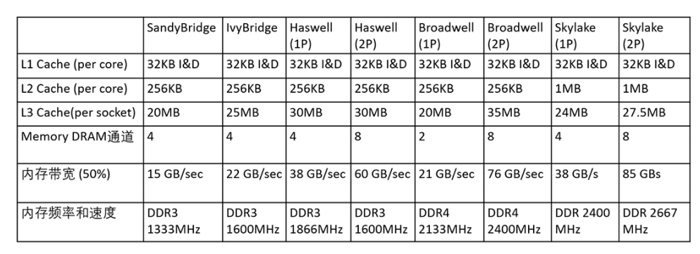

## 内存性能基础

内存方面的性能指标，主要有缓存命中率、缓存一致性、内存带宽、内存延迟、内存的使用大小及碎片、内存的分配和回收速度等

### 缓存和缓存命中率

缓存是 CPU 与内存之间的临时数据交换器，是为了解决两种速度不匹配的矛盾而设计的。

有人甚至开玩笑说，计算机的各种技术说到底就是三种——Cache（缓存）、Hash（哈希处理）和 Trash（资源回收）。

CPU 缓存通常分成了三个级别：L1、L2、L3。一般而言，每个核上都有 L1 和 L2 缓存。L1 缓存其实分成两部分：一个用于存数据，也就 是 L1d Cache（Data Cache），另外一个用于存指令，L1i Cache（Instruction Cache）。 

L1 缓存相对较小，每部分差不多只有几十 KB。L2 缓存更大一些，有几百 KB，速度就要慢一些了。L2一般是一个统一的缓存，不把数据和指令分开。L3 缓存则是三级缓存中最大的可以达到几个 MB 大小，同时也是最慢的一级了。你要注意，在同一个处理器上， 所有核共享一个 L3 缓存。 

为什么要采用多级缓存，并逐级增加缓存大小呢？就是为了提高各级缓存的命中率，从而最大限度地降低直接访问内存的概率。尤其是 L1 的命中率。

### 缓存一致性

虽然缓存能够极大地提升运算性能，但也带来了一些其他的问题，比如“缓存一致性问题（cache coherence）”。 

如果不能保证缓存一致性，就可能造成结果错误。因为每个核都有自己的 L1 和 L2 缓存，当在不同核上运行同一个进程的不同线程时，如果这些线程同时操作同一个进程内存，就可能互相冲突，最终产生错误的结果。 

为了达到数据访问的一致，就需要各个处理器和内核，在访问缓存和写回内存时遵循一些协 议，这样的协议就叫**缓存一致性协议**。常见的缓存一致性协议有 MSI、MESI 等(**可见操作系统笔记**)。 

### 内存带宽和延迟

计算机性能方面的一个趋势就是，内存越来越变成主要的性能瓶颈。内存对性能的制约包括三个方面：内存大小、内存访问延迟和内存带宽。 

内存访问延迟，这个也比较好理解，我们刚刚讨论的各级缓存，都是为了降低内存的直接访问，从而间接地降低内存访问延迟的。

内存带宽，也就是单位时间内，可以并行读取或写入内存的数据量，通常以 字节 / 秒为单位表示。一款 CPU 的最大内存带宽往往是有限而确定的。这个最大内存带宽只是个理论最大值，实际中我们的程序使用只能达到最大带宽利用率的60％。如果超出这个百分比，内存的访问延迟会急剧上升。 

那么一款处理器的内存总带宽取决于哪些因素呢？

答案是，有四个因素：内存总带宽的大小就是这些因素的乘积。这四个因素是：

- DRAM 时钟频率
- 每时钟的数据传输次数
- 内存总线带宽(一般是 64 字节) 
- 内存通道数量。 

文章中的这个表格大体上总结了 5 款 Intel CPU 的各级缓存大小、内存通道数目、可使用内存带宽（这里取最大值的 50%）、内存频率和速度。每款新的 CPU，内存带宽一般还是增加的，这主要归功于内存频率的提升

### 内存的分配

程序使用的内存大小很关键，是影响一个程序性能的重要因素，所以我们应该尽量对程序的内存使用大小进行调优，从而让程序尽量少地使用内存。 

在系统空闲内存很少的时候，程序很可能会变得超级慢。因为操作系统对内存请求进行（比如 malloc()）处理时，如果空闲内存不够，系统需要采取措施回收内存，这个过程可能会阻塞。

 我们写程序时，或许习惯直接使用 new、malloc 等 API 申请分配内存，直观又方便。但这样做有个很大的缺点，就是所申请内存块的大小不定。当这样的内存申请频繁操作时，会造成大量的内存碎片；这些内存碎片会导致系统性能下降。 

### NUMA的影响

我们刚刚谈了内存性能的几个方面，最后看看多处理器使用内存的情景，也就是 NUMA场景。NUMA 系统现在非常普遍，它和 CPU 和内存的性能都很相关。NUMA 包 含多个处理器（或者节点），它们之间通过高速互连网络连接而成。每个处理器都有自己的本地内存，但所有处理器可以访问全部内存。 

因为访问远端内存的延迟远远大于本地内存访问，操作系统的设计已经将内存分布的特点考 虑进去了。比如一个线程运行在一个处理器中，那么为这个线程所分配的内存，一般是该处 理器的本地内存，而不是外部内存。但是，在特殊情况下，比如本地内存已经用光，那就只 能分配远端内存。

我们部署应用程序时，最好将访问相同数据的多个线程放在相同的处理器上。根据情况，有时候也需要强制去绑定线程到某个节点或者 CPU 核上。