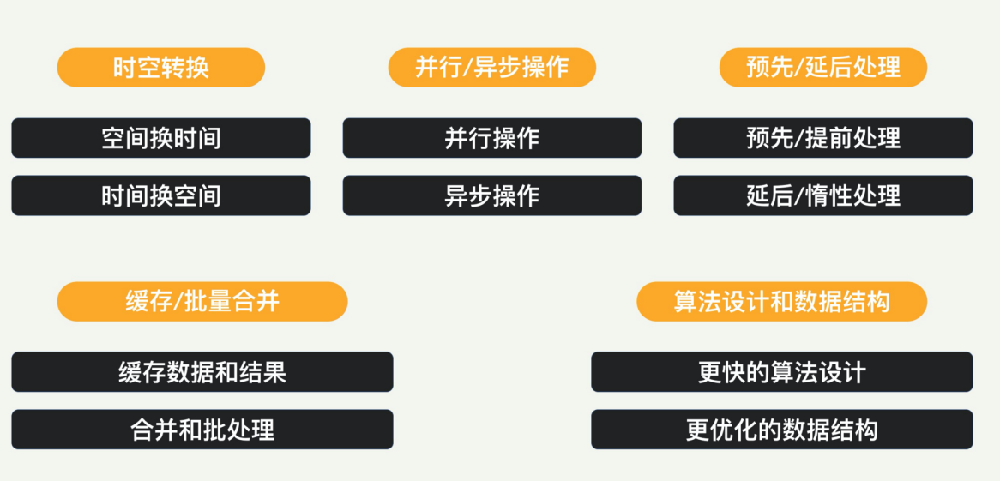

## 性能优化策略

系统来说，可以有十大常用的优化策略

分为五个大类，每个大类里有两种。

### 时空转换

首先是**时间换空间**，我们可以用某种压缩算法压缩内存中的数据，需要的时候再解压。

或者把内存数据存放到更外部的存储系统里压缩的方法和算法有很多种， 比如现在比较流行的 **ZStandard（ZSTD）和 LZ4**。这些算法之间有空间和时间的取舍。

衡量任何压缩算法，基本上看三个指标：**压缩比例**、**压缩速度**以及**使用内存**。

如果系统的瓶颈在网络传输速度或者存储空间大小上，那就尽量采取高压缩比的算法，这样用时间来换空间，就能够节省时间或者其他方面的成本。

然后是**空间换时间**。互联网的服务往往规模很大，比如全国的服务甚至是全球的服务。用户分布在各地，它们对访问时间的要求很高，这就要求被访问的数据和服务，要尽量放在离他们很近的地方。“空间换时间”就是对数据和服务进行多份拷贝，尽可能地完美覆盖大多数的用户。我们前面讲过的 CDN 内容分发网络技术就可以归类于此。

### 预先和延后处理

#### 预先处理

预先 / 提前处理策略同样也表现在很多领域，比如网站页面资源的提前加载。Web 标准规定了至少两种提前加载的方式：preload 和 prefetch，分别用不同的优先级来加载资源，可以显著地提升页面下载性能。

很多文件系统有预读的功能，就是提前从磁盘读取额外的数据，为下次上层应用程序读数据做准备。这个功能对顺序读取非常有效，可以明显地减少磁盘请求的数量，从而提升读数据的性能。

CPU 和内存也有相应的预取操作，就是将内存中的指令和数据，提前存放到缓存中，从而加快处理器执行速度。缓存预取可以通过硬件或者软件实现，也就是分为**硬件预取**和**软件预取**两类

硬件预取是通过处理器中的硬件来实现的。该硬件会一直监控正在执行程序中请求的指令或数据，并且根据既定规则，识别下一个程序需要的数据或指令并预取。

软件预取是在程序编译的过程中，主动插入预取指令（prefetech），这个预取指令可以是编译器自己加的，也可以是我们加的代码。这样在执行过程中，在指定位置就会进行预取的操作。

####  延后 **/** 惰性处理

延后 / 惰性处理策略和前面说的预先 / 提前处理正好相反。就是尽量将操作（比如计算），推迟到必需执行的时刻，这样很可能避免多余的操作，甚至根本不用操作。

运用这一策略最有名的例子，就是 COW（Copy On Write，写时复制）。假设多个线程都想操作一份数据，一般情况下，每个线程可以自己拷贝一份，放到自己的空间里面。但是拷贝的操作很费时间。系统如果采用惰性处理，就会将拷贝的操作推迟。如果多个线程对这份数据只有读的请求，那么同一个数据资源是可以共享的，因为“读”的操作不会改变这份数据。当某个线程需要修改这一数据时（写操作），系统就将资源拷贝一份给该线程使用，允许改写，这样就不会影响别的线程。

### 并行和异步操作

优化策略的第三大类是“并行 / 异步操作”。并行和异步两种操作虽然看起来很不一样，其实有异曲同工之妙，就是都把一条流水线和处理过程分成了几条，不管是物理上分还是逻辑上分。

#### 并行操作

并行操作是一种**物理上**把一条流水线分成好几条的策略。直观上说，一个人干不完的活，那就多找几个人来干。并行操作既增加了系统的吞吐量，又减少了用户的平均等待时间。比如现代的 CPU 都有很多核，每个核上都可以独立地运行线程，这就是并行操作。

并行操作需要我们的程序有扩展性，不能扩展的程序，就无法进行并行处理。这里的并行概念有不同的粒度，比如是在服务器的粒度（所谓的横向扩展），还是在多线程的粒度，甚至是在指令级别的粒度。

#### 异步操作

异步操作这一策略和并行操作不同，这是一种**逻辑上**把一条流水线分成几条的策略。

我们知道 Unix 下的文件操作，是有 block 和 non-block 的方式的，有些系统调用也是block 式的，如：Socket 下的 select 等。如果我们的程序一直是同步操作，那么就会非常影响性能。采用异步操作的话，虽然稍微增加一点程序的复杂度，但会让性能的吞吐率有很大提升。

### 缓存和批量合并

缓存的本质是加速访问。这是一个用得非常普遍的策略，几乎体现在计算机系统里面每一个模块和领域，CPU、内存、文件系统、存储系统、内容分布、数据库等等，都会遵循这样的策略。

程序设计中，对于可能重复创建和销毁，且创建销毁代价很大的对象（比如套接字和线程），也可以缓存，对应的缓存形式，就是连接池和线程池等。

#### 批量合并处理

在有 IO（比如网络 IO 和磁盘 IO）的时候，合并操作和批量操作往往能提升吞吐量，提高性能。我们最常见的是批量 IO 读写。就是在有多次 IO 的时候，可以把它们合并成一次读写数据。这样可以减少读写时间和协议负担。比如，GFS 写文件的时候，尽量批量写，以减少IO 开销。

涉及到网络请求的时候，网络传输的时间可能远大于请求的处理时间，因此合并网络请求也很有必要。上层协议呢，端到端对话次数尽量不要太频繁（Chatty），否则的话，总的应用层吞吐量不会很高

### 算法和数据结构

对每一种具体的场景（包括输入集合大小、时间空间的要求、数据的大小分布等），总会有一种算法是最适合的。我们需要考虑实际情况，来选择这一最优的算法。