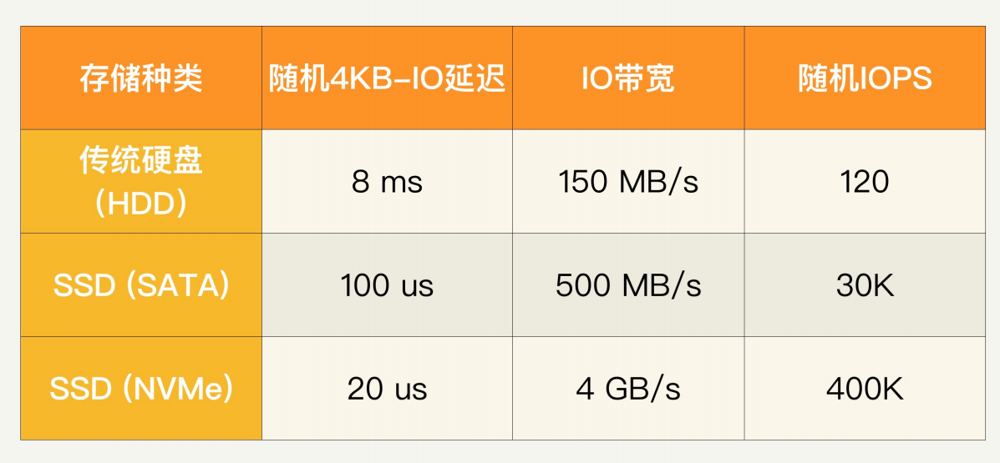
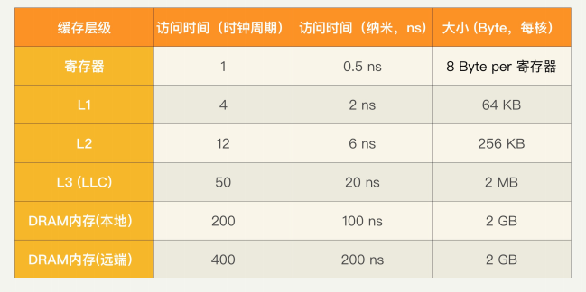
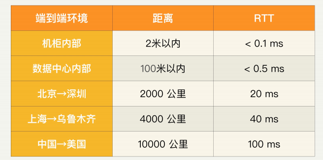

## 性能数字

要做性能优化，必须要对一些常规性能数字敏感。

### 存储

对所有的存储来说，有三个基本的性能指标。

1. IO 读写延迟。一般是用 4KB 大小的 IO 做基准来测试；

2. IO 带宽，一般是针对比较大的 IO 而言；

3. IOPS，就是每秒钟可以读写多少个小的随机 IO。

### CPU 和内存相关

说起 CPU 相关的性能数字，就必须先说 CPU 的时钟频率，也就是主频。主频反映了 CPU 工作节拍，也就直接决定了 CPU 周期大小。

**主频和周期大小。比如基于英特尔 Skylake 微处理器架构的 i7 的一款，其主频为 4GHz，那么每一个时钟周期（Cycle）大约0.25 纳秒（ns）。**

CPU 运行程序时，最基本的执行单位是指令。而每一条指令的执行都需要经过四步：指令获取、指令解码、指令执行、数据存入。这些操作都是按照 CPU 周期来进行的，一般需要好几个周期。

**zwlj: 所以说处理器主频越高，一个时钟周期需要的时间就越少，相同时间就能走更多的周期，也就是能执行更多的指令。因此看CPU的主频很重要。 注意，主频可以理解为CPU每秒执行多少个时钟周期**

#### CPC和IPC

每个指令周期数 CPI 和每个周期指令数 IPC 其实是孪生兄弟，衡量的是同一个东西。

**CPI（cycles per instruction）衡量平均每条指令的平均时钟周期个数**。它的反面是IPC（instructions per cycle）。**虽然一个指令的执行过程需要多个周期，但 IPC 是可以大于 1 的**，因为现代 CPU 都采用流水线结构。一般来讲，测量应用程序运行时的 IPC，如果低于 1，这个运行的系统性能就不是太好，需要做些优化来提高 IPC。

#### MIPS

**MIPS 就是每秒执行的百万指令数**。**我们经常会需要比较不同 CPU 硬件的性能，MIPS 就是一个很好的指标**，一般来讲，MIPS越高，CPU 性能越高。MIPS 可以通过主频和 IPC 相乘得到，

也就是说 MIPS= 主频×IPC。这个很容易理解，比如一个 CPU 频率再高，IPC 是 0 的话，性能就是 0。

CPU 的主频是 4GHz，IPC 是 1，那么这个 CPU 的 MIPS 就是 4000。注

**zwlj：注意这个指标就很重要了，用来衡量cpu的性能**

#### CPU缓存

一般 CPU 都有几级缓存，分别称为 L1、L2、L3，按这个顺序越来越慢，也越来越大，当然成本也越来越低。L3 有时候也称为 LLC（Last Level Cache），因为 L3 经常是最后一级缓存。多核 CPU 的情况下，一般 L1 和 L2 在核上，而 L3 是各个核共享的。

用下面的表格来表示一款 2GHz 主频的 CPU，进行寄存器和缓存访问的一般延迟，分别用时钟周期数和绝对时间来表示，同时也给出在每个 CPU 核上面的字节大小。

比如一般 L3 的访问需要 40 个时钟周期，2GHz 主频的话就是 20 纳秒，大小一般是每个核平均下来 2MB 的样子。

值得一提的是现在的 NUMA（非统一内存访问，Non-Uniform Memory Access）处理器会有本地和远端内存的区别，当访问本地节点的内存是会快一些。

### 操作系统和应用程序

你需要弄清楚如下的几个重要概念和指标

#### 1.指令分支延迟

CPU 需要先获取指令，然后才能执行。获取下一条指令时需要知道指令地址，如果这个地址需要根据现有的指令计算结果才能决定，那么就构成了指令分支。CPU 通常会采取提前提取指令这项优化来提高性能，但是如果是指令分支，那么就可能预测错误，预先提取的指令分支并没有被执行。

指令分支判断错误（Branch Mispredict）的时间代价是很昂贵的。如果判断预测正确，可能只需要一个时钟周期；如果判断错误，就需要十几个时钟周期来重新提取指令，这个延迟一般在 **10 纳秒左右**。

#### 2.互斥加锁和解锁

互斥锁 Mutex（也叫 Lock）是在多线程中用来同步的，可以保证没有两个线程同时运行在受保护的关键区域。使用互斥锁的时候需要加锁和解锁，都是时间很昂贵的操作，每个操作一般需要几十个时钟周期，**10 纳秒以上**。

#### 3. 上下文切换

多个进程或线程共享 CPU 的时候，就需要经常做上下文切换（Context switch）。这种切换在 CPU 时间和缓存上都很大代价；尤其是进程切换。在时间上，上下文切换可能需要几千个时钟周期，**1 微秒（1us）级别**。在缓存代价上，多级 CPU 缓存和 TLB 缓存都需要恢复，所以可能极大地降低程序线程和进程性能。

#### 4.网络相关

互联网服务最终是要面向终端客户的，客户和服务器的延迟对用户的服务体验至关重要。网络的传输延迟是和地理距离相关的。网络信号传递速度不可能超过光速，一般光纤中速度是每毫秒 200 公里左右。如果考虑往返时间（RTT，Round Trip Time），那么可以大致说每 100 公里就需要一毫秒。北京到深圳约 2,000 公里，RTT 就是 20 毫秒；上海到乌鲁木齐或者美国的东西海岸之间距离差不多 4,000 公里，所以 RTT 是 40 毫秒左右；中国到
美国（比如北京到美国西海岸旧金山）差不多 10,000 公里，RTT 就是 100 毫秒。

**在数据中心里面，一般的传输 RTT 不超过半毫秒。如果是同一个机柜里面的两台主机之间，那么延迟就更小了，小于 0.1 毫秒**。

仔细想想的话，你就会发现直线距离本身还不够，因为数据是通过骨干网光纤网络传播的。如果光纤网络绕路的话，那么实际的 RTT 会超过以上估算数值。

另外要注意的是，传输延迟也取决于传输数据的大小，因为各种网络协议都是按照数据包来传输的，包的大小会有影响。比如一个 20KB 大小的数据，用 1Gbps 的网络传输，仅仅网卡发送延迟就是 0.2 毫秒。

