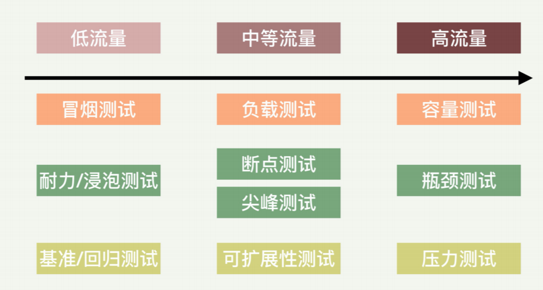
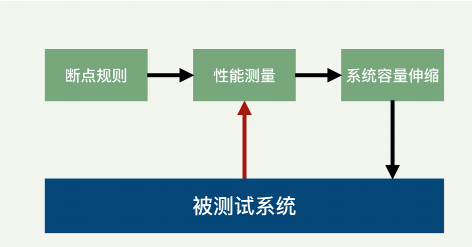
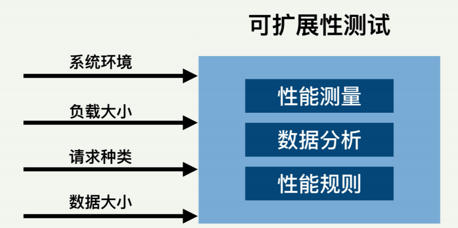
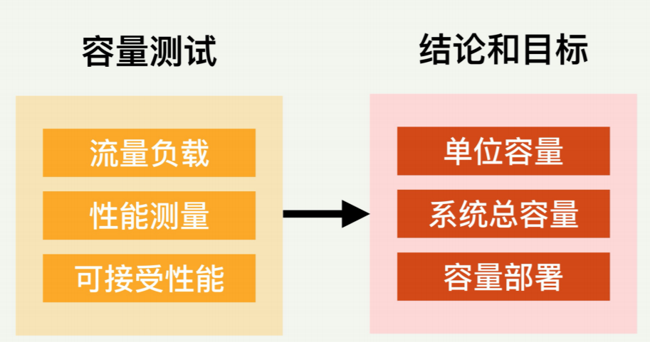

## 性能测试

性能测试如何分类呢？我们需要从几个方面来看，包括测试目的、测试环境、负载流量、测 试对象、负载数据、黑盒白盒等。

测试目的有大致几种：

- 测量服务速度（Speed）：确定程序是否能够快速地响应用户的请求，这个服务速度一 般包括**延迟和吞吐率**两个指标。速度通常是应用程序最重要的属性之一，因为运行缓慢 的应用程序容易丢失用户。
- 测量可扩展性（Scalability）：确定应用程序是否可以在用户负载和客户流量增大情况下 还能正常地运行。
- 测量稳定性（Stability）：确定在各种极端和恶劣环境下，应用程序是否能稳定运行。
- 测量性能瓶颈（Performance Bottleneck）：性能瓶颈是应用程序和系统中的最影响整 体性能的因素。瓶颈是指某个资源不足而导致某些负载下的性能降低。一些常见的性能 瓶颈是 CPU、内存、网络、存储等。

#### 测试环境

性能测试的环境也有几种，主要是开发环境还是生产环境。开发环境里面更多的是简单的测 试来发现一些明显问题，而生产环境测试一般是开发环境测试通过后才进行的。

#### 负载流量

根据测试的负载大小来分：是小流量，正常流量，还是超大流量。除了大小，负载变化的速 度也需要考虑。

### 测试种类

#### 冒烟测试（Smoke Testing）

冒烟测试是开发人员在开发环境里执行的简单测试，以确定新的程序代码不出故障。冒烟测 试目的是确认系统和程序基本功能正常。冒烟测试的执行者往往就是开发人员，但有时也让 运维人员参与。

#### 耐力测试（Endurance Testing）和浸泡测试（Soak Testing）

耐力测试（或者耐久测试）有时也叫浸泡测试，是一种非功能性测试。耐力测试是长时间测 试具有预期负载量的系统，以验证系统的行为是否正常。举一个例子，假设系统设计工作时 间是 3 小时；我们可以对这一系统进行超过 3 小时的测试，比如持续 6 小时的耐力测试， 以检查系统的耐久性。 执行耐力测试最常见的用例是暴露某些不易重现的问题，如内存问题、系统故障或其他随机 问题。

这里的偏重点是测试时间，因为有些程序和系统的问题只有在长期运行后才暴露出来。一个 最明显的例子就是内存泄漏。一个程序或许短时间内运行正常，但是如果有内存泄漏，只要 运行时间足够，就一定会暴露出这个问题。

#### 基准测试（Benchmark Testing）/ 性能回归测试（Performance Regression Testing）

基准测试或者性能回归测试是着重“前后”对比的测试。 这种测试往往是开发过程的一部分，一般不需要具体的性能要求。代码的演化过程中经常需 要确保新的代码不会对整个模块或系统的性能产生任何不好的影响。最简单的方法是对代码 修改前后进行基准测试，并比较前后的性能结果。执行基准测试的重点是保证前后测试环境 的一致，比如负载流量的特征和大小。

#### 负载测试

负载测试用于验证被测试系统或者程序是否可以处理预期的负载流量，并验证正常和峰值负载条件下的系统和程序行为。**这里的负载可以是真正的客户请求，也可以是仿真的人工产生的负载**。 我认为负载测试的定义有时太广泛和模糊，很多其他测试都可以看作是负载测试的一种，比 如马上就要讲到的容量测试，其实就是一种负载测试。

#### 断点测试

断点测试类似于压力测试或者容量测试。这种测试的过程是随着时间的推移而增大流量负 载，同时监视系统的预定故障条件。

断点测试也可以用来确定系统将达到其所需规范或服务水平协议的最大容量，并且自动采取 措施来纠正或者缓解。比如云计算环境中，我们可以设置某种性能断点，用它们来驱动某种 扩展和伸缩策略。

比如一种性能断点可以是根据用户的访问延迟。如果延迟性能测量的结果是已经超过预定的 阈值，就自动进行系统容量调整，比如增加云计算的服务器。反之，系统容量也可以根据断 点的规则来减少，以节省成本。如下图所示。

#### 尖峰测试

尖峰测试用于确定系统在负载（比如用户请求数）突然变化时的系统行为。这种测试是通过 突然增加或减少由用户产生的负载来观察系统的行为。

测试的目标是确定性能在这样的场景下是否会受损，系统是否会失败，或者是否能够处理负 载的显著变化。尖峰测试的核心是负载变化的突然性，所以也算是一种压力测试

#### 可扩展性测试（Scalability Testing）

可扩展性（或者叫可伸缩性）测试用于确定一个程序和系统的非功能性特征能不能在变化的 环境里合理扩展。这里的环境变化包括系统环境的变化、负载量的大小、请求的多样性、数 据量的大小等。

在系统环境变化时，同步的测量和观察各种性能指标，并进行数据的分析，从而确定在各种 环境下被测试系统的可扩展性。如下图所示。 这个测试的主要目的是了解系统在什么样的环境中，以及什么样的变化会导致系统不能扩 展。发现这些环境后，可以进一步有针对性的分析和加强。

#### 容量测试

容量测试（或者叫体积测试，Volume Testing）是用于确定一个单位容量能够支持的最大 负载。比如一个程序运行在某种服务器上，我们有时需要知道每台服务器能够支持的最大负 载（例如客户数），从而决定需要部署多少台服务器才能满足预定的总负载要求。

容量测试一般是会不断增大负载，并且不断地测量各种性能指标。在性能目标变得不可接受 之前，系统和程序可以成功处理的负载大小，就是单位容量可以承担的负载。为了尽量让得 到的结果匹配实际生产环境，采用的负载流量最好是真正的生产环境的请求和数据。

正常生产环境中的流量和数据或许不够大到让一台服务器超载，因此我们需要解决这个问 题。很多公司的解决方案是把其他服务器上的请求重定向到某一台被测试服务器，从而让这 台服务器适度超载。这种机制我后面会用一讲专门讨论。

#### 压力测试

压力测试也是一种负载测试，不过它偏重的是在负载增加到超过系统设计预期后观察和验证 系统的行为。当我们通过增加负载，对系统施压到超出设计期望的负载时，就能发现哪个模 块或组件首先因超载而失败。这样我们就可以通过提升失败组件的性能来设计出更健壮、性 能更优的系统。

相对于容量测试，压力测试的目的是为了暴露系统的问题，因此采用的负载不一定是真正的 生产数据和客户请求。

### 测试规划

当我们规划测试时，要算好几个指标的。

首先是性能指标，用的最多的性能指标就是这三个：

- 服务响应时间
- 服务吞吐量
- 资源利用率

然后是测试指标的度量：

一般需要同时考虑平均值、中位数和几个高端 的百分位数，**比如 99 百分位(也就是所谓P99)**。

然后是确定期望，列出想要的结果，比如：

- 当 2000 个用户同时访问网站时，所有客户的 P99 响应时间不超过 2 秒；
- 测试应用程序崩溃前可以处理的最大并行用户数；
- 测试同时读取 / 写入 500 条记录的数据库执行时间；
- 在峰值负载条件下，检查应用程序和数据库服务器的 CPU 和内存使用情况；
- 验证应用程序在不同负载条件下，比如较低、正常、中等和重载条件下的响应时间。

