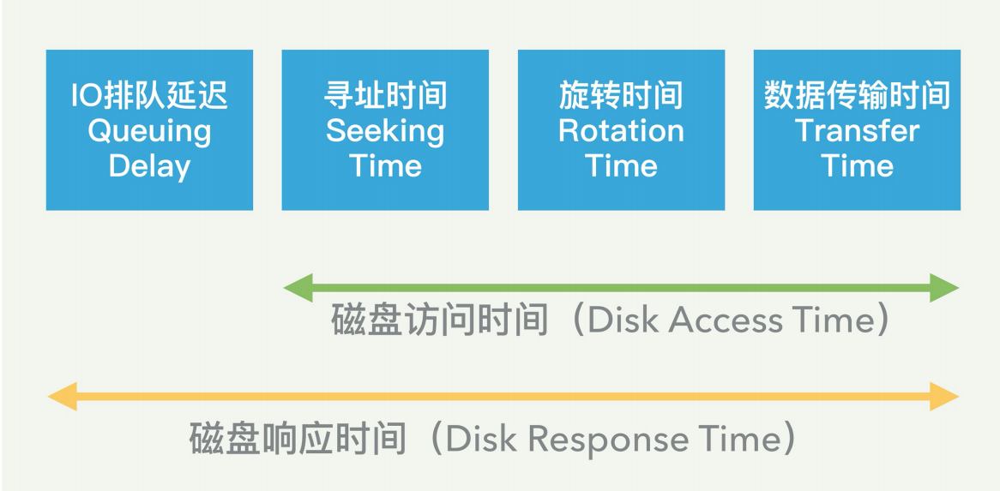
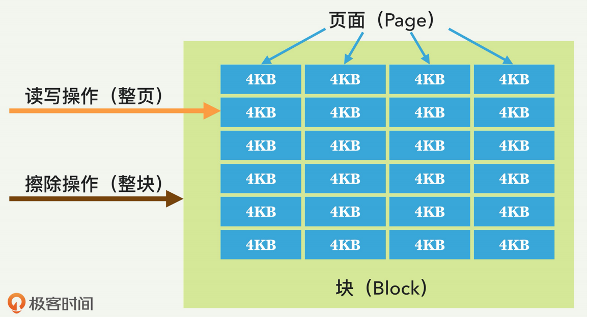

## 硬盘性能基础

一个存储系统的性能最主要的是三个：**IOPS**、**访问延迟**、**吞吐率 / 带宽**。这三个指标其实是互相关联和影响的，但是我们一般还是分开来衡量。

**IOPS**（Input/Output Per Second），即每秒钟能处理的读写请求数量，这是衡量存储性 能的主要指标之一。每个 IO 的请求都有自己的特性，比如读还是写，是顺序读写还是随机读写，IO的大小是多少等。 

### HDD传统硬盘性能

当应用程序发出硬盘 IO 请求后，这个请求就会进入硬盘的 IO 队列。如果前面有其他 IO，那么这个请求可能需要排队等待。当轮到这个 IO 来存取数据时，磁头需要机械运动到数据存放的位置，这就需要磁头寻址到相应的磁道，并旋转到相应的扇区，然后才是数据的传输。所以，讨论硬盘 IO 的性能时，需要充分考虑这一点。 

我们有时候需要把**硬盘响应时间**和**硬盘访问时间**分开对待。它们之间的关系是，硬盘响应时 间除了包括访问时间外，还包括 IO 排队的延迟，如下图所示。

我们如果拿起一块硬盘仔细看看，硬盘上面往往会标注后面三个参数，分别是平均寻址时间、盘片旋转速度，以及数据传输速度，这三个参数就可以提供给我们计算上述三个步骤的时间。 

### SSD

当今的主流 SSD 是基于 NAND 的，它是将数字位存储在单元中。每个 SSD 单元可以存储 一位（SLC，Single Level Cell，单级单元）、两位（MLC，多级单元）、三位（TLC，三级单元），甚至四位（QLC）。 

SSD 的特点是，对 SSD 单元的每次擦除，都会降低单元的寿命，因此每一个单元只能承受 一定数量的擦除。所以，不同的 SSD 就有这几方面的考虑和平衡。单元存储的位数越多，制造成本就越少，SSD 的容量也就越大。但是耐久性（擦除次数）也会降低。所以高端的SSD，比如企业级的，基本都是基于 SLC 的。 

我们总结一下，对 SSD 的 IO 操作，一共有三种类型：**读取**、**写入**和**擦除**。读取和写入是以页为单位的，也就是说最少也要读取写入一个页面。 

IO 写入的延迟，具体取决于磁盘的历史状态，因为如果 SSD 已经存储了许多数据，那么页的写入，有时需要移动已有的数据，这种情况下写入延迟就比较大。但多数情况下，延迟都很低，一般在微秒级别，远远低于 HDD。

SSD 内部有垃圾回收（GC）机制，它的目的就在于此，就是不断回收不用的块，进行擦除，从而产生新的空闲块来备用。这样可以确保以后的页写入能快速分配到一个全新的页。 

#### 写入放大

这是 SSD 相对于 HDD 的一个缺点，即实际写入 SSD 的物理数据量，有可能是应用层写入数据量的多倍。

这是因为，一方面页级别的写入需要移动已有的数据来腾空页面来写入。另一方面，GC 的 操作, 也会移动用户数据来进行块级别的擦除。 

对 SSD 真正的写操作的数据，肯定比实际写的数据量大，这就是写入放大。因为一 块 SSD 只能进行有限的擦除次数，也称为编程 / 擦除（P/E）周期，所以写入放大效用会缩短 SSD 的寿命。 

#### 损耗平衡

对每一个块而言，一旦擦除造成的损耗达到最大数量，该块就会“死亡”，再也不能存储数据了。对于 SLC 类型的块，P/E 周期的典型数目是十万次；对于 MLC 块，P/E 周期的数目是一万；而对于 TLC 块，则可能是几千。为了确保整块 SSD 的容量、性能和可靠性，SSD内部需要对整个 SSD 的各块做平衡，尽量在擦除次数上保持类似。 