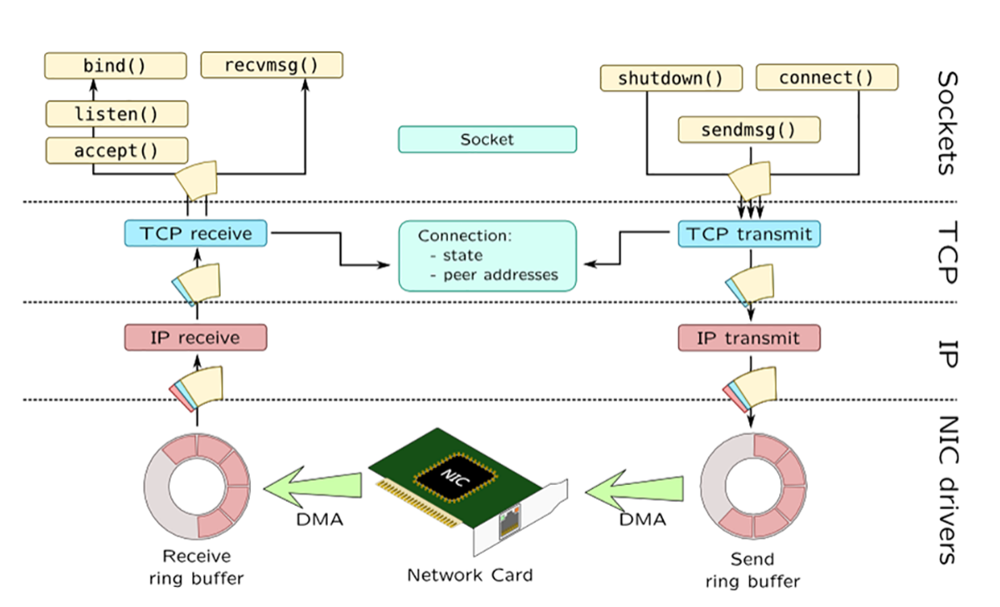
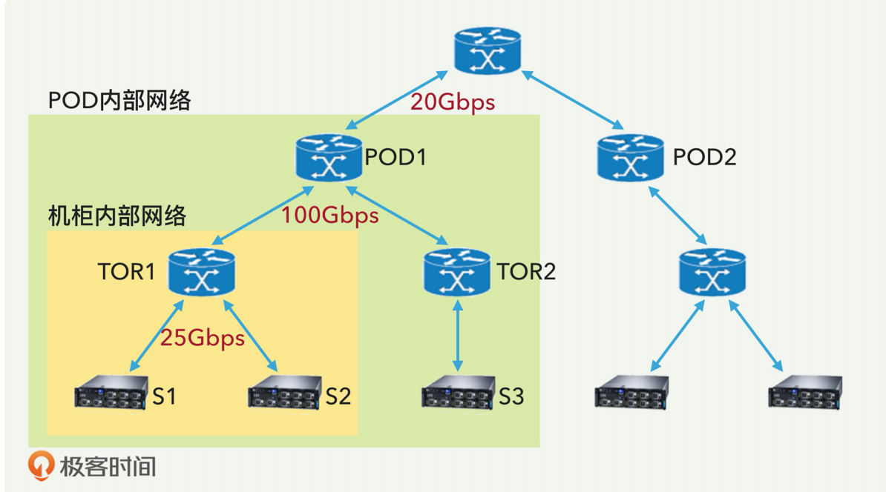
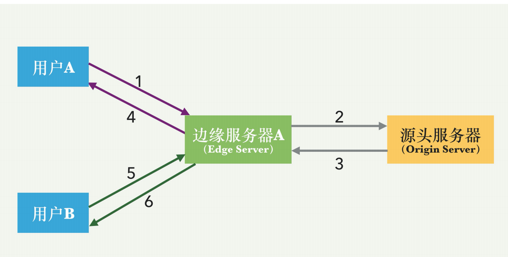

## 网络性能

网络性能的五个常用的指标是：

1. 可用性（availability）

2. 响应时间（response time）

3. 网络带宽容量（network bandwidth capacity）

4. 网络吞吐量（network throughput）

5. 网络利用率（network utilization）

是**网络带宽容量**。它指的是在网络的两个节点之间的最大可用带宽，这一指标一般是由设备和网络协议决定的，比如网卡、局域网和 TCP/IP 的特性。如果是向网络提供商购买的带宽，那么购买的数量就是网络的带宽容量。

**网络吞吐量**是指在某个时刻，在网络中的两个节点之间，端到端的实际传输速度。网络吞吐量取决于当前的网络负载情况，而且是随着时间不同而不断变化的。

标**网络利用率**是指网络被使用的时间占总时间的比例，一般以百分比来表示。因为数据传输的突发性，所以实际中的网络利用率一般不会太高。否则的话，那么响应时间就不能保证。

在 Unix 系统中，网络协议栈可以大体分为三层。从上到下，第一层是通过一系列系统调用，实现 BSD 套接字的套接字层，比如 sendmsg()函数；第二层是中间协议的程序，例如 TCP/IP/UDP；第三层是底部的媒体访问控制层，提供对网络接口卡（NIC）本身的访问。

注意这个图，右边是发送端，左边是接收端。先从右边看起，最上层就是 BSD 套接字。它通过一系列 API 调用（比如 connect() 等），然后是 TCP 的发送，再到 IP 的发送，最后到网卡的发送缓冲区，并最终通过网卡发出。 接收端，也就是图的左边，则会经过相反的顺序，逐层到达应用层。

### 数据中心

谈完单机的网络性能，我们接着讨论端到端的互联网数据传输。一台服务器和互联网的远端服务器进行数据传输的时候，需要经过好几层交换器和不同的网络。数据从一台服务器的网卡出来之后，下一步就是经过机柜上面的交换器，然后是数据中心内部的网络，再进入互联网骨干网络。接收端的情况正好相反。

#### 机柜交换器（TOR, Top Of Rack; or RSW, Rack Switch）

数据中心里面的服务器不是单独放置的，一般是几十台服务器组成了一个机柜。机柜上面会有机柜交换器。这个机柜交换器的作用，一方面让机柜内部的服务器直接互通；另一方面，机柜交换器会有外联线路，连接到数据中心的骨干网络。

#### 数据中心网络

数据中心网络里面也分了好几层，从 TOR 到集群交换器（Cluter Switch），再到集合交换器（Aggregation Switch）等，最后到数据中心路由器。

下面的图示，简单展示了机柜内部的网络和 POD 内部网络。TOR1 是机柜交换器，负责机柜内部几十台服务器之间的数据交换。POD1 内部网络包含很多机柜。

这里有一个值得注意的地方是，就是这个多层次结构，一般是越往上层，总的带宽越少。

比如，服务器的网卡带宽是 25Gbps，即使这个机柜内有 30 台服务器，总带宽就是

750Gbps，机柜交换器 TOR 的外联带宽有多少呢？可能只有 100Gbps。这个差距就叫**带宽超订**（over-subscription）。同样的，POD 交换器之间的带宽会继续变小。之所以允许带宽超订，是因为多数的数据交换是在内部进行的，不会全部都和外部进行交换。

#### CDN

当今互联网几乎普遍采用内容分发网络来提高网络性能。内容分发网络，也叫CDN（Content Delivery Network 或 Content Distribution Network，CDN），是一种分布式网络，它可以有效地将 Web 内容交付给用户

