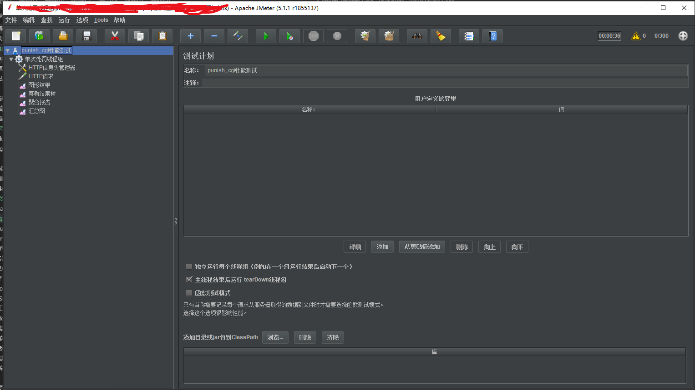
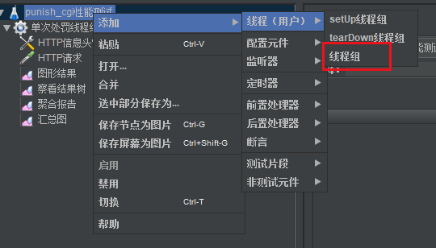
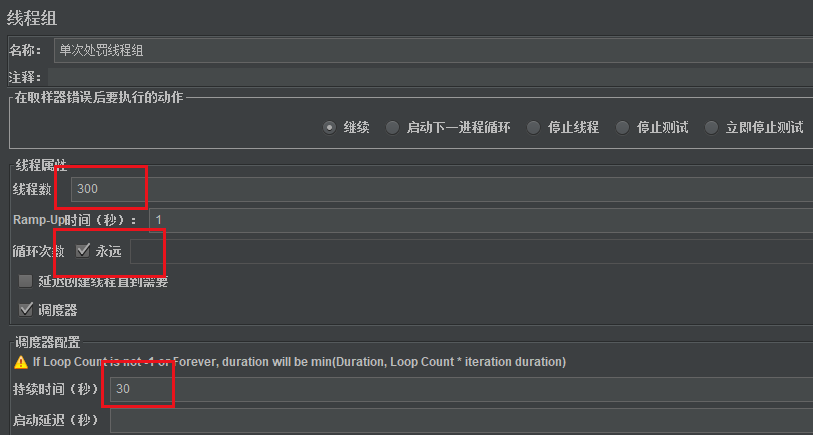
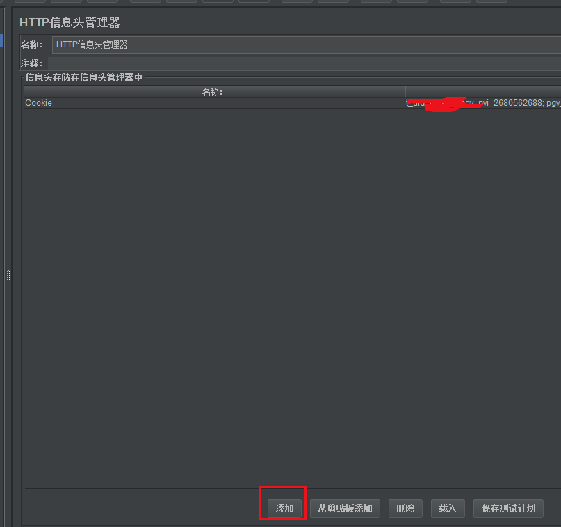
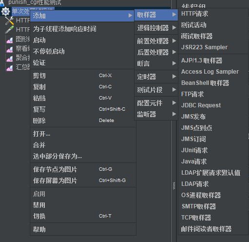
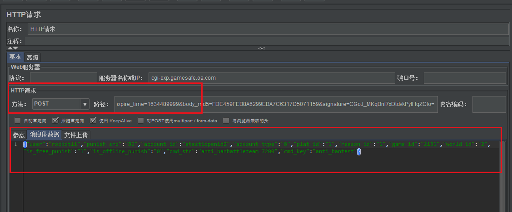
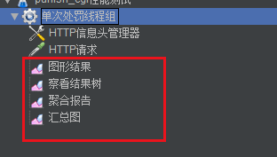
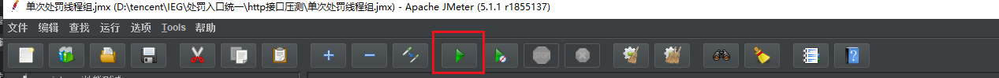
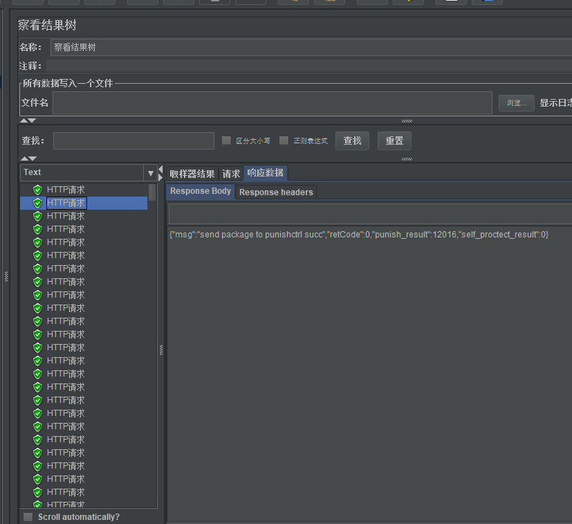

## http接口压力测试
测试http接口的性能，我们可以有很多种工具去测。
其中比较出名的工具就有jmeter。

### Jmeter使用
Jmeter的使用并不算复杂，只需要去官网下载压缩包。

win系统下的话，去到bin里打开ApacheJmeter.jar文件，需要提前安装java

打开之后界面如下：

名称那里输入名字建立一个测试计划，这个测试计划最好需要把它保存成本地文件的形式。

#### 1.建立线程组
我们需要一个线程组来帮助我们进行压测，

对测试计划右键，添加一个线程组。然后我们可以配置线程组的一些信息。

配置时注意填写信息，线程数代表开启线程的数量，循环次数代表是否循环，持续时间代表执行多长时间。

如上图配置的含义就是，开启300个线程，持续压测30秒。

#### 2. 建立http信息头
要发送http包，当然需要我们设置发送的header，我们就可以再这个地方设置。

同理，我们**右键添加->配置原件->HTTP信息头管理器**

这里可以添加Cookie信息，我们点击下面按钮添加键值对即可。

#### 3.建立http请求

右键添加，取样器，添加Http请求。

这里就可以配置一些http请求的内容了，方法选post的话，服务器名称处写域名，路径处写path，下面的消息体数据还能指定body传递什么内容过去。

#### 4. 建立结果展示集
http配置完以后，我们还需要添加一些图形组件来帮助我们观测这个结果。

右键添加，监听器里我们可以添加图形结果，查看结果树，聚合报告，汇总图等等一些组件。

然后我们就可以执行run来看看组件的展示了，点击启动按钮：

察看结果树这个组件下我们可以看到http执行的结果。

聚合报告组件则能看到我们本次压测执行的结果信息。