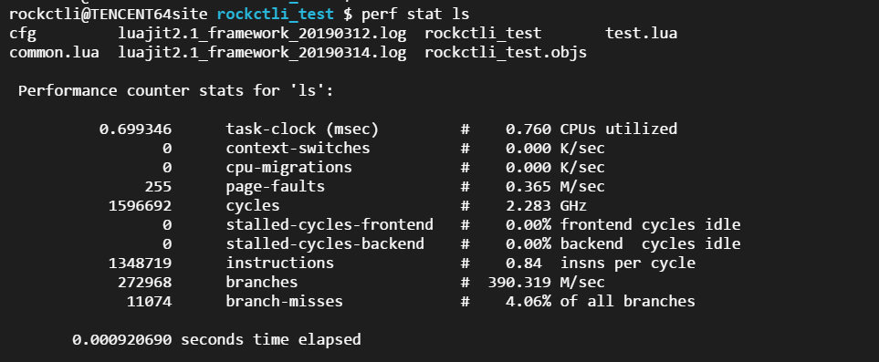

## perf详解
在linux程序性能测试工具总结的笔记里已经稍微有提过这个工具。

Perf 是用来进行软件性能分析的工具。通过它，应用程序可以利用 PMU，tracepoint 和内核中的特殊计数器来进行性能统计。它不但可以分析指定应用程序的性能问题 (per thread)，也可以用来分析内核的性能问题，当然也可以同时分析应用代码和内核，从而全面理解应用程序中的性能瓶颈。

简单来说，perf是一个很强大的软件性能分析工具，比oprofile更强大。

此工具已被许多Linux系统原生支持，通常，它的执行频率是 99Hz（每秒99次），如果99次都返回同一个函数名，那就说明 CPU 这一秒钟都在执行同一个函数，可能存在性能问题

### perf list
使用perf之前肯定要知道perf能监控哪些性能指标吧？那么就要使用perf list进行查看，通常使用的指标是cpu-clock/task-clock等，具体要根据需要来判断

```
perf list
```

不同内核版本列出的结果不一样多…不过基本是够用的，但是无论多少，我们可以基本将其分为三类:

 - Hardware Event 是由 PMU 硬件产生的事件，比如 cache 命中，当您需要了解程序对硬件特性的使用情况时，便需要对这些事件进行采样
 - Software Event 是内核软件产生的事件，比如进程切换，tick 数等
 - Tracepoint event 是内核中的静态 tracepoint 所触发的事件，这些 tracepoint 用来判断程序运行期间内核的行为细节，比如 slab 分配器的分配次数等

具体监控哪个变量的话，譬如使用后面的perf report工具，则加 **-e 监控指标**，如

```
perf report -e cpu-clock ls
监控运行ls命令时的cpu时钟占用监控
```

### perf stat
解决问题的时候有条理才解决的更快，所以面对一个性能问题的时候，最好采用自顶向下的策略。**先整体看看该程序运行时各种统计事件的大概，再针对某些方向深入细节**。而不要一下子扎进琐碎细节，会一叶障目的。

整体监测代码性能就需要使用perf stat这个工具，该工具主要是从全局上监控，可以看到程序导致性能瓶颈主要是什么原因。因为不同的程序导致其性能瓶颈的原因不同，譬如有些程序慢是由于计算量大，而有些程序是由于频繁的I/O导致性能瓶颈，他们的优化方式不同。perf stat通过概括精简的方式提供被调试程序运行的整体情况和汇总数据。

使用方法：

```
perf stats 程序
```

程序运行完之后，然后使用ctrl+c来终止程序（若程序自动终止则不用），之后，perf便会打印出监控事件结果

好比我们监控一下linux 命令ls的性能



如图：

task-clock是指程序运行期间占用了xx的任务时钟周期，该值高，说明程序的多数时间花费在 CPU 计算上而非 IO

context-switches是指程序运行期间发生了xx次上下文切换，记录了程序运行过程中发生了多少次进程切换，频繁的进程切换是应该避免的。（有进程进程间频繁切换，或者内核态与用户态频繁切换）

cpu-migrations 是指程序运行期间发生了xx次CPU迁移，即用户程序原本在一个CPU上运行，后来迁移到另一个CPU

page-faults 是指程序发生了xx次页错误

其他可以监控的譬如分支预测、cache命中等

### perf record
前面通过perf stat获得了程序性能瓶颈类型，之后，假设你已经知道哪个进程需要优化。那么下一步就是对该进程进行细粒度的分析，分析在长长的程序代码中究竟是哪几段代码、哪几个函数需要修改呢？**这便需要使用 perf record 记录单个函数级别的统计信息，并使用 perf report 来显示统计结果**。

调优应该将注意力集中到百分比高的热点代码片段上，假如一段代码只占用整个程序运行时间的 0.1%，就算将其优化到仅剩一条机器指令，恐怕也只能将整体的程序性能提高 0.1%。

仍以之前的gw程序为例，假设要监控的指标为cpu-clock

```
perf record -e cpu-clock -g [fp] 程序
```

**-g选项是告诉perf record额外记录函数的调用关系**，因为原本perf record记录大都是库函数，直接看库函数，大多数情况下，你的代码肯定没有标准库的性能好对吧？除非是针对产品进行特定优化，所以就需要知道是哪些函数频繁调用这些库函数，通过减少不必要的调用次数来提升性能

程序运行完之后，perf record会生成一个名为perf.data的文件（缺省值），如果之前已有，那么之前的perf.data文件会变为perf.data.old文件.获得这个perf.data文件之后，我们其实还不能直接查看，下面就需要perf report工具进行查看

### perf report
前面通过perf record工具获得了某一进程的指标监控数据perf.data，下面就需要使用perf report工具查看该文件

```
perf report -i perf-report生成的文件
```

我们假定perf record获取了这些数据：


 - [.]代表该调用属于用户态，若自己监控的进程为用户态进程，那么这些即主要为用户态的cpu-clock占用的数值，[k]代表属于内核态的调用。
 - /+ 4.93% gw libcurl-gnutls.so.4.3.0 [.] 0x000000000001e1e0 ，左边的加号代表perf已经记录了该调用关系，按enter键可以查看调用关系，不过由于这个是动态库里的函数，基本查看到的都是一些二进制数值


ps：enter键得到的是调用关系，也就是谁调用了这个函数，假如某个函数调用你这个函数调用了非常多次，那这个函数也是要注意的。


### perf script

也是生成报告的：

```
perf script -i perf.data
```

### perf timechart
perf 提供了内置的可视化分析工具 perf timechart，例如：

```
$perf timechart record ./a.out
$perf timechart
```

perf timechart输出的是进程运行过程中系统调度的情况，无法对程序的具体代码段进行性能分析，但可以看出总结运行情况：running，idle，I/O等，