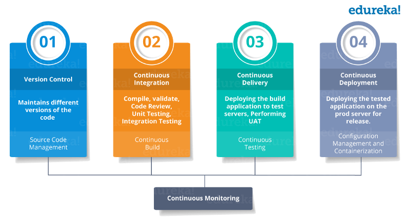
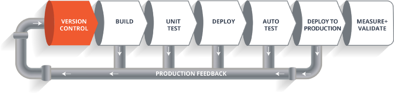

## 流水线
持续集成（Continuous integration）是一种软件开发实践。 它倡导团队开发成员必须经常集成他们的工作，甚至每天都可能发生多次集成。随着devops概念的普及，CI与CD也变得越来越常见。

几个术语要知道：

 - 持续集成（Continuous integration）
 - 持续交付（Continuous delivery）
 - 持续部署（Continuous deployment）

说道CI CD其实又涉及到了devops的概念，这个可以参见devops的笔记。其实本质上devops就是一种软件开发方法：**它将持续开发、持续测试、持续集成、持续部署和持续监控贯穿于软件开发的整个生命周期。** 当前几乎所有的顶尖公司均采用了该方法，用以提高软件开发质量，并缩短软件开发生命周期。从而以达到每个公司对软件产品的期望，交付出客户最满意的产品。

devops的基础概念既是如此，了解这一点，其他就好办啦。

### Devops生命周期
要想完整的理解 DevOps，我们还需要了解一下 DevOps 的生命周期。接下来，我将通过一张图来展示 DevOps 的生命周期以及它和软件开发生命周期之间的关系。

如上图，就是devops的四个声明周期，换成中文其实也就是：

 - 版本控制(git svn)
 - 持续集成
 - 持续交付
 - 持续部署

### CI&CD流水线
CI 代表持续集成（Continuous Integration），**CD 代表持续交付（Continuous Delivery）和持续部署（Continuous Deployment）**。也可以将它们看作是类似于软件开发生命周期的过程。

上图所示，该流水线展示了一个软件在其最终交付给客户或者投入上线之前，它在其生命周期内各个阶段中的移动过程。

版本控制既是我们所知道的git，svn。

 - BUILD 构建阶段，其实就是编译代码的过程
 - TEST测试阶段，各种单元测试，可用性测试，测试项目中的各个模块和组件。
 - DEPLOY 部署阶段，把项目部署到生产环境。
 - VALIDATE 验证阶段

这整个步骤就是流水线，注意任何一部有错，都可能重新回到之前的流水线再走一次。