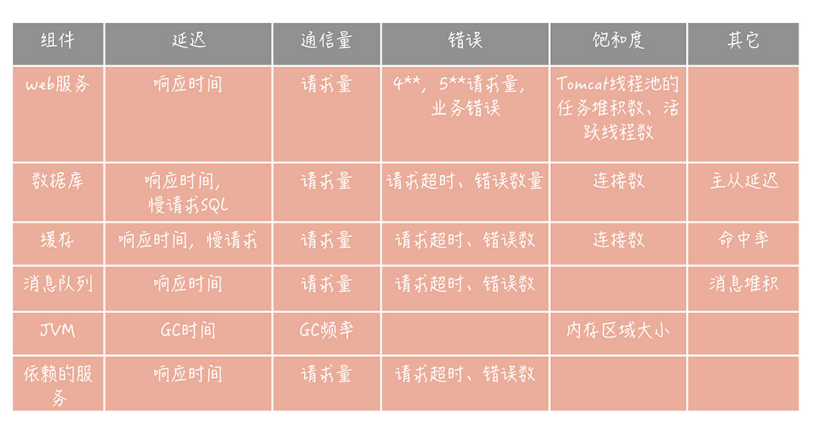

## 服务监控

在搭建监控系统时，所面临的第一个问题就是，选择什么样的监控指标，也就是监控什么。

比如，谷歌针对分布式系统监控的经验总结，四个黄金信号（Four Golden Signals）。它指的是，在服务层面一般需要监控四个指标，**分别是延迟，通信量、错误和饱和度。** 

- 延迟指的是请求的响应时间。比如，接口的响应时间、访问数据库和缓存的响应时间。
- 通信量可以理解为吞吐量，也就是单位时间内，请求量的大小。比如，访问第三方服务的请求量，访问消息队列的请求量。 
- 错误表示当前系统发生的错误数量。**这里需要注意的是，** 我们需要监控的错误既有显示的，比如在监控 Web 服务时，出现 4 * * 和 5 * * 的响应码；也有隐示的，比如，Web服务虽然返回的响应码是 200，但是却发生了一些和业务相关的错误（出现了数组越界的异常或者空指针异常等），这些都是错误的范畴。 
- 饱和度指的是服务或者资源到达上限的程度（也可以说是服务或者资源的利用率），比如说 CPU 的使用率，内存使用率，磁盘使用率，缓存数据库的连接数等等。

这四个黄金信号提供了通用的监控指标，**除此之外，你还可以借鉴 RED 指标体系。**这个体系，是四个黄金信号中衍生出来的，其中，R 代表请求量（Request rate），E 代表错误（Error），D 代表响应时间（Duration），少了饱和度的指标。你可以把它当作一种简化版的通用监控指标体系。 

当然，一些组件或者服务还有独特的指标，这些指标也是需要你特殊关注的。比如，课程中 提到的数据库主从延迟数据、消息队列的堆积情况、缓存的命中率等等。我把高并发系统中常见组件的监控指标，整理成了一张表格，其中没有包含诸如 CPU、内存、网络、磁盘等基础监控指标，只是业务上监控指标，主要方便你在实际工作中参考使用。 

