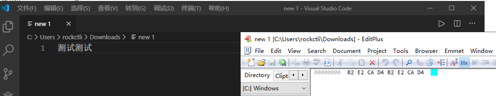
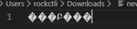
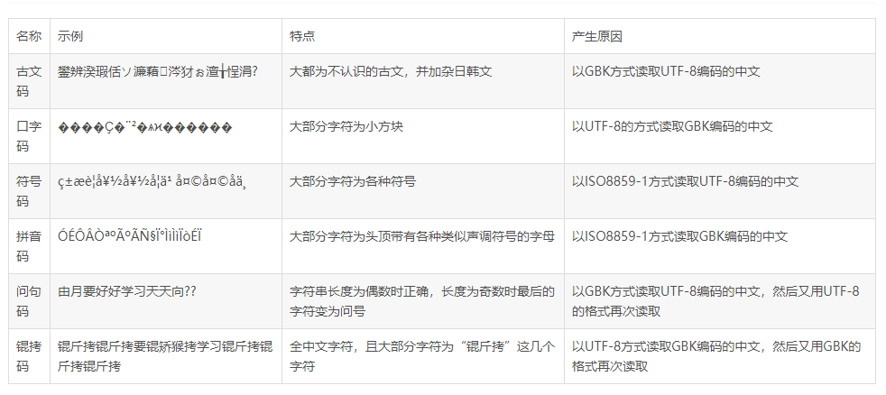

## 编码问题

这里再记录一些编码问题的坑。


### 著名的锟斤拷

锟斤拷发生的本质原因是把

```
0xEF 0xBF, 0xBD 0xEF, 0xBF 0xBD
```

上面这段编码用GBK读取了，所以会变成锟斤拷。


产生的过程是什么呢，首先是这样的。

假如我们有一个GBK编码的文件



左边为中文，右边是对应的十六进制编码。

这时候我们用UTF-8的方式去读这个文件



瞬间，文件就不可读了。UTF-8体系里规定，如果某个编码不存在这个字符，那就会自动显示问号这个字符，问号这个字符对应的UTF-8编码就是0xEF 0xBF, 0xBD，所以如果。此时我们save这个文件，那编码就会自动改变，从B2等变成EF BF BD，所以要切记 **这些不可识别的字符，在UTF-8里会识别成问号，然后如果编码这些问号，会被翻译成EF BF BD的，这会损失以前的编码**


当编码变成EF BF BD之后，用gbk的方式读这个编码，由于GBK两个字节一读，所以`0xEF 0xBF, 0xBD 0xEF, 0xBF 0xBD`就是锟斤拷了。


因此中间是经过一层转换造成精读丢失的 `不可识别字符->翻译成了utf-8的特殊问号->特殊问号编码时统一用EF BF BD编码->GBK显示是锟斤拷`


### 乱码问题表

