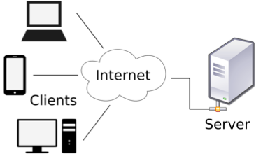
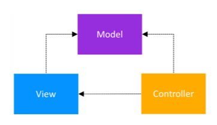
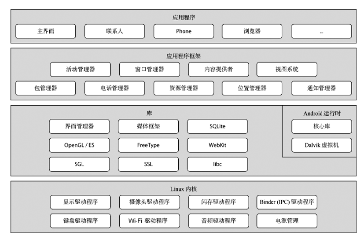
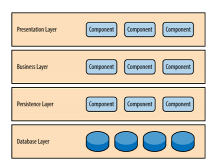
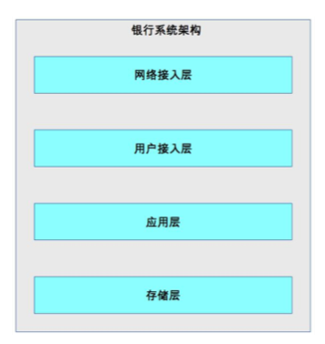
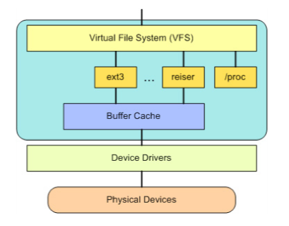
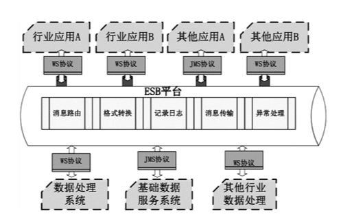
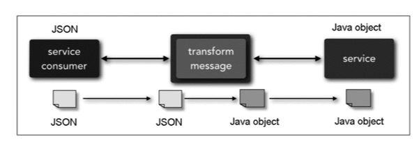
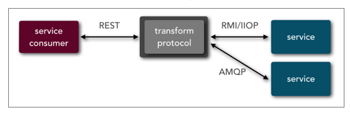
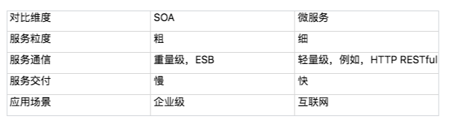

## 可扩展架构模式

传统的可扩展模式，包括分层架构和 SOA，后面还会介绍微服务架构。

## 分层架构

分层架构是很常见的架构模式，它也叫 N 层架构，通常情况下，N 至少是 2 层。例如，C/S 架构、B/S 架构。常见的是 3 层架构（例如，MVC、MVP 架构）、4 层架构，5 层架构的比较少见，一般是比较复杂的系统才会达到或者超过 5 层，比如操作系统内核架构。

###  C/S 架构、B/S 架构

划分的对象是整个业务系统，划分的维度是用户交互，即将和用户交互的部分独立为一层，支撑用户交互的后台作为另外一层。例如，下面是 C/S 架构结构图。

### MVC MVP

划分的对象是单个业务子系统，划分的维度是职责，将不同的职责划分到独立层，但各层的依赖关系比较灵活。例如，MVC 架构中各层之间是两两交互的：

### 逻辑分层架构

划分的对象可以是单个业务子系统，也可以是整个业务系统，划分的维度也是职责。虽然都是基于职责划分，但逻辑分层架构和 MVC 架构、MVP 架构的不同点在于，逻辑分层架构中的层是自顶向下依赖的。典型的有操作系统内核架构、TCP/IP 架构。例如，下面是 Android 操作系统架构图。

典型的 J2EE 系统架构也是逻辑分层架构，架构图如下：

针对整个业务系统进行逻辑分层的架构图如下：

无论采取何种分层维度，分层架构设计最核心的一点就是**需要保证各层之间的差异足够清晰，边界足够明显，让人看到架构图后就能看懂整个架构**，这也是分层不能分太多层的原因。否则如果两个层的差异不明显，就会出现程序员小明认为某个功能应该放在 A 层，而程序员老王却认为同样的功能应该放在 B 层，这样会导致分层混乱。如果这样的架构进入实际开发落地，则 A 层和 B 层就会乱成一锅粥，也就失去了分层的意义。

分层架构之所以能够较好地支撑系统扩展，本质在于**隔离关注点**（separation of concerns），即每个层中的组件只会处理本层的逻辑。比如说，展示层只需要处理展示逻辑，业务层中只需要处理业务逻辑，这样我们在扩展某层时，其他层是不受影响的，通过这种方式可以支撑系统在某层上快速扩展。例如，Linux 内核如果要增加一个新的文件系统，则只需要修改文件存储层即可，其他内核层无须变动。

当然，并不是简单地分层就一定能够实现隔离关注点从而支撑快速扩展，分层时要保证层与层之间的依赖是稳定的，才能真正支撑快速扩展。例如，Linux 内核为了支撑不同的文件系统格式，抽象了 VFS 文件系统接口，架构图如下：

如果没有 VFS，只是简单地将 ext2、ext3、reiser 等文件系统划为“文件系统层”，那么这个分层是达不到支撑可扩展的目的的。因为增加一个新的文件系统后，所有基于文件系统的功能都要适配新的文件系统接口；而有了 VFS 后，只需要 VFS 适配新的文件系统接口，其他基于文件系统的功能是依赖 VFS 的，不会受到影响。

对于操作系统这类复杂的系统，接口本身也可以成为独立的一层。例如，我们把 VFS 独立为一层是完全可以的。而对于一个简单的业务系统，接口可能就是 Java 语言上的几个 interface 定义，这种情况下如果独立为一层，看起来可能就比较重了。例如，经典的 J2EE 分层架构中，Presentation Layer 和 Business Layer 之间如果硬要拆分一个独立的接口层，则显得有点多余了。

分层结构的另外一个特点就是层层传递，也就是说一旦分层确定，整个业务流程是按照层进行依次传递的，不能（不建议）在层之间进行跳跃。**分层架构的优势就体现在通过分层强制约束两两依赖，一旦自由选择绕过分层，时间一长，架构就会变得混乱**。

### SOA

SOA 的全称是 Service Oriented Architecture，中文翻译为“面向服务的架构”，诞生于上世纪 90 年代，1996 年 Gartner 的两位分析师 Roy W. Schulte 和 Yefim V. Natis 发表了第一个 SOA 的报告。

ESB 的全称是 Enterprise Service Bus，中文翻译为“企业服务总线”。从名字就可以看出，ESB 参考了计算机总线的概念。计算机中的总线将各个不同的设备连接在一起，ESB 将企业中各个不同的服务连接在一起。因为各个独立的服务是异构的，如果没有统一的标准，则各个异构系统对外提供的接口是各式各样的。SOA 使用 ESB 来屏蔽异构系统对外提供各种不同的接口方式，以此来达到服务间高效的互联互通。

SOA 更多是在传统企业（例如，制造业、金融业等）落地和推广，在互联网行业并没有大规模地实践和推广。互联网行业推行 SOA 最早的应该是亚马逊，得益于杰弗·贝索斯的远见卓识，亚马逊内部的系统都以服务的方式构造，间接地促使了后来的亚马逊云计算技术的出现。

典型的 SOA 架构样例如下：

SOA 解决了传统 IT 系统重复建设和扩展效率低的问题，但其本身也引入了更多的复杂性。SOA 最广为人诟病的就是 ESB，ESB 需要实现与各种系统间的协议转换、数据转换、透明的动态路由等功能。例如，下图中 ESB 将 JSON 转换为 Java（摘自《Microservices vs. Service-Oriented Architecture》）。

下图中 ESB 将 REST 协议转换为 RMI 和 AMQP 两个不同的协议：

**zwlj：SOA其实是一个打通的问题，把多个部分的系统通过总线打通，是解决服务孤岛打通链条，是无奈之举，是集成思想**

### 微服务

整体上来说，SOA 的服务粒度要粗一些，而微服务的服务粒度要细一些。例如，对一个大型企业来说，“员工管理系统”就是一个 SOA 架构中的服务；而如果采用微服务架构，则“员工管理系统”会被拆分为更多的服务，比如“员工信息管理”“员工考勤管理”“员工假期管理”和“员工福利管理”等更多服务。

SOA 采用了 ESB 作为服务间通信的关键组件，负责服务定义、服务路由、消息转换、消息传递，总体上是重量级的实现。微服务推荐使用统一的协议和格式，例如，RESTful 协议、RPC 协议，无须 ESB 这样的重量级实现。Martin Fowler 将微服务架构的服务通讯理念称为“Smart endpoints and dumb pipes”，简单翻译为“聪明的终端，愚蠢的管道”。之所以用“愚蠢”二字，其实就是与 ESB 对比的，因为 ESB 太强大了，既知道每个服务的协议类型（例如，是 RMI 还是 HTTP），又知道每个服务的数据类型（例如，是 XML 还是 JSON），还知道每个数据的格式（例如，是 2017-01-01 还是 01/01/2017），而微服务的“dumb pipes”仅仅做消息传递，对消息格式和内容一无所知。

微服务更加适合于快速、轻量级、基于 Web 的互联网系统，这类系统业务变化快，需要快速尝试、快速交付；同时基本都是基于 Web，虽然开发技术可能差异很大（例如，Java、C++、.NET 等），但对外接口基本都是提供 HTTP RESTful 风格的接口，无须考虑在接口层进行类似 SOA 的 ESB 那样的处理。

综合上述分析，我将 SOA 和微服务对比如下：

zwlj：微服务其实很依赖基础建设，基础建设不够好，其实微服务是降低效率的。