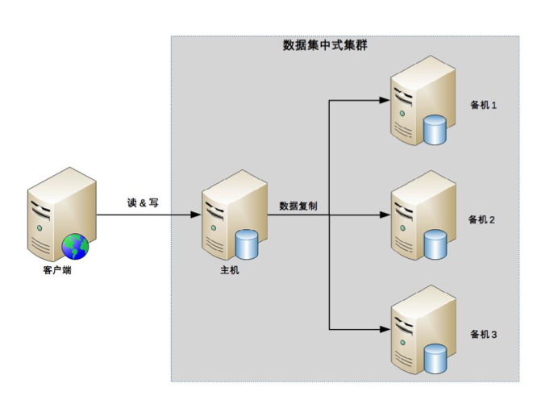
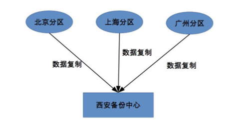
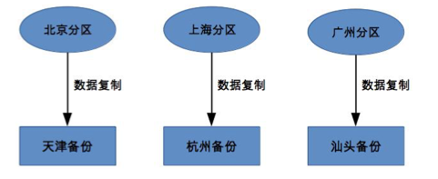

## 存储高可用-数据集群

### 集群

主备、主从、主主架构本质上都有一个隐含的假设：主机能够存储所有数据，但主机本身的存储和处理能力肯定是有极限的。以 PC 为例，Intel 386 时代服务器存储能力只有几百 MB，Intel 奔腾时代服务器存储能力可以有几十 GB，Intel 酷睿多核时代的服务器可以有几个 TB。单纯从硬件发展的角度来看，似乎发展速度还是挺快的，但如果和业务发展速度对比，那就差得远了。早在 2013 年，Facebook 就有 2500 亿张上传照片，当时这些照片的容量就已经达到了 250 PB 字节（250 × 1024TB），平均一天上传的图片有 3 亿 5000 万张。如此大量的数据，单台服务器肯定是无法存储和处理的，我们必须使用多台服务器来存储数据，这就是数据集群架构。

简单来说，集群就是多台机器组合在一起形成一个统一的系统，这里的“多台”，数量上至少是 3 台；相比而言，主备、主从都是 2 台机器。根据集群中机器承担的不同角色来划分，集群可以分为两类：数据集中集群、数据分散集群。

#### 数据集中集群

数据集中集群与主备、主从这类架构相似，我们也可以称数据集中集群为 1 主多备或者 1 主多从。无论是 1 主 1 从、1 主 1 备，还是 1 主多备、1 主多从，数据都只能往主机中写，而读操作可以参考主备、主从架构进行灵活多变。下图是读写全部到主机的一种架构：

虽然架构上是类似的，但由于集群里面的服务器数量更多，导致复杂度整体更高一些，具体体现在：

- 主机如何将数据复制给备机

主备和主从架构中，只有一条复制通道，而数据集中集群架构中，存在多条复制通道。多条复制通道首先会增大主机复制的压力，某些场景下我们需要考虑如何降低主机复制压力，或者降低主机复制给正常读写带来的压力。

其次，多条复制通道可能会导致多个备机之间数据不一致，某些场景下我们需要对备机之间的数据一致性进行检查和修正。

- 备机如何检测主机状态

主备和主从架构中，只有一台备机需要进行主机状态判断。在数据集中集群架构中，多台备机都需要对主机状态进行判断，而不同的备机判断的结果可能是不同的，如何处理不同备机对主机状态的不同判断，是一个复杂的问题。

- 主机故障后，如何决定新的主机

主从架构中，如果主机故障，将备机升级为主机即可；而在数据集中集群架构中，有多台备机都可以升级为主机，但实际上只能允许一台备机升级为主机，那么究竟选择哪一台备机作为新的主机，备机之间如何协调，这也是一个复杂的问题。

目前开源的数据集中集群以 ZooKeeper 为典型，ZooKeeper 通过 ZAB 算法来解决上述提到的几个问题，但 ZAB 算法的复杂度是很高的。

#### 数据分散集群

数据分散集群指多个服务器组成一个集群，每台服务器都会负责存储一部分数据；同时，为了提升硬件利用率，每台服务器又会备份一部分数据。

数据分散集群的复杂点在于如何将数据分配到不同的服务器上，算法需要考虑这些设计点：

- 均衡性

算法需要保证服务器上的数据分区基本是均衡的，不能存在某台服务器上的分区数量是另外一台服务器的几倍的情况。

- 容错性

当出现部分服务器故障时，算法需要将原来分配给故障服务器的数据分区分配给其他服务器。

- 可伸缩性

当集群容量不够，扩充新的服务器后，算法能够自动将部分数据分区迁移到新服务器，并保证扩容后所有服务器的均衡性。

数据分散集群和数据集中集群的不同点在于，数据分散集群中的每台服务器都可以处理读写请求，因此不存在数据集中集群中负责写的主机那样的角色。但在数据分散集群中，必须有一个角色来负责执行数据分配算法，这个角色可以是独立的一台服务器，也可以是集群自己选举出的一台服务器。如果是集群服务器选举出来一台机器承担数据分区分配的职责，则这台服务器一般也会叫作主机，但我们需要知道这里的“主机”和数据集中集群中的“主机”，其职责是有差异的。

Hadoop 的实现就是独立的服务器负责数据分区的分配，这台服务器叫作 Namenode。Hadoop 的数据分区管理架构如下：

与 Hadoop 不同的是，Elasticsearch 集群通过选举一台服务器来做数据分区的分配，叫作 master node，其数据分区管理架构是：

数据集中集群架构中，客户端只能将数据写到主机；数据分散集群架构中，客户端可以向任意服务器中读写数据。正是因为这个关键的差异，决定了两种集群的应用场景不同。一般来说，数据集中集群适合数据量不大，集群机器数量不多的场景。例如，ZooKeeper 集群，一般推荐 5 台机器左右，数据量是单台服务器就能够支撑；而数据分散集群，由于其良好的可伸缩性，适合业务数据量巨大、集群机器数量庞大的业务场景。例如，Hadoop 集群、HBase 集群，大规模的集群可以达到上百台甚至上千台服务器。

### 数据分区(地理)

前面我们讨论的存储高可用架构都是基于硬件故障的场景去考虑和设计的，主要考虑当部分硬件可能损坏的情况下系统应该如何处理，但对于一些影响非常大的灾难或者事故来说，有可能所有的硬件全部故障。例如，新奥尔良水灾、美加大停电、洛杉矶大地震等这些极端灾害或者事故，可能会导致一个城市甚至一个地区的所有基础设施瘫痪，这种情况下基于硬件故障而设计的高可用架构不再适用，我们需要基于地理级别的故障来设计高可用架构，这就是数据分区架构产生的背景。

数据分区指将数据按照一定的规则进行分区，不同分区分布在不同的地理位置上，每个分区存储一部分数据，通过这种方式来规避地理级别的故障所造成的巨大影响。采用了数据分区的架构后，即使某个地区发生严重的自然灾害或者事故，受影响的也只是一部分数据，而不是全部数据都不可用；当故障恢复后，其他地区备份的数据也可以帮助故障地区快速恢复业务。

设计一个良好的数据分区架构，需要从多方面去考虑。

#### 数据量

数据量的大小直接决定了分区的规则复杂度。例如，使用 MySQL 来存储数据，假设一台 MySQL 存储能力是 500GB，那么 2TB 的数据就至少需要 4 台 MySQL 服务器；而如果数据是 200TB，并不是增加到 800 台的 MySQL 服务器那么简单。如果按照 4 台服务器那样去平行管理 800 台服务器，复杂度会发生本质的变化，具体表现为：

- 800 台服务器里面可能每周都有一两台服务器故障，从 800 台里面定位出 2 台服务器故障，很多情况下并不是一件容易的事情，运维复杂度高。
- 增加新的服务器，分区相关的配置甚至规则需要修改，而每次修改理论上都有可能影响已有的 800 台服务器的运行，不小心改错配置的情况在实践中太常见了。
- 如此大量的数据，如果在地理位置上全部集中于某个城市，风险很大，遇到了水灾、大停电这种灾难性的故障时，数据可能全部丢失，因此分区规则需要考虑地理容灾。

因此，数据量越大，分区规则会越复杂，考虑的情况也越多。

#### 分区规则

地理位置有近有远，因此可以得到不同的分区规则，包括洲际分区、国家分区、城市分区。具体采取哪种或者哪几种规则，需要综合考虑业务范围、成本等因素。

通常情况下，洲际分区主要用于面向不同大洲提供服务，由于跨洲通讯的网络延迟已经大到不适合提供在线服务了，因此洲际间的数据中心可以不互通或者仅仅作为备份；国家分区主要用于面向不同国家的用户提供服务，不同国家有不同语言、法律、业务等，国家间的分区一般也仅作为备份；城市分区由于都在同一个国家或者地区内，网络延迟较低，业务相似，分区同时对外提供服务，可以满足业务异地多活之类的需求。

#### 复制规则

数据分区指将数据分散在多个地区，在某些异常或者灾难情况下，虽然部分数据受影响，但整体数据并没有全部被影响，本身就相当于一个高可用方案了。但仅仅做到这点还不够，因为每个分区本身的数据量虽然只是整体数据的一部分，但还是很大，这部分数据如果损坏或者丢失，损失同样难以接受。因此即使是分区架构，同样需要考虑复制方案。

常见的分区复制规则有三种：集中式、互备式和独立式。

**集中式**

集中式备份指存在一个总的备份中心，所有的分区都将数据备份到备份中心，其基本架构如下：

集中式备份架构的优缺点是：

- 设计简单，各分区之间并无直接联系，可以做到互不影响。
- 扩展容易，如果要增加第四个分区（例如，武汉分区），只需要将武汉分区的数据复制到西安备份中心即可，其他分区不受影响。
- 成本较高，需要建设一个独立的备份中心。

**互备式**

互备式备份指每个分区备份另外一个分区的数据，其基本架构如下：

互备式备份架构的优缺点是：

- 设计比较复杂，各个分区除了要承担业务数据存储，还需要承担备份功能，相互之间互相关联和影响。
- 扩展麻烦，如果增加一个武汉分区，则需要修改广州分区的复制指向武汉分区，然后将武汉分区的复制指向北京分区。而原有北京分区已经备份了的广州分区的数据怎么处理也是个难题，不管是做数据迁移，还是广州分区历史数据保留在北京分区，新数据备份到武汉分区，无论哪种方式都很麻烦。
- 成本低，直接利用已有的设备。

**独立式**

独立式备份指每个分区自己有独立的备份中心，其基本架构如下：

有一个细节需要特别注意，各个分区的备份并不和原来的分区在一个地方。例如，北京分区的备份放到了天津，上海的放到了杭州，广州的放到了汕头，这样做的主要目的是规避同城或者相同地理位置同时发生灾难性故障的极端情况。如果北京分区机房在朝阳区，而备份机房放在通州区，整个北京停电的话，两个机房都无法工作。

独立式备份架构的优缺点是：

- 设计简单，各分区互不影响。
- 扩展容易，新增加的分区只需要搭建自己的备份中心即可。
- 成本高，每个分区需要独立的备份中心，备份中心的场地成本是主要成本，因此独立式比集中式成本要高很多。

