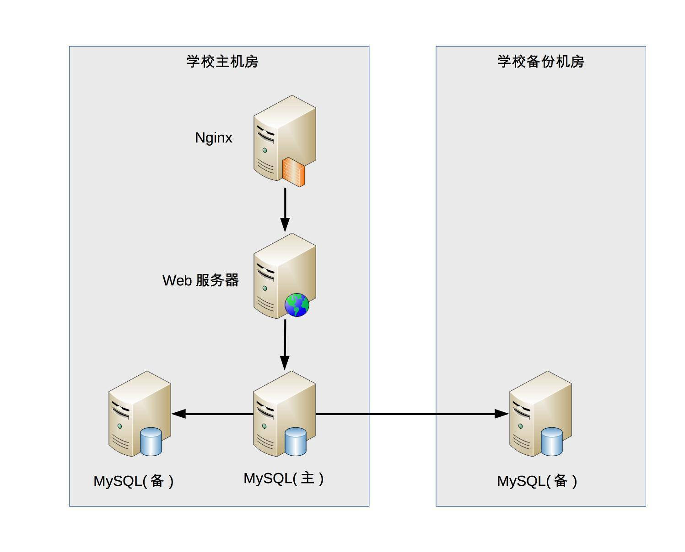

## 架构概念基础

### 模块和组件

模块和组件两个概念在实际工作中很容易混淆，我们经常能够听到类似这样的说法：

其实这个不难区分，**从逻辑的角度来拆分系统后，得到的单元就是“模块”；从物理的角度来拆分系统后，得到的单元就是“组件”。**

假设我们要做一个学生信息管理系统，这个系统从逻辑的角度来拆分，可以分为“登录注册模块”“个人信息模块”“个人成绩模块”；从物理的角度来拆分，可以拆分为 Nginx、Web 服务器、MySQL。

模块是功能的角度来说的，组件则类似那种可以替换得到部件。

### 框架和架构

框架是和架构比较相似的概念，且两者有较强的关联关系

提炼一下其中关键部分：

1. 框架是组件规范：例如，MVC 就是一种最常见的开发规范，类似的还有 MVP、MVVM、J2EE 等框架。
2. 框架提供基础功能的产品：例如，Spring MVC 是 MVC 的开发框架，除了满足 MVC 的规范，Spring 提供了很多基础功能来帮助我们实现功能，包括注解（@Controller 等）、Spring Security、Spring JPA 等很多基础功能。

框架和架构的区别还是比较明显的，**框架关注的是“规范”，架构关注的是“结构”**。框架的英文是 Framework，架构的英文是 Architecture。Spring MVC 的英文文档标题就是“Web MVC framework”。

从业务逻辑的角度分解，“学生管理系统”的架构是：

从物理部署的角度分解，“学生管理系统”的架构是：

### 架构设计时考虑的一些FAQ原则

- 这么多需求，从哪里开始下手进行架构设计呢？

  ——通过熟悉和理解需求，识别系统复杂性所在的地方，然后针对这些复杂点进行架构设计。

- 架构设计要考虑高性能、高可用、高扩展……这么多高 XX，全部设计完成估计要 1 个月，但老大只给了 1 周时间”

  ——架构设计并不是要面面俱到，不需要每个架构都具备高性能、高可用、高扩展等特点，而是要识别出复杂点然后有针对性地解决问题。

- 业界 A 公司的架构是 X，B 公司的方案是 Y，两个差别比较大，该参考哪一个呢？

  ——理解每个架构方案背后所需要解决的复杂点，然后才能对比自己的业务复杂点，参考复杂点相似的方案。

**架构设计的真正目的是为了解决软件系统复杂度带来的问题**

### 架构设计复杂度分析实例

设计架构时，不免需要考虑到

- 高性能
- 高可用
- 可扩展
- 安全性
- 等等......

一定要针对业务，找到系统的复杂度。

假设我们需要设计一个大学的学生管理系统，其基本功能包括登录、注册、成绩管理、课程管理等。当我们对这样一个系统进行架构设计的时候，首先应识别其复杂度到底体现在哪里。

- 性能：一个学校的学生大约 1 ~ 2 万人，学生管理系统的访问频率并不高，平均每天单个学生的访问次数平均不到 1 次，因此性能这部分并不复杂，存储用 MySQL 完全能够胜任，缓存都可以不用，Web 服务器用 Nginx 绰绰有余。
- 可扩展性：学生管理系统的功能比较稳定，可扩展的空间并不大，因此可扩展性也不复杂。
- 高可用：学生管理系统即使宕机 2 小时，对学生管理工作影响并不大，因此可以不做负载均衡，更不用考虑异地多活这类复杂的方案了。但是，如果学生的数据全部丢失，修复是非常麻烦的，只能靠人工逐条修复，这个很难接受，因此需要考虑存储高可靠，这里就有点复杂了。我们需要考虑多种异常情况：机器故障、机房故障，针对机器故障，我们需要设计 MySQL 同机房主备方案；针对机房故障，我们需要设计 MySQL 跨机房同步方案。
- 安全性：学生管理系统存储的信息有一定的隐私性，例如学生的家庭情况，但并不是和金融相关的，也不包含强隐私（例如玉照、情感）的信息，因此安全性方面只要做 3 个事情就基本满足要求了：Nginx 提供 ACL 控制、用户账号密码管理、数据库访问权限控制。
- 成本：由于系统很简单，基本上几台服务器就能够搞定，对于一所大学来说完全不是问题，可以无需太多关注。

通过上面的分析，可以看到这个方案的主要复杂性体现在存储可靠性上，需要保证异常的时候，不要丢失所有数据即可（丢失几个或者几十个学生的信息问题不大），对应的架构如下

### 架构设计时考虑的三大原则

1. **简单原则宣言：“简单优于复杂”** 。 未必架构设计越复杂越好，复杂可能会引入问题。(想要答辩答好那就另说)
2. **演化原则宣言：“演化优于一步到位”。** 对于软件来说，变化才是主题。软件架构需要根据业务发展不断变化。架构师在进行架构设计时需要牢记这个原则，时刻提醒自己不要贪大求全，或者盲目照搬大公司的做法。应该认真分析当前业务的特点，明确业务面临的主要问题，设计合理的架构，快速落地以满足业务需要，然后在运行过程中不断完善架构，不断随着业务演化架构。
3. **合适原则宣言：“合适优于业界领先”。** 真正优秀的架构都是在企业当前人力、条件、业务等各种约束下设计出来的，能够合理地将资源整合在一起并发挥出最大功效，并且能够快速落地。这也是很多 BAT 出来的架构师到了小公司或者创业团队反而做不出成绩的原因，因为没有了大公司的平台、资源、积累，只是生搬硬套大公司的做法，失败的概率非常高。

### 架构设计时要设计备选方案

架构师需要设计多个备选方案，但方案的数量可以说是无穷无尽的，架构师也不可能穷举所有方案

- **备选方案的数量以 3 ~ 5 个为最佳**。少于 3 个方案可能是因为思维狭隘，考虑不周全；多于 5 个则需要耗费大量的精力和时间，并且方案之间的差别可能不明显。
- **备选方案的差异要比较明显**。例如，主备方案和集群方案差异就很明显，或者同样是主备方案，用 ZooKeeper 做主备决策和用 Keepalived 做主备决策的差异也很明显。但是都用 ZooKeeper 做主备决策，一个检测周期是 1 分钟，一个检测周期是 5 分钟，这就不是架构上的差异，而是细节上的差异了，不适合做成两个方案。
- **备选方案的技术不要只局限于已经熟悉的技术**。设计架构时，架构师需要将视野放宽，考虑更多可能性。很多架构师或者设计师积累了一些成功的经验，出于快速完成任务和降低风险的目的，可能自觉或者不自觉地倾向于使用自己已经熟悉的技术，对于新的技术有一种不放心的感觉。就像那句俗语说的：“如果你手里有一把锤子，所有的问题在你看来都是钉子”。例如，架构师对 MySQL 很熟悉，因此不管什么存储都基于 MySQL 去设计方案，系统性能不够了，首先考虑的就是 MySQL 分库分表，而事实上也许引入一个 Memcache 缓存就能够解决问题。