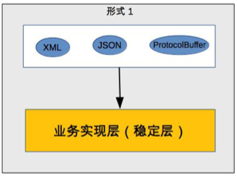

## 可扩展性

可扩展性指系统为了应对将来需求变化而提供的一种扩展能力，当有新的需求出现时，系统不需要或者仅需要少量修改就可以支持，无须整个系统重构或者重建。

由于软件系统固有的多变性，新的需求总会不断提出来，因此可扩展性显得尤其重要。在软件开发领域，面向对象思想的提出，就是为了解决可扩展性带来的问题；后来的设计模式，更是将可扩展性做到了极致。得益于设计模式的巨大影响力，几乎所有的技术人员对于可扩展性都特别重视。

设计具备良好可扩展性的系统，有两个基本条件：**正确预测变化**、**完美封装变化**。但要达成这两个条件，本身也是一件复杂的事情

### 预测变化

“唯一不变的是变化”，如果按照这个标准去衡量，架构师每个设计方案都要考虑可扩展性。例如，架构师准备设计一个简单的后台管理系统，当架构师考虑用 MySQL 存储数据时，是否要考虑后续需要用 Oracle 来存储？当架构师设计用 HTTP 做接口协议时，是否要考虑要不要支持 ProtocolBuffer？甚至更离谱一点，架构师是否要考虑 VR 技术对架构的影响从而提前做好可扩展性？

**如果每个点都考虑可扩展性，架构师会不堪重负**，架构设计也会异常庞大且最终无法落地。但架构师也不能完全不做预测，否则可能系统刚上线，马上来新的需求就需要重构，这同样意味着前期很多投入的工作量也白费了。

综合分析，预测变化的复杂性在于：

- 不能每个设计点都考虑可扩展性。
- 不能完全不考虑可扩展性。
- 所有的预测都存在出错的可能性。

### 应对变化

假设架构师经验非常丰富，目光非常敏锐，看问题非常准，所有的变化都能准确预测，是否意味着可扩展性就很容易实现了呢？也没那么理想！因为预测变化是一回事，采取什么方案来应对变化，又是另外一个复杂的事情。即使预测很准确，如果方案不合适，则系统扩展一样很麻烦。

第一种应对变化的常见方案是**将“变化”封装在一个“变化层”，将不变的部分封装在一个独立的“稳定层”**。

无论是变化层依赖稳定层，还是稳定层依赖变化层都是可以的，需要根据具体业务情况来设计。例如，如果系统需要支持 XML、JSON、ProtocolBuffer 三种接入方式，那么最终的架构就是上面图中的“形式 1”架构，也就是下面这样。

如果系统需要支持 MySQL、Oracle、DB2 数据库存储，那么最终的架构就变成了“形式 2”的架构了，你可以看下面这张图。

无论采取哪种形式，通过剥离变化层和稳定层的方式应对变化，都会带来两个主要的复杂性相关的问题。

1. 系统需要拆分出变化层和稳定层

对于哪些属于变化层，哪些属于稳定层，很多时候并不是像前面的示例（不同接口协议或者不同数据库）那样明确，不同的人有不同的理解，导致架构设计评审的时候可能吵翻天。

2. 需要设计变化层和稳定层之间的接口

接口设计同样至关重要，对于稳定层来说，接口肯定是越稳定越好；但对于变化层来说，在有差异的多个实现方式中找出共同点，并且还要保证当加入新的功能时原有的接口设计不需要太大修改，这是一件很复杂的事情。例如，MySQL 的 REPLACE INTO 和 Oracle 的 MERGE INTO 语法和功能有一些差异，那存储层如何向稳定层提供数据访问接口呢？是采取 MySQL 的方式，还是采取 Oracle 的方式，还是自适应判断？如果再考虑 DB2 的情况呢？相信你看到这里就已经能够大致体会到接口设计的复杂性了。

第二种常见的应对变化的方案是**提炼出一个“抽象层”和一个“实现层”**。抽象层是稳定的，实现层可以根据具体业务需要定制开发，当加入新的功能时，只需要增加新的实现，无须修改抽象层。这种方案典型的实践就是设计模式和规则引擎。考虑到绝大部分技术人员对设计模式都非常熟悉，我以设计模式为例来说明这种方案的复杂性。

以设计模式的“装饰者”模式来分析，下面是装饰者模式的类关系图。

图中的 Component 和 Decorator 就是抽象出来的规则，这个规则包括几部分：

1.Component 和 Decorator 类。 2.Decorator 类继承 Component 类。 3.Decorator 类聚合了 Component 类。

这个规则一旦抽象出来后就固定了，不能轻易修改。例如，把规则 3 去掉，就无法实现装饰者模式的目的了。

装饰者模式相比传统的继承来实现功能，确实灵活很多。例如，《设计模式》中装饰者模式的样例“TextView”类的实现，用了装饰者之后，能够灵活地给 TextView 增加额外更多功能，比如可以增加边框、滚动条、背景图片等，这些功能上的组合不影响规则，只需要按照规则实现即可。但装饰者模式相对普通的类实现模式，明显要复杂多了。本来一个函数或者一个类就能搞定的事情，现在要拆分成多个类，而且多个类之间必须按照装饰者模式来设计和调用。

规则引擎和设计模式类似，都是通过灵活的设计来达到可扩展的目的，但“灵活的设计”本身就是一件复杂的事情，不说别的，光是把 23 种设计模式全部理解和备注，都是一件很困难的事情。