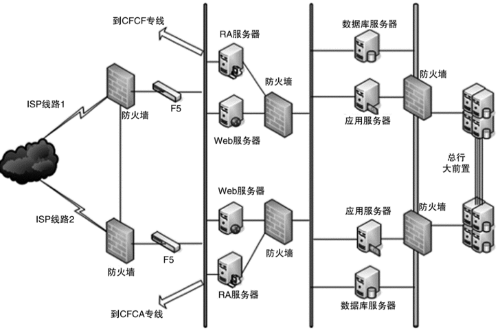

## 低成本、安全、规模

### 低成本

当我们的架构方案只涉及几台或者十几台服务器时，一般情况下成本并不是我们重点关注的目标，但如果架构方案涉及几百上千甚至上万台服务器，成本就会变成一个非常重要的架构设计考虑点。

例如，A 方案需要 10000 台机器，B 方案只需要 8000 台机器，单从比例来看，也就节省了 20% 的成本，但从数量来看，B 方案能节省 2000 台机器，1 台机器成本预算每年大约 2 万元，这样一年下来就能节省 4000 万元，4000 万元成本不是小数目，给 100 人的团队发奖金每人可以发 40 万元了，这可是算得上天价奖金了。通过一个架构方案的设计，就能轻松节约几千万元，不但展现了技术的强大力量，也带来了可观的收益，对于技术人员来说，最有满足感的事情莫过于如此了。

低成本本质上是与高性能和高可用冲突的，所以低成本很多时候不会是架构设计的首要目标，而是架构设计的附加约束。也就是说，我们首先设定一个成本目标，当我们根据高性能、高可用的要求设计出方案时，评估一下方案是否能满足成本目标，如果不行，就需要重新设计架构；如果无论如何都无法设计出满足成本要求的方案，那就只能找老板调整成本目标了。

低成本给架构设计带来的主要复杂度体现在，**往往只有“创新”才能达到低成本目标**。这里的“创新”既包括开创一个全新的技术领域（这个要求对绝大部分公司太高），也包括引入新技术，如果没有找到能够解决自己问题的新技术，那么就真的需要自己创造新技术了。

技术栈上，打几个比方：

- NoSQL（Memcache、Redis 等）的出现是为了解决关系型数据库无法应对高并发访问带来的访问压力。
- 全文搜索引擎（Sphinx、Elasticsearch、Solr）的出现是为了解决关系型数据库 like 搜索的低效的问题。
- Hadoop 的出现是为了解决传统文件系统无法应对海量数据存储和计算的问题。

再来举几个业界类似的例子：

- Facebook 为了解决 PHP 的低效问题，刚开始的解决方案是 HipHop PHP，可以将 PHP 语言翻译为 C++ 语言执行，后来改为 HHVM，将 PHP 翻译为字节码然后由虚拟机执行，和 Java 的 JVM 类似。
- 新浪微博将传统的 Redis/MC + MySQL 方式，扩展为 Redis/MC + SSD Cache + MySQL 方式，SSD Cache 作为 L2 缓存使用，既解决了 MC/Redis 成本过高，容量小的问题，也解决了穿透 DB 带来的数据库访问压力（来源：http://www.infoq.com/cn/articles/weibo-platform-archieture ）。
- Linkedin 为了处理每天 5 千亿的事件，开发了高效的 Kafka 消息系统。
- 其他类似将 Ruby on Rails 改为 Java、Lua + redis 改为 Go 语言实现的例子还有很多。

相比来说，创造新技术复杂度更高，因此一般中小公司基本都是靠引入新技术来达到低成本的目标；而大公司更有可能自己去创造新的技术来达到低成本的目标，因为大公司才有足够的资源、技术和时间去创造新技术。

### 安全性

安全本身是一个庞大而又复杂的技术领域，并且一旦出问题，对业务和企业形象影响非常大。例如：

- 2016 年雅虎爆出史上最大规模信息泄露事件，逾 5 亿用户资料在 2014 年被窃取。
- 2016 年 10 月美国遭史上最大规模 DDoS 攻击，东海岸网站集体瘫痪。
- 2013 年 10 月，为全国 4500 多家酒店提供网络服务的浙江慧达驿站网络有限公司，因安全漏洞问题，致 2 千万条入住酒店的客户信息泄露，由此导致很多敲诈、家庭破裂的后续事件。

从技术的角度来讲，安全可以分为两类：一类是功能上的安全，一类是架构上的安全。

#### 功能安全

例如，常见的 XSS 攻击、CSRF 攻击、SQL 注入、Windows 漏洞、密码破解等，本质上是因为系统实现有漏洞，黑客有了可乘之机。黑客会利用各种漏洞潜入系统，这种行为就像小偷一样，黑客和小偷的手法都是利用系统或家中不完善的地方潜入，并进行破坏或者盗取。因此形象地说，**功能安全其实就是“防小偷”**。

从实现的角度来看，功能安全更多地是和具体的编码相关，与架构关系不大。现在很多开发框架都内嵌了常见的安全功能，能够大大减少安全相关功能的重复开发，但框架只能预防常见的安全漏洞和风险（常见的 XSS 攻击、CSRF 攻击、SQL 注入等），无法预知新的安全问题，而且框架本身很多时候也存在漏洞（例如，流行的 Apache Struts2 就多次爆出了调用远程代码执行的高危漏洞，给整个互联网都造成了一定的恐慌）。所以功能安全是一个逐步完善的过程，而且往往都是在问题出现后才能有针对性的提出解决方案，我们永远无法预测系统下一个漏洞在哪里，也不敢说自己的系统肯定没有任何问题。换句话讲，功能安全其实也是一个“攻”与“防”的矛盾，只能在这种攻防大战中逐步完善，不可能在系统架构设计的时候一劳永逸地解决。

#### 架构安全

如果说功能安全是“防小偷”，那么**架构安全就是“防强盗”**。强盗会直接用大锤将门砸开，或者用炸药将围墙炸倒；小偷是偷东西，而强盗很多时候就是故意搞破坏，对系统的影响也大得多。因此架构设计时需要特别关注架构安全，尤其是互联网时代，理论上来说系统部署在互联网上时，全球任何地方都可以发起攻击。

传统的架构安全主要依靠防火墙，防火墙最基本的功能就是隔离网络，通过将网络划分成不同的区域，制定出不同区域之间的**访问控制策略**来控制不同信任程度区域间传送的数据流。例如，下图是一个典型的银行系统的安全架构。

从图中你可以看到，整个系统根据不同的分区部署了多个防火墙来保证系统的安全。

防火墙的功能虽然强大，但性能一般，所以在传统的银行和企业应用领域应用较多。但在互联网领域，防火墙的应用场景并不多。因为互联网的业务具有海量用户访问和高并发的特点，防火墙的性能不足以支撑；尤其是互联网领域的 DDoS 攻击，轻则几 GB，重则几十 GB。2016 年知名安全研究人员布莱恩·克莱布斯（Brian Krebs）的安全博客网站遭遇 DDoS 攻击，攻击带宽达 665Gbps，是目前在网络犯罪领域已知的最大的拒绝服务攻击。这种规模的攻击，如果用防火墙来防，则需要部署大量的防火墙，成本会很高。例如，中高端一些的防火墙价格 10 万元，每秒能抗住大约 25GB 流量，那么应对这种攻击就需要将近 30 台防火墙，成本将近 300 万元，这还不包括维护成本，而这些防火墙设备在没有发生攻击的时候又没有什么作用。也就是说，如果花费几百万元来买这么一套设备，有可能几年都发挥不了任何作用。

互联网系统的架构安全目前并没有太好的设计手段来实现，更多地是依靠运营商或者云服务商强大的带宽和流量清洗的能力，较少自己来设计和实现。

### 规模

很多企业级的系统，既没有高性能要求，也没有双中心高可用要求，也不需要什么扩展性，但往往我们一说到这样的系统，很多人都会脱口而出：这个系统好复杂！为什么这样说呢？关键就在于这样的系统往往功能特别多，逻辑分支特别多。特别是有的系统，发展时间比较长，不断地往上面叠加功能，后来的人由于不熟悉整个发展历史，可能连很多功能的应用场景都不清楚，或者细节根本无法掌握，面对的就是一个黑盒系统，看不懂、改不动、不敢改、修不了，复杂度自然就感觉很高了。

**规模带来复杂度的主要原因就是“量变引起质变”**，当数量超过一定的阈值后，复杂度会发生质的变化。常见的规模带来的复杂度有：

1. 功能越来越多，导致系统复杂度指数级上升
2. 数据越来越多，系统复杂度发生质变

以 MySQL 为例，MySQL 单表的数据因不同的业务和应用场景会有不同的最优值，但不管怎样都肯定是有一定的限度的，一般推荐在 5000 万行左右。如果因为业务的发展，单表数据达到了 10 亿行，就会产生很多问题

