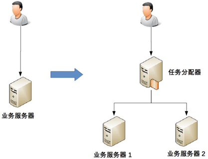

## 架构设计之高性能

之前在架构概念基础笔记里已经有提到，在做架构设计得时候一定逃不开的，需要考虑的几个点：高性能，高可用，可扩展性。这里就来展开研究下高性能

### 单机复杂度

计算机内部复杂度最关键的地方就是操作系统。计算机性能的发展本质上是由硬件发展驱动的，尤其是 CPU 的性能发展。**著名的“摩尔定律”了认为CPU 的处理能力每隔 18 个月就翻一番；**

多进程多线程虽然让多任务并行处理的性能大大提升，但本质上还是分时系统，并不能做到时间上真正的并行。解决这个问题的方式显而易见，就是让多个 CPU 能够同时执行计算任务，从而实现真正意义上的多任务并行。目前这样的解决方案有 3 种：**SMP（Symmetric Multi-Processor，对称多处理器结构）、NUMA（Non-Uniform Memory Access，非一致存储访问结构）、MPP（Massive Parallel Processing，海量并行处理结构）**。其中 SMP 是我们最常见的，目前流行的多核处理器就是 **SMP 方案**。

如果我们要完成一个高性能的软件系统，需要考虑如多进程、多线程、进程间通信、多线程并发等技术点，而且这些技术并不是最新的就是最好的，也不是非此即彼的选择。在做架构设计的时候，需要花费很大的精力来结合业务进行分析、判断、选择、组合，这个过程同样很复杂。举一个最简单的例子：Nginx 可以用多进程也可以用多线程，JBoss 采用的是多线程；Redis 采用的是单进程，Memcache 采用的是多线程，这些系统都实现了高性能，但内部实现差异却很大。

### 集群复杂度

虽然计算机硬件的性能快速发展，但和业务的发展速度相比，还是小巫见大巫了，尤其是进入互联网时代后，业务的发展速度远远超过了硬件的发展速度。

通过大量机器来提升性能，并不仅仅是增加机器这么简单，让多台机器配合起来达到高性能的目的，是一个复杂的任务，针对常见的几种方式简单分析一下：

#### 任务分配

任务分配的意思是指每台机器都可以处理完整的业务任务，不同的任务分配到不同的机器上执行。

我从最简单的一台服务器变两台服务器开始，来讲任务分配带来的复杂性，整体架构示意图如下。

从图中可以看到，1 台服务器演变为 2 台服务器后，架构上明显要复杂多了，主要体现在：

- 需要增加一个任务分配器，这个分配器可能是硬件网络设备（例如，F5、交换机等），可能是软件网络设备（例如，LVS），也可能是负载均衡软件（例如，Nginx、HAProxy），还可能是自己开发的系统。选择合适的任务分配器也是一件复杂的事情，需要综合考虑性能、成本、可维护性、可用性等各方面的因素。
- 任务分配器和真正的业务服务器之间有连接和交互（即图中任务分配器到业务服务器的连接线），需要选择合适的连接方式，并且对连接进行管理。例如，连接建立、连接检测、连接中断后如何处理等。
- 任务分配器需要增加分配算法。例如，是采用轮询算法，还是按权重分配，又或者按照负载进行分配。如果按照服务器的负载进行分配，则业务服务器还要能够上报自己的状态给任务分配器。

上面这个架构只是最简单地增加 1 台业务机器，我们假设单台业务服务器每秒能够处理 5000 次业务请求，那么这个架构理论上能够支撑 10000 次请求，实际上的性能一般按照 8 折计算，大约是 8000 次左右。

如果我们的性能要求继续提高，假设要求每秒提升到 10 万次，上面这个架构会出现什么问题呢？是不是将业务服务器增加到 25 台就可以了呢？显然不是，因为随着性能的增加，任务分配器本身又会成为性能瓶颈，当业务请求达到每秒 10 万次的时候，单台任务分配器也不够用了，任务分配器本身也需要扩展为多台机器，这时的架构又会演变成这个样子。

这个架构比 2 台业务服务器的架构要复杂，主要体现在：

- 任务分配器从 1 台变成了多台（对应图中的任务分配器 1 到任务分配器 M），这个变化带来的复杂度就是需要将不同的用户分配到不同的任务分配器上（即图中的虚线“用户分配”部分），常见的方法包括 DNS 轮询、智能 DNS、CDN（Content Delivery Network，内容分发网络）、GSLB 设备（Global Server Load Balance，全局负载均衡）等。
- 任务分配器和业务服务器的连接从简单的“1 对多”（1 台任务分配器连接多台业务服务器）变成了“多对多”（多台任务分配器连接多台业务服务器）的网状结构。
- 机器数量从 3 台扩展到 30 台（一般任务分配器数量比业务服务器要少，这里我们假设业务服务器为 25 台，任务分配器为 5 台），状态管理、故障处理复杂度也大大增加。

上面这两个例子都是以业务处理为例，实际上“任务”涵盖的范围很广，**可以指完整的业务处理，也可以单指某个具体的任务**。例如，“存储”“运算”“缓存”等都可以作为一项任务，因此存储系统、运算系统、缓存系统都可以按照任务分配的方式来搭建架构。此外，“任务分配器”也并不一定只能是物理上存在的机器或者一个独立运行的程序，也可以是嵌入在其他程序中的算法，例如 Memcache 的集群架构。

### 任务分解

通过任务分配的方式，我们能够突破单台机器处理性能的瓶颈，通过增加更多的机器来满足业务的性能需求，但如果业务本身也越来越复杂，单纯只通过任务分配的方式来扩展性能，收益会越来越低。例如，业务简单的时候 1 台机器扩展到 10 台机器，性能能够提升 8 倍（需要扣除机器群带来的部分性能损耗，因此无法达到理论上的 10 倍那么高），但如果业务越来越复杂，1 台机器扩展到 10 台，性能可能只能提升 5 倍。造成这种现象的主要原因是业务越来越复杂，单台机器处理的性能会越来越低。为了能够继续提升性能，我们需要采取第二种方式：**任务分解**。

以微信的后台架构为例。

通过上面的架构示意图可以看出，微信后台架构从逻辑上将各个子业务进行了拆分，包括：接入、注册登录、消息、LBS、摇一摇、漂流瓶、其他业务（聊天、视频、朋友圈等）。

通过这种任务分解的方式，能够把原来大一统但复杂的业务系统，拆分成小而简单但需要多个系统配合的业务系统。

主要有几方面的因素：

- **简单的系统更加容易做到高性能** 系统的功能越简单，影响性能的点就越少，就更加容易进行有针对性的优化。
- **可以针对单个任务进行扩展**  当各个逻辑任务分解到独立的子系统后，整个系统的性能瓶颈更加容易发现，而且发现后只需要针对有瓶颈的子系统进行性能优化或者提升，不需要改动整个系统，风险会小很多。

既然将一个大一统的系统分解为多个子系统能够提升性能，那是不是划分得越细越好呢？其实不然，这样做性能不仅不会提升，反而还会下降，最主要的原因是如果系统拆分得太细，为了完成某个业务，系统间的调用次数会呈指数级别上升，而系统间的调用通道目前都是通过网络传输的方式，性能远比系统内的函数调用要低得多。

虽然系统拆分可能在某种程度上能提升业务处理性能，但提升性能也是有限的，不可能系统不拆分的时候业务处理耗时为 50ms，系统拆分后业务处理耗时只要 1ms，因为最终决定业务处理性能的还是业务逻辑本身，业务逻辑本身没有发生大的变化下，理论上的性能是有一个上限的，系统拆分能够让性能逼近这个极限，但无法突破这个极限。因此，任务分解带来的性能收益是有一个度的，并不是任务分解越细越好，而对于架构设计来说，如何把握这个粒度就非常关键了。