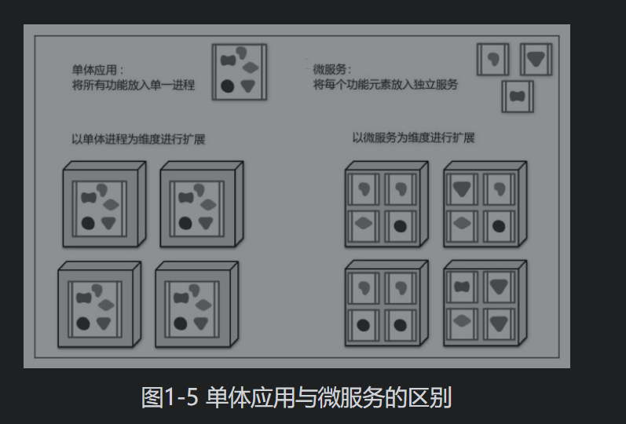
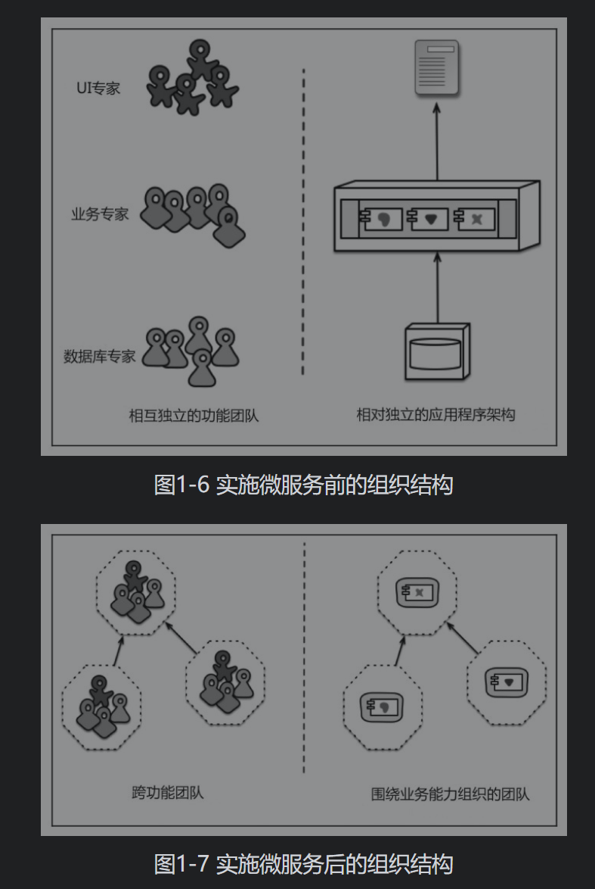

## 微服务与云原生

### 微服务

单体应用虽然简单且深入人心，但是随着越来越多的应用被部署到云端，它的劣势也体现得愈加明显。因为应用变更的范围和周期被捆绑在一起，因此即使只变更应用的一部分，也需要重新构建并部署整个单体应用，而且扩展时无法只对需要更多资源的部分模块进行单独扩展，必须将应用整体扩展。这种粗粒度的划分，不利于对系统进行管理，也不利于资源的充分利用。因此，人们越来越倾向于将应用进行合理的拆分。

微服务是一种架构风格，它将一个复杂的单体应用分解成多个独立部署的微型服务，每个服务运行在自己的进程中，服务间的通信采用轻量级通信机制，如 RESTful API。服务可以使用不同的开发语言和数据存储技术。通过服务拆分，系统可以更加自由地将资源分配到所需的应用中，而无须直接扩展整个应用。

微服务的优势是通过清晰的模块边界构建易于理解的架构风格，它可以让每个服务具有独立部署、与开发语言无关的能力。分布式系统的开发成本和运维开销则是伴随微服务的普及而需要付出的代价。

相比于集中式架构，微服务架构需要额外处理的分布式开发和运维工作包括以下几点。

#### 配置管理

相比于集中式架构的属性文件配置方式，微服务架构更加倾向于使用集中化的配置中心来存储配置数据。配置中心不一定在任何时候都是100%高可用的，大部分时间，配置是从客户端的缓存中读取的，如果配置中心恰好在配置修改时不可用，就会带来很大的影响，导致配置修改无法及时生效。配置修改要想及时生效，配置中心必须有推送配置变更事件的能力。如果配置中心是高可用的，也要慎重考虑如何保证多个配置中心间的数据一致性。

#### 服务发现

单体应用的服务是可数且可人工运维的，而对于基于微服务架构的应用而言，其服务数非常多，数不胜数。因此，微服务框架要具有服务发现的能力。一般情况下，服务发现是通过向注册中心注册服务实例的运行时标识以及对其进行监听并反向通知其状态变化来实现的。

#### 负载均衡

与服务发现类似，大量的微服务应用实例无法通过静态修改负载均衡器的方式进行运维，因此需要反向代理或使用客户端负载均衡器配合服务发现动态调整负载均衡策略。

#### 弹性扩缩容

这是集中式架构所不具备的能力，即能够在流量洪峰期通过增加应用实例的水平伸缩来增强服务的处理能力，并且能够在流量回归正常时简单地关闭应用实例，平滑地将多余的资源移出集群。

#### 分布式调用追踪

大量微服务应用的调用和交互，需要依靠一套完善的调用链追踪系统来实现，包括确定服务当前的运行状况，以及在出现状况时迅速定位相应的问题点。

#### 日志中心

在微服务架构中，散落在应用节点上的日志不易排查，而且随着应用实例的销毁，日志也会丢失，因此需要将日志发送至日志中心统一进行存储和排查。

#### 自愈能力

这是一个进阶功能，如果微服务应用可以通过健康检查感知各个服务实例的存活状态，并通过系统资源监控以及SLA分析获知应用当前的承载量，同时应用本身具有弹性扩缩容能力且微服务管控系统具有自动服务发现以及调整负载均衡的能力，那么便可以根据合理的调度策略配置通过调度系统来自动增加、关闭和重启应用实例，达到系统自愈的效果，使系统更加健壮。

### 云原生

云一般指的是一个提供资源的平台，云计算的本质是按需分配资源和弹性计算。

从本质上来说，**云原生是一种设计模式**，它要求云原生应用**具备可用性和伸缩性，以及自动化部署和管理的能力，可随处运行，并且能够通过持续集成、持续交付工具提升研发、测试与发布的效率**。

在云原生体系中，有下面两组词语用于形容应用。

无状态（stateless）、牲畜（cattle）、无名（nameless）、可丢弃（disposable）：表示应用并未采用本地内存和磁盘存储状态和日志，因此可以将应用随意部署到另一个全新的环境中，在本书中我们将这类应用统称为无状态应用。

有状态（stateful）、宠物（pet）、有名（having name）、不可丢弃（non-disposable）：表示应用状态将依赖于本地的运行环境，因此无法将应用随意部署至其他环境，应用是不能随意扩展的，在本书中我们将这类应用统称为有状态应用。