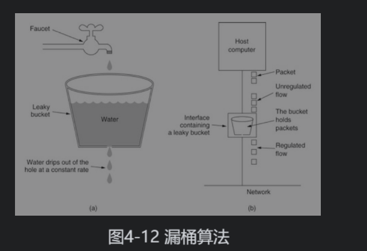
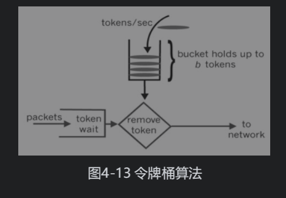

## 服务治理

在微服务大行其道的今天，服务的粒度被拆分得非常细，随之而来的是服务数量的迅速增长。在云原生的浪潮中，服务治理更多情况下与容器调度平台结合，共同形成一站式的自动化调度治理平台。无论是否使用基于容器的调度系统，服务治理的原理和范畴都不会发生改变，只是实现方式不同而已。

服务治理主要包括服务发现、负载均衡、限流、熔断、超时、重试、服务追踪等。目前已经有很多成熟的服务治理解决方案，它们是保证微服务顺利实施的中流砥柱。

### 服务发现

微服务架构意味着有更多的独立服务，服务之间通过远程通信来交互。如果只有少量服务或服务部署的频率较低，则可以通过硬编码或配置文件的方式提供所有的服务地址。但面对大量服务实例和频繁的上线部署行为，服务之间若想知道彼此的地址以及运行时状态，就需要通过服务发现组件来实现了。

**服务发现是指使用一个注册中心来记录分布式系统中的全部服务的信息**，以便让其他服务能够快速找到这些已注册的服务。服务发现是支撑大规模 SOA 和微服务架构的核心模块，它应该尽量做到高可用。**服务发现模块需要具有服务注册、服务查找、服务健康检查和服务变更通知等关键功能**。

常被用于服务发现的技术：

- Zookeeper
- Eureka(被用作SpringCloud的注册中心)

### 负载均衡

负载均衡（Load Balance）是分布式系统架构设计中必须考虑的因素之一，它是实现系统高可用、网络流量疏导和扩容的重要手段。**负载均衡的本质是通过合理的算法将请求分摊到多个服务节点**。对于由服务承载能力对等的节点组成的服务集群来说，实现负载均衡的关键在于均匀分发请求。

DNS 可以说是最早出现的负载均衡使用案例。在 DNS 服务器中为同一个主机名称配置多个IP地址，在应答查询时，DNS服务器对每个查询都将以轮询的方式返回不同的主机IP地址，将客户端访问引导至不同的服务器，从而达到负载均衡的目的。小规模系统可以使用DNS作为负载均衡的手段，**但DNS缺乏对服务发现的应对能力，一旦服务节点的启动和销毁变得更加频繁，DNS就会无法应对，它的记录和传播速度无法跟上服务节点的变化节奏**。

负载均衡相关，可以看**从零开始学架构相关笔记**

### 限流

限流又被称为流量整形（Traffic Shaping），它能够平滑网络上的突发流量，并将突发流量整形为一个稳定的流量供网络使用。**限流的主要目的是保护后端的服务节点不被突然到来的流量洪峰冲垮**。

限流通过对一个时间窗口内的请求流量进行限速来实施对系统的保护，一旦达到限速阈值，则进入限流之后的处理流程。限流之后的操作主要有以下三种：

- 拒绝服务：直接定向到错误页面，或告知用户当前资源已经没有了。
- 排队等待：将客户端请求放入队列，在服务端有资源处理时再从队列中获取请求处理，处理完毕再返回客户端。客户端通常会设置超时等待时间，请求失效后再次发起请求即可。这比较适用于资源稀缺的场景，如商品“秒杀”或车票抢购等。
- 应用降级：提供默认行为或数据，如默认显示无任何评论、库存有货等。

#### 限流算法

目前常见的限流算法主要有计数器限流算法、漏桶算法和令牌桶算法，它们分别适用于不同的限流场景，下面具体来看一下。

##### 计数器限流算法

使用计数器统计一段时间窗口之内的请求数量来进行限流，这在简单场景下是可行的。但这种限流方案在较为复杂的场景中使用时则显得粒度较粗，它并未将QPS（Queries-per-second，每秒查询率）平均分配到一段时间窗口的各个时间单位中，也未将时间窗口的边界进行有效处理。举例说明，如果上一个时间窗口的最后一毫秒与下一个时间窗口的第一毫秒都达到了请求阈值，那么实际上两毫秒内承载了双倍的QPS，而并未成功限流(**zwlj:非滑动窗口**)。

计数器限流方案常用于限制服务端资源而非客户端请求。**服务端资源包括数据库连接池和线程池等**。相比于并不精确的用户请求数量，服务端的资源则显得更加珍贵。因此，采用计数器方案可以更加精确地控制服务端资源的使用，最好不要将其浪费在精确控制海量用户请求的场景。

##### 漏桶算法

漏桶算法（Leaky Bucket）中要用到一个容量固定的桶，该桶的底部有一个洞。我们可以以任意流速让水流入漏桶，但漏桶只能按照固定的流速让水流出，一旦水流入的速度超过了水流出的速度，水将会很快超出漏桶的容量，这时新流入的水将溢出漏桶，而漏桶中包含的水的总量是维持不变的。

漏桶算法可以控制应用服务器向其他应用服务器发送请求的速率，确保速率稳定。它主要用于控制其他系统的回调洪峰，若想针对用户洪峰，使用令牌桶算法更适合。

##### 令牌桶算法

令牌桶算法（Token Bucket）的原理是使用一个存放固定容量令牌的桶，按照固定速率向桶中添加令牌，如果有请求需要被处理，就先从令牌桶中获取一个令牌，当令牌桶中没有令牌时，该请求将被放入队列等待执行或者直接被拒绝执行。图4-13是令牌桶算法的示意图。令牌桶算法与漏桶算法最明显的区别是，令牌桶算法允许一定程度上的流量突发。令牌桶算法在取走令牌时不会耗费时间，如果令牌桶内有1024个令牌，则可以在一瞬间允许1024个请求通过。

#### 具体限流方案

##### 客户端限流

客户端限流方案是通过限制客户端对服务端的访问来实现的。为避免单个调用者对服务过度使用，可以在客户端实现限流，以降低网络传输的消耗。客户端限流需要嵌入应用程序，虽然效率最优，但却使得应用本身变得十分复杂。客户端限流不易进行全局控制，虽然阈值等参数可以通过统一的配置中心修改，但当限流算法本身发生变化时，整体升级会比较困难。

##### 服务端限流

服务端限流是在服务端采取的对资源进行保护的限流方案。在客户端实现限流可以有效地控制单个客户端访问服务端的速率，但一个服务端可能同时为多个客户端提供服务，单从客户端角度是无法完全了解服务端的状态的。对于一个应用系统来说，一定会有极限并发阈值，超过阈值的应用系统响应请求会变得非常慢，甚至无法正确响应请求，因此服务端需要根据自身的状态进行保护性限流，以防止大量请求涌入将系统击垮。应用服务端一般通过框架或中间件提供服务，如Tomcat、Dubbo等。Tomcat和Dubbo都提供了防止过载的限流能力。

##### 接入端限流

接入端是流量的入口，通常是通过负载均衡服务器来实现的，比如F5和Nginx。接入端限流是通过对网关路由请求进行限制而保护服务端资源的限流方案。仅通过客户端和服务端的单个实例限流，难于实现分布式，而且应用端本身处理高强度负载的能力有限，接入端处理负载的能力远远高于应用端。

### 熔断

熔断（circuit breaker）也称为自动停盘机制，是指当股指波幅达到一定的熔断点时，交易所为控制风险所采取的暂停交易措施。它同样是服务治理中用于保护后端服务节点的有效手段，都属于服务化中流量调控的范畴。

在流量过载的情况下禁止客户端对服务端进行访问，是熔断的目的所在。**限流和熔断在某种意义上来说，是类似的两个概念，限流是允许部分流量通过，而熔断则是完全禁止某客户端访问后端服务**，它们的目的都是防止流量洪峰压垮整个集群。

