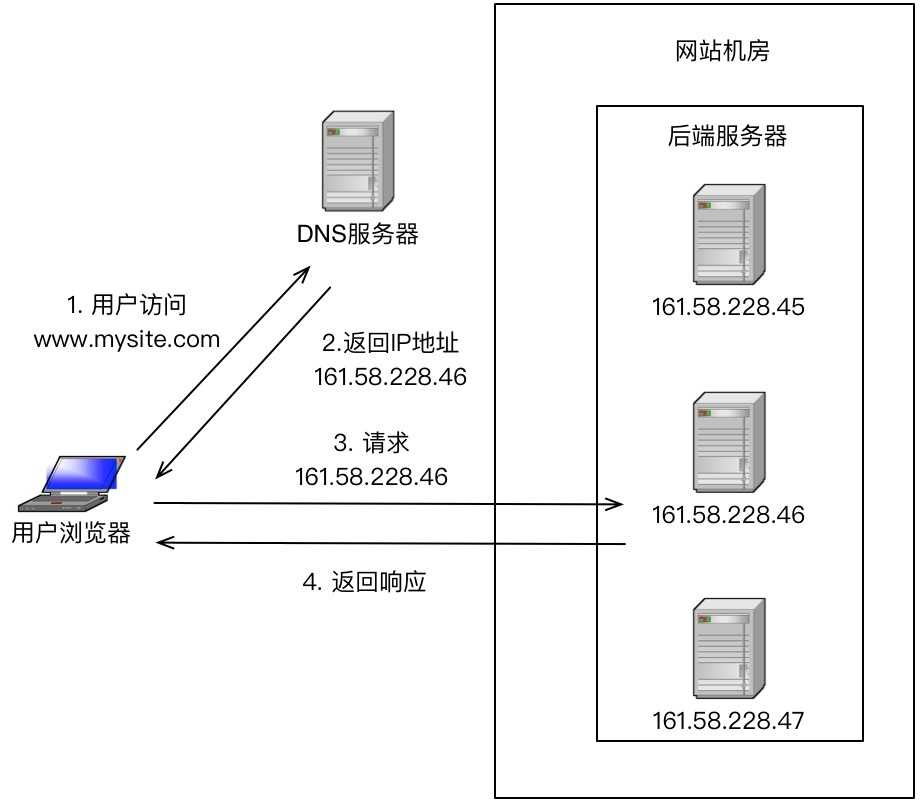
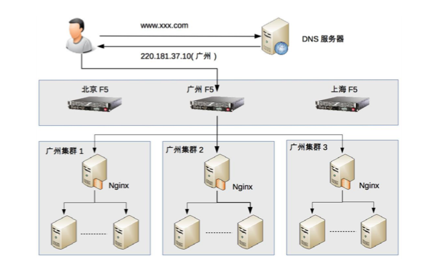

## 负载均衡架构

**高性能集群的复杂性主要体现在需要增加一个任务分配器，以及为任务选择一个合适的任务分配算法**。对于任务分配器，现在更流行的通用叫法是“负载均衡器”。但这个名称有一定的误导性，会让人潜意识里认为任务分配的目的是要保持各个计算单元的负载达到均衡状态。而实际上任务分配并不只是考虑计算单元的负载均衡，不同的任务分配算法目标是不一样的，有的基于负载考虑，有的基于性能（吞吐量、响应时间）考虑，有的基于业务考虑。

常见的负载均衡系统包括 3 种：**DNS 负载均衡**、**硬件负载均衡**和**软件负载均衡**。

#### DNS 负载均衡

DNS 是最简单也是最常见的负载均衡方式，一般用来实现地理级别的均衡。例如，北方的用户访问北京的机房，南方的用户访问深圳的机房。DNS 负载均衡的本质是 DNS 解析同一个域名可以返回不同的 IP 地址。例如，同样是 www.baidu.com，北方用户解析后获取的地址是 61.135.165.224（这是北京机房的 IP），南方用户解析后获取的地址是 14.215.177.38（这是深圳机房的 IP）。

下面是 DNS 负载均衡的简单示意图：

DNS 负载均衡实现简单、成本低，但也存在粒度太粗、负载均衡算法少等缺点。仔细分析一下优缺点，其优点有：

- 简单、成本低：负载均衡工作交给 DNS 服务器处理，无须自己开发或者维护负载均衡设备。
- 就近访问，提升访问速度：DNS 解析时可以根据请求来源 IP，解析成距离用户最近的服务器地址，可以加快访问速度，改善性能。

缺点有：

- 更新不及时：DNS 缓存的时间比较长，修改 DNS 配置后，由于缓存的原因，还是有很多用户会继续访问修改前的 IP，这样的访问会失败，达不到负载均衡的目的，并且也影响用户正常使用业务。
- 扩展性差：DNS 负载均衡的控制权在域名商那里，无法根据业务特点针对其做更多的定制化功能和扩展特性。
- 分配策略比较简单：DNS 负载均衡支持的算法少；不能区分服务器的差异（不能根据系统与服务的状态来判断负载）；也无法感知后端服务器的状态。

针对 DNS 负载均衡的一些缺点，对于时延和故障敏感的业务，有一些公司自己实现了 HTTP-DNS 的功能，即使用 HTTP 协议实现一个私有的 DNS 系统。这样的方案和通用的 DNS 优缺点正好相反。

#### 硬件负载均衡

硬件负载均衡是通过单独的硬件设备来实现负载均衡功能，这类设备和路由器、交换机类似，可以理解为一个用于负载均衡的基础网络设备。目前业界典型的硬件负载均衡设备有两款：F5 和 A10。这类设备性能强劲、功能强大，但价格都不便宜，一般只有“土豪”公司才会考虑使用此类设备。普通业务量级的公司一是负担不起，二是业务量没那么大，用这些设备也是浪费。

硬件负载均衡的优点是：

- 功能强大：全面支持各层级的负载均衡，支持全面的负载均衡算法，支持全局负载均衡。
- 性能强大：对比一下，软件负载均衡支持到 10 万级并发已经很厉害了，硬件负载均衡可以支持 100 万以上的并发。
- 稳定性高：商用硬件负载均衡，经过了良好的严格测试，经过大规模使用，稳定性高。
- 支持安全防护：硬件均衡设备除具备负载均衡功能外，还具备防火墙、防 DDoS 攻击等安全功能。

硬件负载均衡的缺点是：

- 价格昂贵：最普通的一台 F5 就是一台“马 6”，好一点的就是“Q7”了。
- 扩展能力差：硬件设备，可以根据业务进行配置，但无法进行扩展和定制。

#### 软件负载均衡

软件负载均衡通过负载均衡软件来实现负载均衡功能，常见的有 Nginx 和 LVS，其中 Nginx 是软件的 7 层负载均衡，LVS 是 Linux 内核的 4 层负载均衡。4 层和 7 层的区别就在于**协议**和**灵活性**，Nginx 支持 HTTP、E-mail 协议；而 LVS 是 4 层负载均衡，和协议无关，几乎所有应用都可以做，例如，聊天、数据库等。

软件和硬件的最主要区别就在于性能，硬件负载均衡性能远远高于软件负载均衡性能。Ngxin 的性能是万级，一般的 Linux 服务器上装一个 Nginx 大概能到 5 万 / 秒；LVS 的性能是十万级，据说可达到 80 万 / 秒；而 F5 性能是百万级，从 200 万 / 秒到 800 万 / 秒都有（数据来源网络，仅供参考，如需采用请根据实际业务场景进行性能测试）。当然，软件负载均衡的最大优势是便宜，一台普通的 Linux 服务器批发价大概就是 1 万元左右，相比 F5 的价格，那就是自行车和宝马的区别了。

除了使用开源的系统进行负载均衡，如果业务比较特殊，也可能基于开源系统进行定制（例如，Nginx 插件），甚至进行自研。

下面是 Nginx 的负载均衡架构示意图：

软件负载均衡的优点：

- 简单：无论是部署还是维护都比较简单。
- 便宜：只要买个 Linux 服务器，装上软件即可。
- 灵活：4 层和 7 层负载均衡可以根据业务进行选择；也可以根据业务进行比较方便的扩展，例如，可以通过 Nginx 的插件来实现业务的定制化功能。

其实下面的缺点都是和硬件负载均衡相比的，并不是说软件负载均衡没法用。

- 性能一般：一个 Nginx 大约能支撑 5 万并发。
- 功能没有硬件负载均衡那么强大。
- 一般不具备防火墙和防 DDoS 攻击等安全功能。

#### 负载均衡典型架构

前面我们介绍了 3 种常见的负载均衡机制：DNS 负载均衡、硬件负载均衡、软件负载均衡，每种方式都有一些优缺点，但并不意味着在实际应用中只能基于它们的优缺点进行非此即彼的选择，反而是基于它们的优缺点进行组合使用。具体来说，组合的**基本原则**为：DNS 负载均衡用于实现地理级别的负载均衡；硬件负载均衡用于实现集群级别的负载均衡；软件负载均衡用于实现机器级别的负载均衡。

我以一个假想的实例来说明一下这种组合方式，如下图所示。

整个系统的负载均衡分为三层。

- 地理级别负载均衡：www.xxx.com 部署在北京、广州、上海三个机房，当用户访问时，DNS 会根据用户的地理位置来决定返回哪个机房的 IP，图中返回了广州机房的 IP 地址，这样用户就访问到广州机房了。
- 集群级别负载均衡：广州机房的负载均衡用的是 F5 设备，F5 收到用户请求后，进行集群级别的负载均衡，将用户请求发给 3 个本地集群中的一个，我们假设 F5 将用户请求发给了“广州集群 2”。
- 机器级别的负载均衡：广州集群 2 的负载均衡用的是 Nginx，Nginx 收到用户请求后，将用户请求发送给集群里面的某台服务器，服务器处理用户的业务请求并返回业务响应。

需要注意的是，上图只是一个示例，一般在大型业务场景下才会这样用，如果业务量没这么大，则没有必要严格照搬这套架构。例如，一个大学的论坛，完全可以不需要 DNS 负载均衡，也不需要 F5 设备，只需要用 Nginx 作为一个简单的负载均衡就足够了。

### 负载均衡算法

负载均衡算法数量较多，而且可以根据一些业务特性进行定制开发，抛开细节上的差异，根据算法期望达到的目的，大体上可以分为下面几类。

- 任务平分类：负载均衡系统将收到的任务平均分配给服务器进行处理，这里的“平均”可以是绝对数量的平均，也可以是比例或者权重上的平均。
- 负载均衡类：负载均衡系统根据服务器的负载来进行分配，这里的负载并不一定是通常意义上我们说的“CPU 负载”，而是系统当前的压力，可以用 CPU 负载来衡量，也可以用连接数、I/O 使用率、网卡吞吐量等来衡量系统的压力。
- 性能最优类：负载均衡系统根据服务器的响应时间来进行任务分配，优先将新任务分配给响应最快的服务器。
- Hash 类：负载均衡系统根据任务中的某些关键信息进行 Hash 运算，将相同 Hash 值的请求分配到同一台服务器上。常见的有源地址 Hash、目标地址 Hash、session id hash、用户 ID Hash 等。

接下来我介绍一下负载均衡算法以及它们的优缺点。

#### 轮询

负载均衡系统收到请求后，按照顺序轮流分配到服务器上。

轮询是最简单的一个策略，无须关注服务器本身的状态，例如：

- 某个服务器当前因为触发了程序 bug 进入了死循环导致 CPU 负载很高，负载均衡系统是不感知的，还是会继续将请求源源不断地发送给它。
- 集群中有新的机器是 32 核的，老的机器是 16 核的，负载均衡系统也是不关注的，新老机器分配的任务数是一样的。

需要注意的是负载均衡系统无须关注“服务器本身状态”，这里的关键词是“本身”。也就是说，**只要服务器在运行，运行状态是不关注的**。但如果服务器直接宕机了，或者服务器和负载均衡系统断连了，这时负载均衡系统是能够感知的，也需要做出相应的处理。例如，将服务器从可分配服务器列表中删除，否则就会出现服务器都宕机了，任务还不断地分配给它，这明显是不合理的。

总而言之，“简单”是轮询算法的优点，也是它的缺点。

#### 加权轮询

负载均衡系统根据服务器权重进行任务分配，这里的权重一般是根据硬件配置进行静态配置的，采用动态的方式计算会更加契合业务，但复杂度也会更高。

加权轮询是轮询的一种特殊形式，其主要目的就是为了**解决不同服务器处理能力有差异的问题**。例如，集群中有新的机器是 32 核的，老的机器是 16 核的，那么理论上我们可以假设新机器的处理能力是老机器的 2 倍，负载均衡系统就可以按照 2:1 的比例分配更多的任务给新机器，从而充分利用新机器的性能。

加权轮询解决了轮询算法中无法根据服务器的配置差异进行任务分配的问题，但同样存在无法根据服务器的状态差异进行任务分配的问题。

#### 负载最低优先

负载均衡系统将任务分配给当前负载最低的服务器，这里的负载根据不同的任务类型和业务场景，可以用不同的指标来衡量。例如：

- LVS 这种 4 层网络负载均衡设备，可以以“**连接数**”来判断服务器的状态，服务器连接数越大，表明服务器压力越大。
- Nginx 这种 7 层网络负载系统，可以以“HTTP 请求数”来判断服务器状态（Nginx 内置的负载均衡算法不支持这种方式，需要进行扩展）。
- 如果我们自己开发负载均衡系统，可以根据业务特点来选择指标衡量系统压力。如果是 CPU 密集型，可以以“CPU 负载”来衡量系统压力；如果是 I/O 密集型，可以以“I/O 负载”来衡量系统压力。

负载最低优先的算法解决了轮询算法中无法感知服务器状态的问题，由此带来的代价是复杂度要增加很多。例如：

- 最少连接数优先的算法要求负载均衡系统统计每个服务器当前建立的连接，其应用场景仅限于负载均衡接收的任何连接请求都会转发给服务器进行处理，否则如果负载均衡系统和服务器之间是固定的连接池方式，就不适合采取这种算法。例如，LVS 可以采取这种算法进行负载均衡，而一个通过连接池的方式连接 MySQL 集群的负载均衡系统就不适合采取这种算法进行负载均衡。
- CPU 负载最低优先的算法要求负载均衡系统以某种方式收集每个服务器的 CPU 负载，而且要确定是以 1 分钟的负载为标准，还是以 15 分钟的负载为标准，不存在 1 分钟肯定比 15 分钟要好或者差。不同业务最优的时间间隔是不一样的，时间间隔太短容易造成频繁波动，时间间隔太长又可能造成峰值来临时响应缓慢。

负载最低优先算法基本上能够比较完美地解决轮询算法的缺点，因为采用这种算法后，负载均衡系统需要感知服务器当前的运行状态。当然，其代价是复杂度大幅上升。通俗来讲，轮询可能是 5 行代码就能实现的算法，而负载最低优先算法可能要 1000 行才能实现，甚至需要负载均衡系统和服务器都要开发代码。负载最低优先算法如果本身没有设计好，或者不适合业务的运行特点，算法本身就可能成为性能的瓶颈，或者引发很多莫名其妙的问题。所以负载最低优先算法虽然效果看起来很美好，但实际上真正应用的场景反而没有轮询（包括加权轮询）那么多。

#### 性能最优类

负载最低优先类算法是站在服务器的角度来进行分配的，而性能最优优先类算法则是站在客户端的角度来进行分配的，优先将任务分配给处理速度最快的服务器，通过这种方式达到最快响应客户端的目的。

和负载最低优先类算法类似，性能最优优先类算法本质上也是感知了服务器的状态，只是通过响应时间这个外部标准来衡量服务器状态而已。因此性能最优优先类算法存在的问题和负载最低优先类算法类似，复杂度都很高，主要体现在：

- 负载均衡系统需要收集和分析每个服务器每个任务的响应时间，在大量任务处理的场景下，这种收集和统计本身也会消耗较多的性能。
- 为了减少这种统计上的消耗，可以采取采样的方式来统计，即不统计所有任务的响应时间，而是抽样统计部分任务的响应时间来估算整体任务的响应时间。采样统计虽然能够减少性能消耗，但使得复杂度进一步上升，因为要确定合适的**采样率**，采样率太低会导致结果不准确，采样率太高会导致性能消耗较大，找到合适的采样率也是一件复杂的事情。
- 无论是全部统计还是采样统计，都需要选择合适的**周期**：是 10 秒内性能最优，还是 1 分钟内性能最优，还是 5 分钟内性能最优……没有放之四海而皆准的周期，需要根据实际业务进行判断和选择，这也是一件比较复杂的事情，甚至出现系统上线后需要不断地调优才能达到最优设计。

#### Hash类

负载均衡系统根据任务中的某些关键信息进行 Hash 运算，将相同 Hash 值的请求分配到同一台服务器上，这样做的目的主要是为了满足特定的业务需求。例如：

- 源地址 Hash

将来源于同一个源 IP 地址的任务分配给同一个服务器进行处理，适合于存在事务、会话的业务。例如，当我们通过浏览器登录网上银行时，会生成一个会话信息，这个会话是临时的，关闭浏览器后就失效。网上银行后台无须持久化会话信息，只需要在某台服务器上临时保存这个会话就可以了，但需要保证用户在会话存在期间，每次都能访问到同一个服务器，这种业务场景就可以用源地址 Hash 来实现。

- ID Hash

将某个 ID 标识的业务分配到同一个服务器中进行处理，这里的 ID 一般是临时性数据的 ID（如 session id）。例如，上述的网上银行登录的例子，用 session id hash 同样可以实现同一个会话期间，用户每次都是访问到同一台服务器的目的。