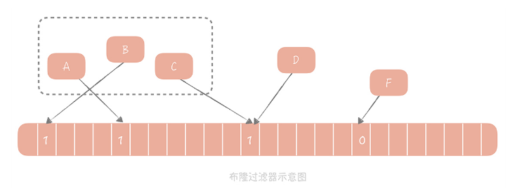
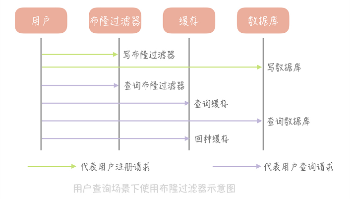

## 缓存穿透

缓存的容量有限，并且大部分的访问只会请求 20% 的热点数据，那么理论上说，我们只需要在有限的缓存空间里存储 20% 的热点数据就可以有效地保护脆弱的后端系统了，也就可以放弃缓存另外 80% 的非热点数据了。所以，这种少量的缓存穿透是不可避免的，但是对系统是没有损害的。

但是大量的穿透请求超过了后端系统的承受范围，就会引起后端崩溃，这样是不行的。

先来考虑这样一种场景：在你的电商系统的用户表中，我们需要通过用户 ID 查询用户的信息，缓存的读写策略采用 Cache Aside 策略。

那么，如果要读取一个用户表中未注册的用户，会发生什么情况呢？按照这个策略，我们会先读缓存，再穿透读数据库。由于用户并不存在，所以缓存和数据库中都没有查询到数据，因此也就不会向缓存中回种数据（也就是向缓存中设置值的意思），这样当再次请求这个用户数据的时候还是会再次穿透到数据库。在这种场景下，缓存并不能有效地阻挡请求穿透到数据库上，它的作用就微乎其微了。

那如何解决缓存穿透呢？一般来说我们会有两种解决方案：**回种空值以及使用布隆过滤器。**


### 回种空值

回顾上面提到的场景，你会发现最大的问题在于数据库中并不存在用户的数据，这就造成无论查询多少次，数据库中永远都不会存在这个用户的数据，穿透永远都会发生。

**类似的场景还有一些：**比如由于代码的 bug 导致查询数据库的时候抛出了异常，这样可以认为从数据库查询出来的数据为空，同样不会回种缓存。

那么，当我们从数据库中查询到空值或者发生异常时，我们可以向缓存中回种一个空值。但是因为空值并不是准确的业务数据，并且会占用缓存的空间，所以我们会给这个空值加一个比较短的过期时间，让空值在短时间之内能够快速过期淘汰。**下面是这个流程的伪代码：**

```java
Object nullValue = new Object();
try {
  Object valueFromDB = getFromDB(uid); // 从数据库中查询数据
  if (valueFromDB == null) {
    cache.set(uid, nullValue, 10);   // 如果从数据库中查询到空值，就把空值写入缓存，设置较短的超时时间
  } else {
    cache.set(uid, valueFromDB, 1000);
  }
} catch(Exception e) {
  cache.set(uid, nullValue, 10);
}
```

回种空值虽然能够阻挡大量穿透的请求，但如果有大量获取未注册用户信息的请求，缓存内就会有有大量的空值缓存，也就会浪费缓存的存储空间，如果缓存空间被占满了，还会剔除掉一些已经被缓存的用户信息反而会造成缓存命中率的下降。

**所以这个方案，我建议你在使用的时候应该评估一下缓存容量是否能够支撑。**如果需要大量的缓存节点来支持，那么就无法通过通过回种空值的方式来解决，这时你可以考虑使用布隆过滤器。


### 布隆过滤器

1970 年布隆提出了一种布隆过滤器的算法，用来判断一个元素是否在一个集合中。这种算法由一个二进制数组和一个 Hash 算法组成。**它的基本思路如下：**

我们把集合中的每一个值按照提供的 Hash 算法算出对应的 Hash 值，然后将 Hash 值对数组长度取模后得到需要计入数组的索引值，并且将数组这个位置的值从 0 改成 1。在判断一个元素是否存在于这个集合中时，你只需要将这个元素按照相同的算法计算出索引值，如果这个位置的值为 1 就认为这个元素在集合中，否则则认为不在集合中。



A、B、C 等元素组成了一个集合，元素 D 计算出的 Hash 值所对应的的数组中值是 1，所以可以认为 D 也在集合中。而 F 在数组中的值是 0，所以 F 不在数组中。

还是以存储用户信息的表为例进行讲解。首先，我们初始化一个很大的数组，比方说长度为 20 亿的数组，接下来我们选择一个 Hash 算法，然后我们将目前现有的所有用户的 ID 计算出 Hash 值并且映射到这个大数组中，映射位置的值设置为 1，其它值设置为 0。

新注册的用户除了需要写入到数据库中之外，它也需要依照同样的算法更新布隆过滤器的数组中，相应位置的值。那么当我们需要查询某一个用户的信息时，我们首先查询这个 ID 在布隆过滤器中是否存在，如果不存在就直接返回空值，而不需要继续查询数据库和缓存，这样就可以极大地减少异常查询带来的缓存穿透。



布隆过滤器拥有极高的性能，无论是写入操作还是读取操作，时间复杂度都是 O(1)，是常量值。在空间上，相对于其他数据结构它也有很大的优势，比如，20 亿的数组需要 2000000000/8/1024/1024 = 238M 的空间，而如果使用数组来存储，假设每个用户 ID 占用 4 个字节的空间，那么存储 20 亿用户需要 2000000000 * 4 / 1024 / 1024 = 7600M 的空间，是布隆过滤器的 32 倍。

不过，任何事物都有两面性，布隆过滤器也不例外，**它主要有两个缺陷：**

1. 它在判断元素是否在集合中时是有一定错误几率的，比如它会把不是集合中的元素判断为处在集合中；

2. 不支持删除元素。

**要依据业务场景来选择是否能够使用布隆过滤器，**比如像是注册用户的场景下，因为用户删除的情况基本不存在，所以还是可以使用布隆过滤器来解决缓存穿透的问题的。

**关于布隆过滤器的使用上，还有几个建议：**

1. 选择多个 Hash 函数计算多个 Hash 值，这样可以减少误判的几率；

2. 布隆过滤器会消耗一定的内存空间，所以在使用时需要评估你的业务场景下需要多大的内存，存储的成本是否可以接受。