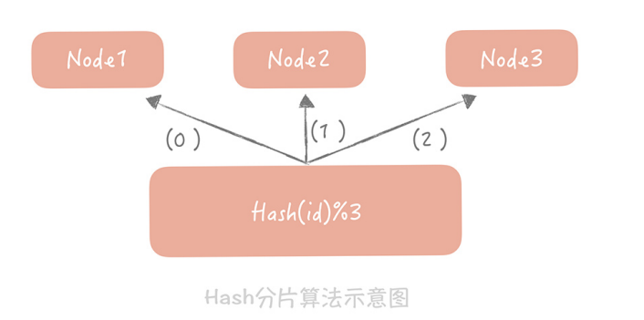
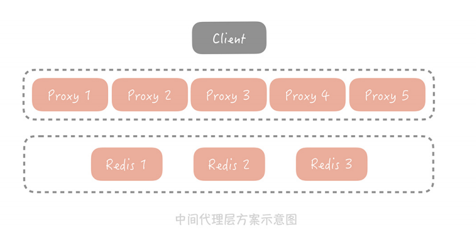
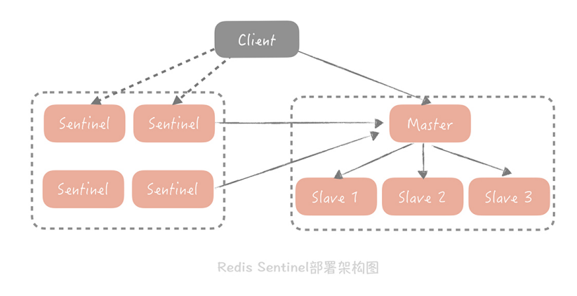

### 高可用缓存方案

我们可以通过部署多个节点，同时设计一些方案让这些节点互为备份。这样，当某个节点故障时，它的备份节点可以顶替它继续提供服务。**而这些方案就是我们本节的重点：分布式缓存的高可用方案。** 

方案有**客户端方案、中间代理层方案和服务端方案**三大类：

- **客户端方案**就是在客户端配置多个缓存的节点，通过缓存写入和读取算法策略来实现分布式，从而提高缓存的可用性。
- **中间代理层方案**是在应用代码和缓存节点之间增加代理层，客户端所有的写入和读取的请求都通过代理层，而代理层中会内置高可用策略，帮助提升缓存系统的高可用。
- **服务端方案**就是 Redis 2.4 版本后提出的 Redis Sentinel 方案。

### 客户端方案

在客户端方案中，你需要关注缓存的写和读两个方面：

写入数据时，需要把被写入缓存的数据分散到多个节点中，即进行数据分片；读数据时，可以利用多组的缓存来做容错，提升缓存系统的可用性。关于读数据，这里可以使用主从和多副本两种策略，两种策略是为了解决不同的问题而提出的

#### 缓存数据分片

单一的缓存节点受到机器内存、网卡带宽和单节点请求量的限制，不能承担比较高的并发，因此我们考虑将数据分片，依照分片算法将数据打散到多个不同的节点上，每个节点上存储部分数据。

这样在某个节点故障的情况下，其他节点也可以提供服务，保证了一定的可用性。这就好比不要把鸡蛋放在同一个篮子里，这样一旦一个篮子掉在地上，摔碎了，别的篮子里还有没摔碎的鸡蛋，不至于一个不剩。 

**一般来讲，分片算法常见的就是 Hash 分片算法和一致性 Hash 分片算法两种。**

### 中间层代理

虽然客户端方案已经能解决大部分的问题，但是只能在单一语言系统之间复用。例如微博使用 Java 语言实现了这么一套逻辑，我使用 PHP 就难以复用，需要重新写一套，很麻烦。 **而中间代理层的方案就可以解决这个问题。**你可以将客户端解决方案的经验移植到代理层中，通过通用的协议（如 Redis 协议）来实现在其他语言中的复用。 

业界也有很多中间代理层方案，比如 Facebook 的Mcrouter，Twitter 的Twemproxy，豌豆荚的Codis。它

### 服务端方案

Redis 在 2.4 版本中提出了 Redis Sentinel 模式来解决主从 Redis 部署时的高可用问题，它可以在主节点挂了以后自动将从节点提升为主节点。保证整体集群的可用性，整体的架构 

如下图所示：

Redis Sentinel 也是集群部署的，这样可以避免 Sentinel 节点挂掉造成无法自动故障恢复的问题，每一个 Sentinel 节点都是无状态的。在 Sentinel 中会配置 Master 的地址， Sentinel 会时刻监控 Master 的状态，当发现 Master 在配置的时间间隔内无响应，就认为Master 已经挂了，Sentinel 会从从节点中选取一个提升为主节点，并且把所有其他的从节 点作为新主的从节点。Sentinel 集群内部在仲裁的时候，会根据配置的值来决定当有几个Sentinel 节点认为主挂掉可以做主从切换的操作，也就是集群内部需要对缓存节点的状态达成一致才行。 

Redis Sentinel 不属于代理层模式，因为对于缓存的写入和读取请求不会经过 Sentinel 节点。Sentinel 节点在架构上和主从是平级的，是作为管理者存在的，**所以可以认为是在服务端提供的一种高可用方案。** 

