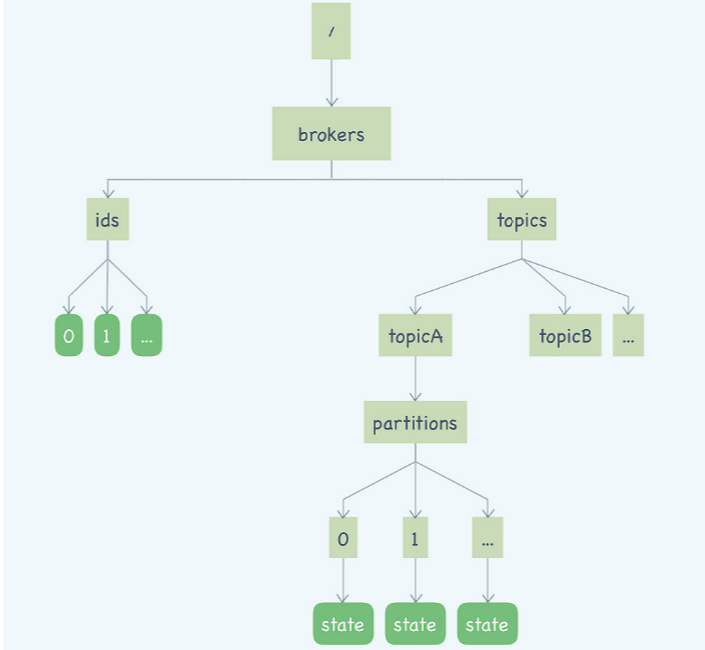

## kafka与zk

ZooKeeper 最核心的功能是，它提供了一个分布式的存储系统，**数据的组织方式类似于 UNIX 文件系统的树形结构**。由于这是一个可以保证一致性的存储系统，所以你可以放心地在你的应用集群中读写 ZooKeeper 的数据，而不用担心数据一致性的问题。分布式系统中一些需要整个集群所有节点都访问的元数据，比如集群节点信息、公共配置信息等，特别适合保存在 ZooKeeper 中。

在这个树形的存储结构中，每个节点被称为一个“ZNode”。ZooKeeper 提供了一种特殊的 ZNode 类型：临时节点。这种临时节点有一个特性：如果创建临时节点的客户端与 ZooKeeper 集群失去连接，这个临时节点就会自动消失。在 ZooKeeper 内部，它维护了 ZooKeeper 集群与所有客户端的心跳，通过判断心跳的状态，来确定是否需要删除客户端创建的临时节点。

ZooKeeper 还提供了一种订阅 ZNode 状态变化的通知机制：Watcher，一旦 ZNode 或者它的子节点状态发生了变化，订阅的客户端会立即收到通知。

利用 ZooKeeper 临时节点和 Watcher 机制，我们很容易随时来获取业务集群中每个节点的存活状态，并且可以监控业务集群的节点变化情况，当有节点上下线时，都可以收到来自 ZooKeeper 的通知。

此外，我们还可以用 ZooKeeper 来实现业务集群的快速选举、节点间的简单通信、分布式锁等很多功能。

最新版本的 Kafka 已经将消费位置管理等一些原本依赖 ZooKeeper 实现的功能，替换成了其他的实现方式。

图中圆角的矩形是临时节点，直角矩形是持久化的节点。

我们从左往右来看，左侧这棵树保存的是 Kafka 的 Broker 信息，/brokers/ids/[0…N]，每个临时节点对应着一个在线的 Broker，Broker 启动后会创建一个临时节点，代表 Broker 已经加入集群可以提供服务了，节点名称就是 BrokerID，节点内保存了包括 Broker 的地址、版本号、启动时间等等一些 Broker 的基本信息。如果 Broker 宕机或者与 ZooKeeper 集群失联了，这个临时节点也会随之消失。

右侧部分的这棵树保存的就是主题和分区的信息。/brokers/topics/ 节点下面的每个子节点都是一个主题，节点的名称就是主题名称。每个主题节点下面都包含一个固定的 partitions 节点，pattitions 节点的子节点就是主题下的所有分区，节点名称就是分区编号。

每个分区节点下面是一个名为 state 的临时节点，节点中保存着分区当前的 leader 和所有的 ISR 的 BrokerID。这个 state 临时节点是由这个分区当前的 Leader Broker 创建的。如果这个分区的 Leader Broker 宕机了，对应的这个 state 临时节点也会消失，直到新的 Leader 被选举出来，再次创建 state 临时节点。

### Broker节点搜寻

那 Kafka 客户端如何找到主题、队列对应的 Broker 呢？其实，通过上面 ZooKeeper 中的数据结构，你应该已经可以猜的八九不离十了。是的，先根据主题和队列，在右边的树中找到分区对应的 state 临时节点，我们刚刚说过，state 节点中保存了这个分区 Leader 的 BrokerID。拿到这个 Leader 的 BrokerID 后，再去左侧的树中，找到 BrokerID 对应的临时节点，就可以获取到 Broker 真正的访问地址了。